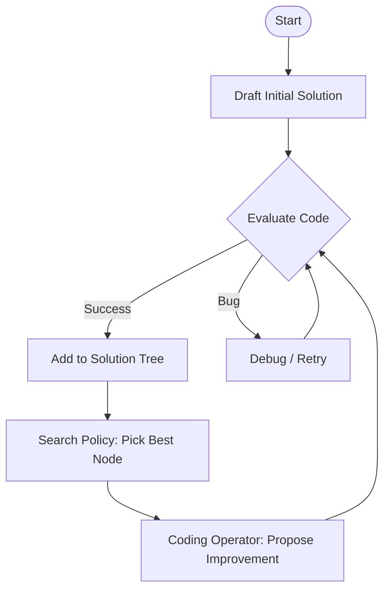

# AIDE: AI-Driven Exploration in the Space of Code

## 1. Latest Context
**Date**: Early 2026
**Trend**: Autonomous AI Engineering & Agentic Code Search
**Key Insight**: Moving beyond "Copilots" (autocomplete) to "Agents" that perform iterative **trial-and-error** in the space of code.
**Status**: Top trending research (GitHub + arXiv). **AIDE** (AI-Driven Exploration) represents a shift where LLMs don't just write code, but *explore* potential solutions in a tree structure, simulating the human engineering process of drafting, debugging, and improving.

---

## 2. What is AIDE?
**AIDE (AI-Driven Exploration)** is a framework that frames **Machine Learning Engineering (MLE)** as a **Code Optimization Problem**.

Instead of searching for hyperparameters in a fixed grid (like traditional AutoML), AIDE searches for **python scripts** in an infinite solution space.

### The Core Loop
1.  **Draft**: Generate an initial solution (e.g., a simple Random Forest script).
2.  **Evaluate**: Run the code, get a metric (Accuracy, RMSE).
3.  **Improve**: The agent looks at the code and the result, then proposes a *child* solution (e.g., "Change the scaler to RobustScaler").
4.  **Tree Search**: It maintains a tree of solutions. If a path fails (bugs or low score), it backtracks or branches out from a better node.

### Why it matters
*   **Human-like**: It mimics how humans work—we don't write perfect code in one go. We iterate.
*   **Flexible**: Can invent new architectures, loss functions, or preprocessing steps, not just tune numbers.
*   **State-of-the-Art**: Beats human experts on Kaggle benchmarks (MLE-Bench).

---

## 3. Deep Dive: The AIDE Paper (arXiv:2502.13138)

The paper "AIDE: AI-Driven Exploration in the Space of Code" introduces three key operators that drive the agent.

### 3.1. The Solution Tree ($T$)
All code versions are nodes in a tree $T$.
*   **Root**: Empty or Initial Draft.
*   **Edge**: An improvement attempt (Mutation).
*   **Node**: A complete, executable Python script + its evaluation score.

### 3.2. Operators
1.  **Search Policy ($\pi$)**: Decides *which node* to work on next.
    *   *Greedy*: Pick the best scoring node.
    *   *Exploration*: Pick a promising but less visited node.
2.  **Coding Operator ($f$)**: The LLM prompt that generates the next step.
    *   *Draft*: Create from scratch.
    *   *Debug*: Fix a crash (using stderr logs).
    *   *Improve*: Optimize a working solution (e.g., "Add interaction terms").
3.  **Summarization Operator ($\Sigma$)**:
    *   Instead of feeding the whole tree history to the LLM (context overflow), it summarizes the path: "We tried X, it failed. We tried Y, it worked but overfitted."

---

## 4. Architecture & Logic



---

## 5. Python Simulation: Tree Search Mechanism

This simulation demonstrates the core **Tree Search** logic of AIDE without needing a real LLM. We simulate the "Coding Operator" by perturbing values in a vector space to maximize a score.

```python
import random
import math
import heapq

class Solution:
    def __init__(self, code, parent=None, improvement_desc=""):
        self.code = code  # In this sim, 'code' is a list of hyperparameters [x, y]
        self.score = float('-inf')
        self.parent = parent
        self.improvement_desc = improvement_desc
        self.children = []

    def __repr__(self):
        return f"Solution(code={self.code}, score={self.score:.4f})"

class Evaluator:
    """
    Simulates the evaluation step.
    Goal: Maximize the function f(x, y) = -((x-10)^2 + (y-5)^2)
    Peak is at (10, 5) with score 0.
    """
    def evaluate(self, solution):
        x, y = solution.code
        # Simple quadratic objective function (negative distance to target)
        score = -((x - 10)**2 + (y - 5)**2)
        solution.score = score
        return score

class CodingOperator:
    """
    Simulates the LLM Coding Operator.
    It takes a solution and 'improves' it by tweaking values.
    """
    def propose_improvement(self, solution):
        # Simulate LLM drafting/improving code
        # We perturb the current values slightly (local search behavior)
        if solution is None:
            # Initial draft (random start)
            return [random.uniform(0, 20), random.uniform(0, 20)]

        current_code = solution.code
        new_code = [
            current_code[0] + random.uniform(-2, 2),
            current_code[1] + random.uniform(-2, 2)
        ]
        return new_code

class AIDE:
    """
    AI-Driven Exploration Agent.
    Implements the Tree Search algorithm.
    """
    def __init__(self, steps=20):
        self.steps = steps
        self.evaluator = Evaluator()
        self.coding_operator = CodingOperator()
        self.root = None
        self.solutions = [] # Flat list for tracking

    def run(self):
        print(f"--- Starting AIDE Simulation (Steps: {self.steps}) ---")

        # Step 1: Initialize Base Solution (Drafting)
        initial_code = self.coding_operator.propose_improvement(None)
        self.root = Solution(initial_code, improvement_desc="Initial Draft")
        self.evaluator.evaluate(self.root)
        self.solutions.append(self.root)

        print(f"Step 0: Initial Draft -> {self.root}")

        current_best = self.root

        for i in range(1, self.steps + 1):
            # Step 2: Search Policy (Select best node to expand)
            # AIDE uses a policy pi(T). Simple version: Greedy Best-First
            # We filter for nodes that haven't been over-expanded or we just pick the global best
            # and try to improve it (hill climbing with history).

            # In this sim, we pick the current best solution to improve
            base_solution = max(self.solutions, key=lambda s: s.score)

            # Step 3: Coding Operator (Propose new solution)
            new_code = self.coding_operator.propose_improvement(base_solution)

            # Step 4: Evaluate
            new_solution = Solution(new_code, parent=base_solution, improvement_desc=f"Step {i} Improvement")
            self.evaluator.evaluate(new_solution)

            # Update Tree
            base_solution.children.append(new_solution)
            self.solutions.append(new_solution)

            print(f"Step {i}: Improving {base_solution.code} -> {new_solution}")

            if new_solution.score > current_best.score:
                current_best = new_solution
                print(f"  >>> New Best Found! Score: {current_best.score:.4f}")

        return current_best

if __name__ == "__main__":
    # Fix seed for reproducibility
    random.seed(42)

    aide_agent = AIDE(steps=15)
    best_result = aide_agent.run()

    print("\\n--- Final Result ---")
    print(f"Best Solution Found: {best_result.code}")
    print(f"Target Solution: [10, 5]")
    print(f"Final Score: {best_result.score:.4f}")
```

---

## 6. Real-World Examples & Use Cases

1.  **Kaggle Competitions (MLE-Bench)**:
    *   AIDE outperformed 50%+ of human participants on average across 16 Kaggle competitions.
    *   It uses "Data Preview" prompts to understand the CSV structure without loading the whole dataset into context.

2.  **Research & Development**:
    *   Used to optimize Triton kernels (low-level GPU code).
    *   Can discover novel neural architectures by editing PyTorch class definitions.

3.  **Surpassing AutoGPT**:
    *   AutoGPT (ReAct loop) often gets stuck in loops or context length limits.
    *   AIDE's **Tree Search** allows it to abandon a bad path and jump back to a previous good state, making it much more robust.

---

## 7. Future Readiness & Critique

### Pros
*   **Recoverability**: Unlike linear agents, it doesn't fail permanently if one step is buggy. It just prunes that branch.
*   **Context Efficiency**: The `Summarization Operator` keeps prompts small, enabling long-running searches (24h+).

### Cons
*   **Compute Cost**: Running hundreds of "Improve" steps requires significant LLM inference tokens.
*   **Evaluator Dependency**: It needs a solid feedback signal (e.g., validation loss). If the signal is noisy, the tree search gets confused.
*   **Local Optima**: Greedy policies might get stuck in local maxima (though tree search mitigates this better than linear search).

### Evolution
*   **AutoML 1.0 (2015)**: `sklearn` GridSearch (Static).
*   **AutoML 2.0 (2020)**: Neural Architecture Search (NAS).
*   **AI Engineering (2025/2026)**: **AIDE**. Agentic search in the space of *executable code*.
