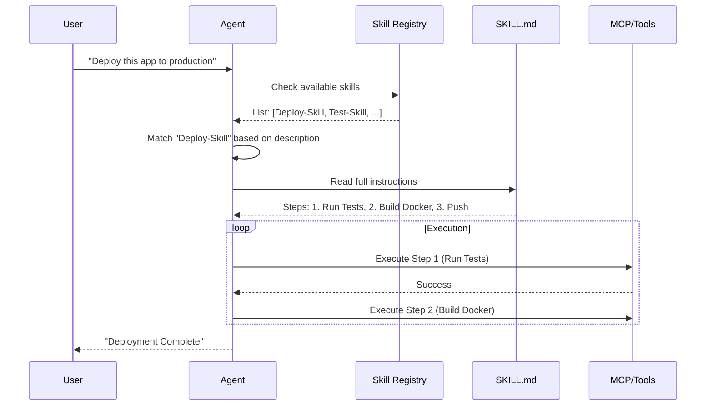
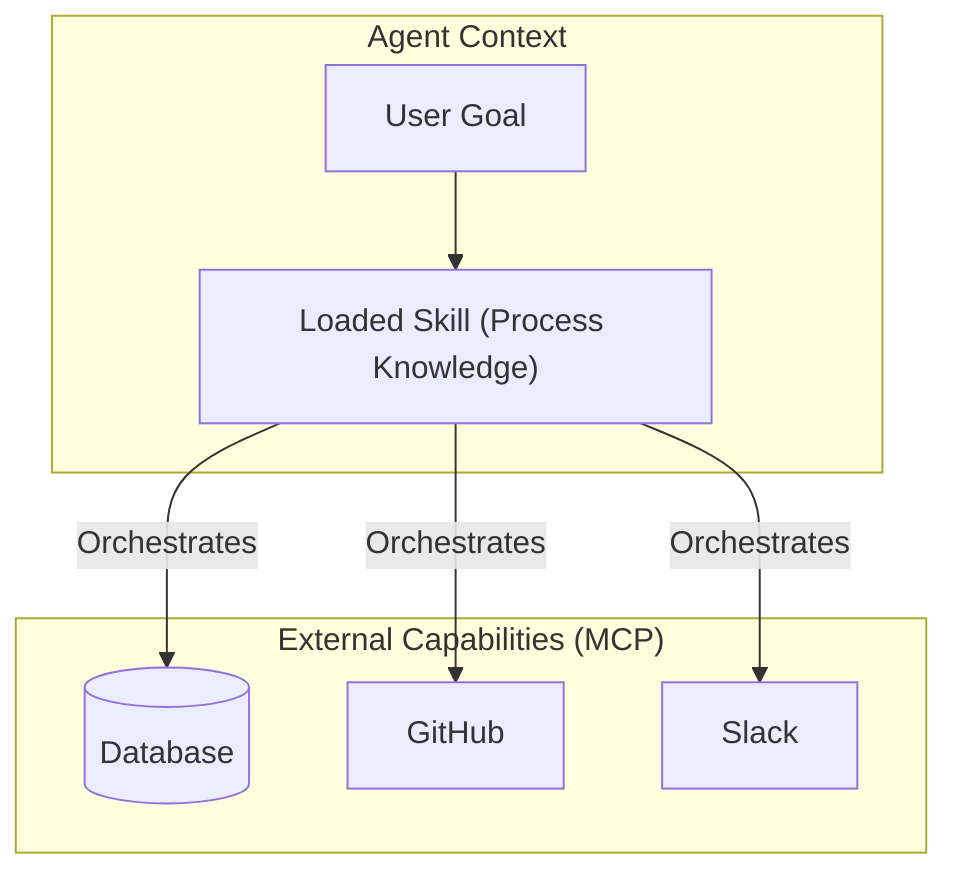

# Agent Skills: The New Standard for AI Capability

## 1. Latest Context
As of late 2024 and 2025, **Agent Skills** have emerged as a standardized, open format for extending the capabilities of AI agents. Originally championed by Anthropic and adopted by tools like Claude Code, VS Code, and GitHub Copilot, Agent Skills represent a shift from "prompt engineering" to "context engineering."

Unlike generic tool use (function calling) or permanent fine-tuning, Agent Skills are lightweight, filesystem-based "instruction packs" that load on demand. They bridge the gap between a general-purpose LLM and a specialized domain expert by providing **procedural knowledge** (how to do X) and **contextual knowledge** (company standards for X) just-in-time.

## 2. What, Why, How

### What are Agent Skills?
At its core, an Agent Skill is a directory containing a `SKILL.md` file and optional supporting assets (scripts, templates, reference docs).
*   **`SKILL.md`**: Contains metadata (name, description) and natural language instructions.
*   **The Paradigm**: It is "Instruction as Code." It is a portable, version-controlled way to teach an agent a specific workflow.

### Why do we need them?
*   **Context Window Efficiency**: Loading every possible tool definition and instruction into the context window is expensive and confusing for the model. Skills use **progressive disclosure**: agents only see the skill's description initially and load the full instructions only when the task demands it.
*   **Reliability**: Standardizing *how* a task is performed (e.g., "Always run tests before committing") reduces hallucination and error rates.
*   **Portability**: A skill defined in `SKILL.md` can be shared across different agent platforms that support the standard.

### How do they work?
1.  **Discovery**: The agent scans available skills (usually checking `SKILL.md` headers).
2.  **Activation**: When a user request matches a skill's description, the agent reads the full `SKILL.md` content.
3.  **Execution**: The agent follows the steps defined in the markdown, utilizing any attached scripts or tools (like MCP servers) as directed.



## 3. Use Cases
Agent Skills are best suited for **repeatable, complex workflows** that require specific domain knowledge but are too variable for a rigid code script.

*   **Engineering Onboarding**: A skill named `setup-dev-env` that walks an agent (and the human user) through installing specific dependencies and configuring local secrets.
*   **Code Reviews**: A skill `perform-code-review` that instructs the agent to check for specific company anti-patterns (e.g., "Ensure all SQL queries use parameterized inputs") before approving.
*   **Incident Response**: A skill `triage-incident` that guides the agent to check specific logs (DataDog), run specific diagnostics, and draft a status page update following a specific template.
*   **Document Processing**: A skill `extract-invoice-data` containing specific rules on how to handle edge cases in vendor invoices.

## 4. Real World Examples

### Example 1: The "Smoke Test" Skill
A simple skill used to verify an environment is ready.
*   **Structure**:
    ```text
    skills/
    └── smoke-test/
        ├── SKILL.md
        └── test_script.py
    ```
*   **Content**: The `SKILL.md` instructs the agent to run `python test_script.py` and interpret the output code, rather than just guessing.

### Example 2: Enterprise Compliance
Large financial firms use skills to enforce **"Policy-as-Code"**.
*   **Scenario**: An agent is asked to write a SQL query.
*   **Skill Action**: The `secure-query-writing` skill intercepts the request, forces the agent to use a specific ORM pattern, and verifies no PII is exposed in the `SELECT` clause.

## 5. Future Readiness & Critique
*   **Future Readiness**: High. As context windows grow, the "cost" of loading skills decreases, but the *need* for structured guidance increases. Skills are likely to evolve into "Agentic RAG" where the retrieval is not just data, but *behavior*.
*   **Critique**: The format is currently text-heavy (`.md`). As agents become more autonomous, we might see a shift toward a hybrid of Text + Formal Logic (e.g., pseudo-code or state machines) to reduce ambiguity. Currently, a poorly written `SKILL.md` leads to poor agent performance, shifting the burden back to the human author.

## 6. Evolution & Problem Solving
*   **Problem Solved**: **"The Empty Prompt Problem."**
    *   *Before*: You had to paste a 50-line prompt every time you started a new chat ("Act as a senior engineer, follow these rules...").
    *   *After*: The agent "knows" these rules implicitly because the `senior-engineer` skill is in its registry.
*   **Evolution**:
    *   **Prompts**: One-off instructions.
    *   **Custom Instructions**: Global, static context (always on).
    *   **Agent Skills**: Modular, dynamic context (loaded on demand).
    *   **MCP (Model Context Protocol)**: The *tools* the agent uses. Skills often *orchestrate* MCP tools.

## 7. Deep Dive: Skills vs. MCP
It is crucial to distinguish **Skills** (Process) from **MCP** (Capability).

| Feature | Agent Skill (`SKILL.md`) | MCP Server (Tool) |
| :--- | :--- | :--- |
| **Primary Role** | **The Manager**. Defines *how* to do a job. | **The Worker**. Defines *what* can be done. |
| **Format** | Markdown (Text) | Python/TS Code (API) |
| **Example** | "Check the database, then slack the team." | `query_db()`, `send_slack_msg()` |
| **Change Freq** | High (Process changes often) | Low (APIs change rarely) |



## 8. Details, Trade-offs & Architecture

### Architecture
The architecture relies on the **Agentic Loop**:
1.  **Observe**: See user input.
2.  **Orient**: Search filesystem/registry for relevant `SKILL.md`.
3.  **Decide**: Load skill content into context.
4.  **Act**: Generate tokens/call tools based on skill instructions.

### Trade-offs
*   **Latency**: Discovery and loading of markdown files adds a small overhead compared to baked-in system prompts.
*   **Complexity**: Managing a library of 100+ skills requires "Skill Ops" (versioning, testing, deprecation).
*   **Determinism**: While better than raw prompting, Skills are still natural language. They are **probabilistic**, not deterministic like a Python script. An agent *can* still misinterpret a `SKILL.md`.

## 9. Pros, Cons & Industry Usage

### Pros
*   **Democratization**: Anyone who can write a Readme can build an Agent Skill. No coding required.
*   **Auditability**: Compliance teams can read a `SKILL.md` and know exactly what the agent is instructed to do.
*   **Composability**: Skills can refer to other skills (though explicit sub-agent orchestration is still maturing).

### Cons
*   **Ambiguity**: Natural language is imprecise. "Check the logs" might mean different things to different models (Claude vs. GPT-4).
*   **Context Pollution**: A very large `SKILL.md` can flood the context window, distracting the model from the immediate nuance of the user's request.

### Industry Usage
*   **Anthropic**: Heavily pushing this with Claude Desktop and Claude Code.
*   **Dev Tools**: VS Code and Cursor are adopting similar "rules for AI" patterns (e.g., `.cursorrules`), which are spiritually identical to Agent Skills.
*   **Enterprise**: Used for "Guardrails" — ensuring agents don't hallucinate libraries that don't exist by forcing them to check a `approved-libraries` skill first.
