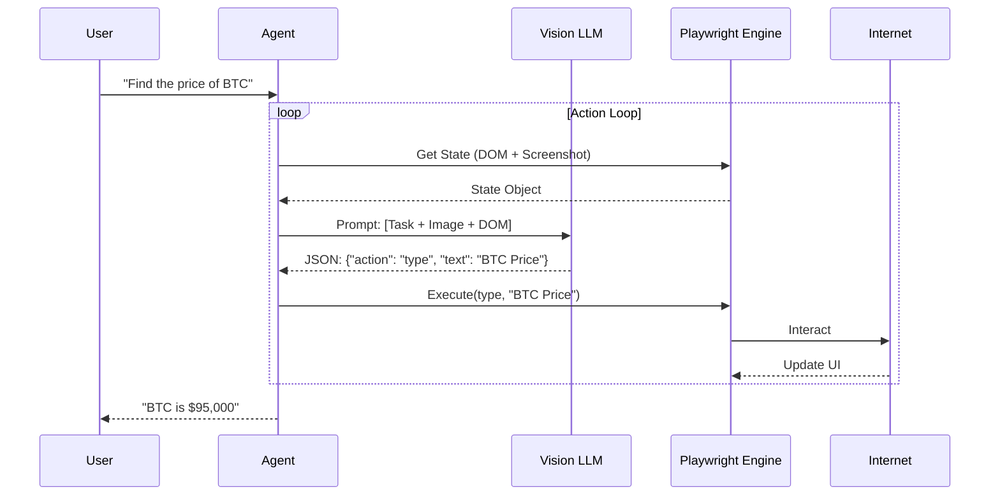

# Browser Use: The "Action" Layer for AI Agents

## 1. Latest Context
As of early 2025, **Browser Use** (`browser-use`) has exploded in popularity, becoming the top trending open-source agentic library on GitHub (75k+ stars). While 2023-2024 focused on LLM reasoning (Chain of Thought) and RAG, 2025 is the year of **Computer Use**. Browser Use provides the missing link: a reliable, high-level interface for LLMs to control a real web browser (via Playwright) to perform end-to-end tasks like "Apply to this job" or "Buy these groceries."

## 2. What, Why, How

### What is Browser Use?
It is a Python library that connects an LLM (like GPT-4o, Claude 3.5 Sonnet) to a headless browser. Unlike traditional scrapers (BeautifulSoup) that *read* data, or testing tools (Selenium/Playwright) that require strict code, Browser Use enables **autonomous navigation** using natural language instructions.

### Why do we need it?
*   **The "Last Mile" Problem**: LLMs can write an email *text*, but they cannot open Gmail, click "Compose," and hit "Send." Browser Use bridges this gap.
*   **Dynamic Webs**: Modern websites (SPAs, React apps) are difficult to scrape with static tools. Browser Use "sees" the page like a human (using screenshots and accessibility trees), making it robust against complex DOM structures.
*   **Vision-First**: It leverages the new Vision capabilities of LLMs to understand UI layouts, icons, and state changes.

### How does it work?
1.  **State Capture**: The library captures the current browser state (Screenshot + DOM Accessibility Tree).
2.  **Prompting**: It packages this state into a structured prompt for the LLM.
3.  **Action Decision**: The LLM outputs a structured action (e.g., `{'click': '12'}`, `{'type': 'Hello', 'element': '45'}`).
4.  **Execution**: The library maps this action to a Playwright command and executes it.
5.  **Loop**: The cycle repeats until the goal is met.

## 3. Use Cases
Browser Use is transforming "Chatbots" into "Action Bots":
*   **Automated Logistics**: "Log into the supplier portal, download the invoice for Order #123, and upload it to Xero."
*   **Recruitment**: "Go to LinkedIn, search for 'Senior Python Engineer' jobs in Austin, and apply to the top 3 using my resume.pdf."
*   **Competitive Intelligence**: "Visit our top 5 competitors, screenshot their pricing pages, and summarize the changes in a table."
*   **QA Testing**: "Go to our staging site, sign up as a new user, and verify the welcome email triggers."

## 4. Real World Examples

### Example 1: The "Job Application" Bot
One of the most viral examples from the community is an agent that autonomously applies to jobs.
*   **Task**: "Apply to software engineering roles on Y Combinator's Work at a Startup."
*   **Process**: The agent navigates the list, filters by "Remote," clicks "Apply," fills in the form fields (Name, GitHub, Resume), and submits.
*   **Reality Check**: It handles "Apply with LinkedIn" buttons and CAPTCHAs (if using the stealth mode) better than traditional scripts.

### Example 2: Grocery Shopping (Instacart)
*   **Task**: "Add 5 bananas, milk, and eggs to my cart on Instacart."
*   **Complexity**: The agent must handle search results, "Out of Stock" popups, and variant selection (e.g., "Organic vs Regular").

## 5. Future Readiness & Critique
*   **Future Readiness**: **Critical**. As LLMs become OS-level controllers (like Apple Intelligence), libraries like Browser Use define the standard protocol for interaction.
*   **Critique**:
    *   **Latency**: The "Screenshot -> Upload -> Token Generation" loop is slow (seconds per action).
    *   **Cost**: Sending screenshots to GPT-4o for every click is expensive ($0.01-$0.05 per step).
    *   **Safety**: Giving an agent "Click" access to a logged-in bank account or email has massive security implications.

## 6. Evolution & Problem Solved
*   **Problem Solved**: **"The brittle selector problem."**
    *   *Before*: Scripts broke whenever a `
` ID changed. `find_element(By.ID, "submit-btn")` fails if the ID changes to "btn-submit".
    *   *After*: The LLM sees a button labeled "Submit" and clicks it, regardless of the underlying HTML structure.
*   **Evolution**:
    *   **Selenium/Puppeteer**: Code-driven, brittle.
    *   **AutoGPT**: Early autonomous attempts, often got stuck.
    *   **Browser Use**: Vision-augmented, state-aware, reliable loops.

## 7. Deep Dive: References & Resources

### Key Links
*   **GitHub Repository**: [https://github.com/browser-use/browser-use](https://github.com/browser-use/browser-use)
*   **Documentation**: [https://docs.browser-use.com/](https://docs.browser-use.com/)
*   **Cloud Platform**: [https://cloud.browser-use.com/](https://cloud.browser-use.com/)

### Core Simulation
A Python simulation demonstrating the **Agent -> LLM -> Browser** architecture is available in this directory:
`browser_use_simulation.py`

## 8. Architecture & Details

The architecture follows a strict **Observer-Controller** pattern.

### Technical Nuance: The "DOM Distillation"
Sending the raw HTML to an LLM uses too many tokens. Browser Use employs a **distillation algorithm** that converts the DOM into a lightweight "Accessibility Tree" or a custom simplified format (e.g., `[Button id=12] "Submit"`), mapping every interactive element to a unique integer ID. The LLM simply outputs the ID to interact with.

## 9. Pros, Cons & Industry Usage

### Pros
*   **Model Agnostic**: Works with OpenAI, Anthropic, Gemini, or local models (Llama 3).
*   **Self-Correcting**: If a click fails, the agent sees the error message in the next screenshot and tries a different approach.
*   **Vision Native**: Can solve visual CAPTCHAs or identify elements purely by icon.

### Cons
*   **Token Consumption**: Extremely high usage of input tokens due to images and long context history.
*   **Speed**: Not suitable for high-frequency trading or sub-second latency tasks.
*   **Context Window Limits**: Long sessions (e.g., "Research these 50 companies") can overflow the context window, requiring memory management strategies.

### Industry Usage
*   **QA Automation**: Replacing brittle Cypress scripts with adaptive AI agents.
*   **Data Aggregation**: Hedge funds scraping unstructured financial data from diverse news sites.
*   **Personal Assistants**: Integrated into desktop apps to handle routine admin work.
