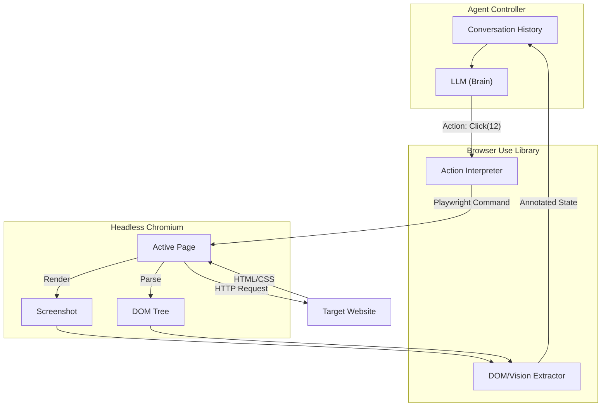

# Browser Use: The "Hands" of the Agentic Web

## 1. Latest Context
As of early 2025, **Browser Use** has exploded onto the AI engineering scene, amassing over **77k stars** on GitHub and frequently trending as the #1 Python repository. It represents a critical shift in the AI landscape: moving from "Chatbots" that *talk* about tasks to "Agents" that *perform* tasks.

While Large Language Models (LLMs) act as the "Brain", they have historically been trapped in a text box. **Browser Use** gives them "Hands" (Playwright) and "Eyes" (Vision Models), allowing them to interact with the web just like a human: clicking buttons, filling forms, and extracting data from dynamic, complex interfaces that traditional scrapers can't handle.

## 2. What, Why, How

### What is it?
**Browser Use** is an open-source Python library that connects an LLM (like GPT-4o, Claude 3.5 Sonnet, or Llama 3) to a headless browser (Chromium/Playwright). It manages the "context loop": putting the browser state into the LLM and executing the LLM's commands on the browser.

### Why do we need it?
*   **The "API Gap"**: Most of the web does not have an API. To book a flight, order groceries, or apply for a job programmatically, you previously had to write brittle scrapers (Selenium/BS4) that broke whenever the UI changed.
*   **Vision-First Automation**: Modern web apps (SPAs, React, dynamic classes like `div.css-1x2y3z`) are hostile to code-based selectors. An AI agent doesn't care about the code; it "looks" at the page and clicks "Login" because it sees a button labeled "Login".

### How does it work?
1.  **Observe**: The library takes a screenshot and extracts the accessibility tree (DOM) of the current page.
2.  **Reason**: It sends this visual and textual context to the LLM with a system prompt like: *"You are a browser agent. Your goal is X. Here is the screen. What should we do next?"*
3.  **Plan**: The LLM analyzes the inputs and outputs a structured command (e.g., `{'action': 'click', 'index': 12}` or `{'action': 'type', 'text': 'San Francisco'}`).
4.  **Act**: The library translates this command into a Playwright event (mouse click, keyboard input) and executes it.
5.  **Loop**: The cycle repeats until the goal is achieved.

## 3. Use Cases
The library enables **"Universal Web Automation"**:

*   **Complex Form Filling**: Applying to jobs on LinkedIn/Workday, filing taxes, or government forms.
*   **Data Extraction (RAG)**: Scraping data from sites that use heavy JavaScript, captchas, or infinite scrolling (e.g., extracting flight prices, stock trends, or real estate listings).
*   **QA & Testing**: An agent that "plays" a user journey to find bugs. *"Go to the staging site, log in, and try to buy a hat. Tell me if it fails."*
*   **Personal Assistants**: "Log into my Instacart and order the ingredients for Carbonara."
*   **Legacy Enterprise Automation**: Interacting with internal tools that have no APIs but exist in a browser.

## 4. Real World Examples

### Example 1: The "Job Applicant" Agent
*   **Goal**: "Find Python jobs on Indeed and apply to them."
*   **Process**:
    1.  Agent goes to `indeed.com`.
    2.  Types "Python Engineer" in the `what` box (identified visually).
    3.  Clicks "Search".
    4.  Iterates through listings, extracting descriptions.
    5.  (Advanced) Navigates to the "Apply" page, uploads a PDF resume, and fills out the "Years of Experience" field by answering based on the resume content.

### Example 2: The "Flight Booker"
*   **Goal**: "Find the cheapest flight from NYC to London next Tuesday."
*   **Process**:
    1.  Navigates to Google Flights or Kayak.
    2.  Handles the date picker (often a complex UI component) by clicking the correct calendar day.
    3.  Filters by "Price".
    4.  Returns the flight details to the user.

## 5. Future Readiness & Critique

### Future Readiness: **Critical**
We are moving towards **LAMs (Large Action Models)**. `Browser Use` is the precursor to OS-level agents (like Anthropic's "Computer Use"). As models get faster and cheaper, "writing code to scrape" will become obsolete; we will simply "tell the agent to look and click."

### Critique & Challenges
*   **Cost**: "Vision-based" browsing is expensive. Sending a screenshot to GPT-4o for every click can cost $0.50 - $1.00 per session.
*   **Latency**: The loop (Snapshot -> Upload -> Tokenize -> Inference -> Network -> Action) is slow (2-5 seconds per step). It is not suitable for high-frequency trading.
*   **Context Window**: Long sessions accumulate massive context (history of all pages visited), potentially confusing the model or hitting token limits.
*   **The "Hallucination Click"**: The model might confidently try to click a button that doesn't exist or click the wrong element (e.g., "Delete" instead of "Save") if the screenshot is ambiguous.

## 6. Evolution
*   **Generation 1 (2010s)**: **Selenium/Puppeteer**. Required hard-coded XPaths (`/div[2]/span[1]`). Extremely brittle; broke on every UI update.
*   **Generation 2 (2020s)**: **Playwright**. Better, faster, more reliable, but still required explicit programming of every step.
*   **Generation 3 (2024+)**: **Browser Use (Agentic)**. Intent-based. "Book a flight" (Agent figures out the steps). The code doesn't change even if the website UI changes, as long as the "Book" button is still visible *somewhere*.

## 7. Deep Dive: Architecture & Simulation

### 7.1 Architecture Diagram



### 7.2 Simulation Code
The following Python code simulates the core logic of `browser-use`—the interaction between a `MockLLM`, a `MockBrowser`, and the `Agent` loop—without requiring external dependencies like Playwright.

*(See `browser_use_simulation.py` in this directory for the executable version)*

```python
# Simplified snippet of the simulation logic
class MockBrowser:
    def get_state(self):
        # Returns a simplified DOM with IDs
        return "[1] <Button>Search</Button> [2] <Input>Destination</Input>"

class MockLLM:
    def predict(self, state):
        # "Vision" model decides what to click based on text state
        if "Destination" in state:
            return {"action": "type", "id": 2, "text": "Paris"}
        return {"action": "click", "id": 1}
```

## 8. References

*   **GitHub Repository**: [browser-use/browser-use](https://github.com/browser-use/browser-use)
*   **Documentation**: [docs.browser-use.com](https://docs.browser-use.com)
*   **Anthropic Computer Use**: [Anthropic Docs](https://docs.anthropic.com/en/docs/build-with-claude/computer-use) (The underlying model capability often used).
*   **Playwright**: [playwright.dev](https://playwright.dev) (The engine under the hood).
