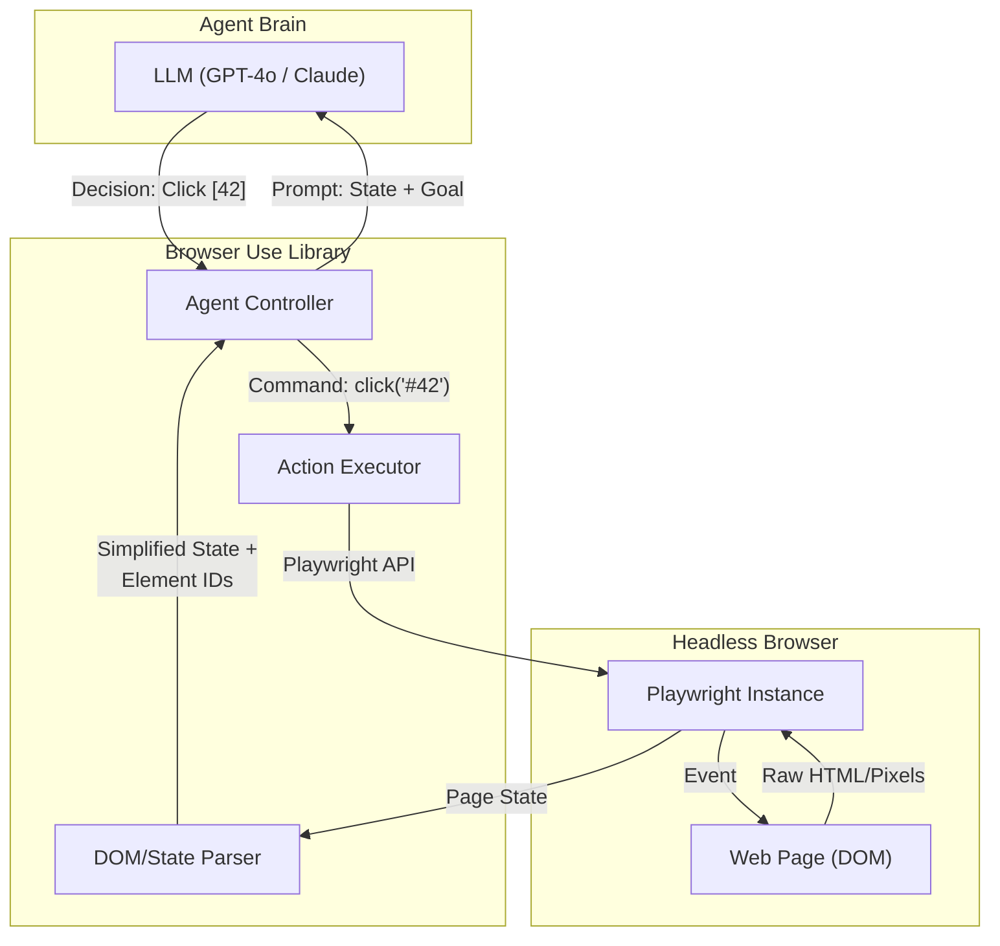

# Browser Use & Autonomous Web Agents: The Shift from Chat to Action

## 1. Latest Context
As of early 2025, the AI engineering focus has shifted aggressively from "Chatbots" to **"Action Models"**. While RAG (Retrieval-Augmented Generation) dominated 2024, the breakout trend of Q1 2025 is **Autonomous Web Agents**.

The open-source library **"Browser Use"** (based on LangChain and Playwright) became the #1 trending repository on GitHub in January 2025. This signals a democratization of technology that was previously proprietary (like Adept AI or MultiOn). Developers are now building agents that can autonomously navigate the open web, authenticating into portals, scraping complex SPAs (Single Page Applications), and executing multi-step workflows (e.g., "Find the cheapest flight to Tokyo on Expedia and draft an email with the itinerary").

## 2. What, Why, How

### What is "Browser Use"?
"Browser Use" is a Python library that connects an LLM (like GPT-4o, Claude 3.5, or DeepSeek-V3) to a headless browser (via Playwright). It acts as the bridge between **Reasoning** (the LLM) and **Execution** (the Browser).

### Why is it trending now?
*   **Context Windows**: LLMs now have large enough context windows (128k+) to ingest simplified DOM trees or screenshots of web pages.
*   **Vision Capabilities**: Multimodal models (GPT-4o, Claude 3.5 Sonnet) can "see" the UI, making them resilient to CSS changes that break traditional scrapers.
*   **The "API Problem"**: Most websites do not have public APIs. Web Agents bypass this by using the GUI, unlocking "Universal API" capabilities.

### How does it work?
1.  **State Capture**: The library captures the current browser state (Screenshot + Accessibility Tree/DOM).
2.  **Context Reduction**: Raw HTML is too large and noisy. The library parses the DOM into a simplified format (e.g., Markdown or JSON) or extracts only interactive elements (buttons, inputs) with unique IDs.
3.  **Reasoning**: The LLM receives the state and the user's goal (e.g., "Search for laptops"). It outputs a structured action (e.g., `{"action": "click", "element_id": 42}`).
4.  **Execution**: The library translates this into a Playwright command (`page.locator('#42').click()`).
5.  **Loop**: The process repeats until the goal is met.

## 3. Use Cases
*   **Automated Background Research**: "Go to LinkedIn, find the CTO of Company X, and summarize their recent posts."
*   **Legacy System Integration**: Automating data entry into internal corporate tools that lack APIs.
*   **E-Commerce Monitoring**: "Check the price of this GPU on Amazon, Best Buy, and Newegg every hour."
*   **End-to-End Testing**: Testing web apps by describing user flows in English rather than writing brittle Selenium code.

## 4. Real World Examples
*   **Job Application Agent**: A user configures an agent to search Indeed.com for "Python Engineer", filter by salary, and submit a predefined CV to the top 5 results.
*   **Travel Planner**: An agent visits Airbnb and Skyscanner, cross-referencing availability and prices to create a spreadsheet of options.
*   **SaaS Onboarding**: A "Trainer Agent" that logs into a new SaaS account and configures the initial settings (profile, notifications, integrations) based on user preferences.

## 5. Future Readiness Critique
*   **High Impact**: As "Computer Use" becomes standard, the web will evolve from "Read-Only" for bots to "Read-Write".
*   **Risks**:
    *   **Anti-Bot Warfare**: Websites will deploy advanced measures (Cloudflare Turnstile, Behavioral Analysis) to block agents.
    *   **Cost/Latency**: A 10-step web task might cost $0.50-$1.00 in tokens and take 30 seconds, which is too slow for real-time applications but acceptable for background jobs.
    *   **Safety**: An agent accidentally booking a non-refundable ticket or deleting data is a real risk.

## 6. Evolution & Problem Solved
*   **Evolution**:
    1.  **Requests/BeautifulSoup**: Static HTML parsing. Fast but breaks on JavaScript apps.
    2.  **Selenium/Puppeteer**: Headless browsers controlled by code. Powerful but brittle (breaks if UI changes).
    3.  **Autonomous Agents (Browser Use)**: Headless browsers controlled by LLMs. Resilient (understands "Search Button" even if ID changes) and adaptive.
*   **Problem Solved**: **Fragility of Automation**. Traditional scripts break when a `div` class changes. AI agents adapt by understanding the *intent* and *visuals* of the page.

## 7. Deep Dive: The Relevant Paper & Technology

### Paper: "Mind2Web: Towards a Generalist Agent for the Web" (Deng et al., NeurIPS 2023)
While "Browser Use" is a library, it operationalizes concepts pioneered in papers like *Mind2Web* and *WebArena*.

*   **The Challenge**: Real-world websites are complex. A raw HTML dump can be 100k+ tokens. How do you fit the internet into an LLM context window?
*   **Key Innovation - The Accessibility Tree**: Instead of raw HTML, agents often rely on the Accessibility Tree (used by screen readers). This tree contains only the semantic, interactive elements (Buttons, Links, Inputs) and ignores purely decorative `div`s.
*   **Methodology**:
    1.  **Element Filtering**: The paper proposes filtering the DOM to keep only candidate elements that are interactable.
    2.  **Action Prediction**: The model predicts the `element_id` and the `operation` (Click, Type, Select).
*   **Relevance to Industry**: Tools like "Browser Use" implement this by injecting JavaScript to label every interactive element with a visible number (e.g., `[12] Search`), allowing the LLM to simply output "Click 12".

### References
*   **Mind2Web Paper**: [NeurIPS 2023 Proceedings](https://arxiv.org/abs/2306.06070)
*   **WebArena Paper**: [ICLR 2024](https://webarena.dev/)
*   **Browser Use Repository**: [GitHub](https://github.com/browser-use/browser-use)
*   **LangChain Documentation**: [Web Research](https://python.langchain.com/docs/use_cases/web_scraping/)

## 8. Architecture & Details

## 9. Pros/Cons & Industry Usage

| Feature | Pros | Cons |
| :--- | :--- | :--- |
| **Adaptability** | Can handle dynamic SPAs and UI changes without code rewrites. | Slower than hard-coded API scripts. |
| **Development Speed** | "English programming" - just describe the task. | Harder to debug when the LLM makes a logic error. |
| **Scope** | Can access 100% of the visible web (Universal API). | Vulnerable to blocking/captchas; Privacy concerns with sending data to LLMs. |

**Industry Usage**:
*   **QA Testing**: Companies like Diffblue and others are exploring "Autonomous Testing" where agents explore UI to find bugs.
*   **Sales Intelligence**: Startups like Clay are integrating web agents to enrich leads by visiting company websites.
*   **Personal Assistants**: MultiOn and Rabbit are consumer-facing examples of this technology.
