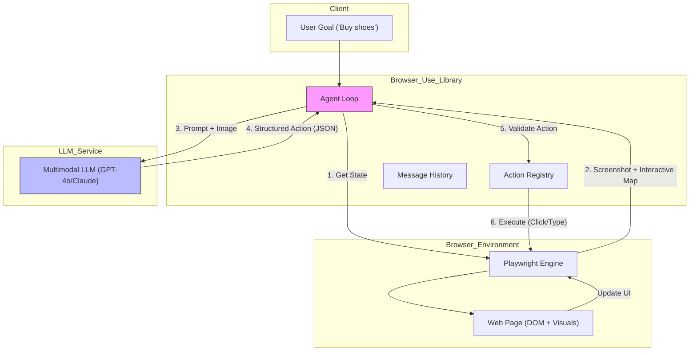

# Browser Use: The Interface for AI Agent Web Automation

## 1. Latest Context
As of early 2025, **Browser Use** has exploded in popularity (gaining over 20k stars on GitHub in weeks) and trended repeatedly on Hacker News. It represents a critical shift in AI Engineering: moving from **Chat Interfaces** (text-in, text-out) to **Action Interfaces** (agents that can manipulate existing software).

While "Computer Use" (like Anthropic's beta) allows general OS control, **Browser Use** specifically targets the web—the operating system of the modern workflow. It has become the de-facto standard library for Python developers building agents that need to browse, click, type, and extract data from websites that lack public APIs.

## 2. What, Why, How

### What is Browser Use?
**Browser Use** is an open-source Python library that connects Large Language Models (LLMs) to a web browser (via Playwright). It gives an AI agent "eyes" (screenshots/DOM) and "hands" (mouse/keyboard actions).
*   **The Core**: It wraps the complexities of browser automation (tabs, sessions, proxies) into a simple `Agent` interface.
*   **The Brain**: It uses multimodal models (like GPT-4o or Claude 3.5 Sonnet) to interpret the visual state of a page and decide the next action.

### Why do we need it?
*   **The "No-API" Problem**: Most of the world's useful data and functionality (flights, legacy CRMs, government portals) are behind GUIs, not APIs.
*   **Fragility of Selectors**: Traditional scraping (Selenium/BeautifulSoup) relies on rigid CSS selectors (e.g., `#btn-submit-2`) which break whenever the UI changes.
*   **Dynamic Content**: Modern SPAs (React/Vue) require complex rendering and interaction that static HTML parsers cannot handle.

### How does it work?
The library operates on a simple feedback loop:
1.  **Observe**: The browser takes a screenshot and extracts a simplified accessibility tree (DOM).
2.  **Think**: The LLM receives the image and text, analyzes the goal (e.g., "Find the cheapest flight"), and selects a tool from the library's registry (e.g., `click_element(34)`).
3.  **Act**: The library executes the Playwright command.
4.  **Repeat**: The loop continues until the goal is met or max steps are reached.

## 3. Use Cases
*   **Automated QA Testing**: Agents that can "explore" a staging site to find UI bugs without rigid test scripts.
*   **Competitive Intelligence**: Monitoring competitor pricing on e-commerce sites that aggressively block traditional bots.
*   **Legacy System Automation (RPA)**: Automating data entry into internal enterprise tools that haven't been updated in a decade.
*   **Personal Assistants**: "Book me a table at a generic Italian restaurant for Friday at 7 PM."

## 4. Real World Examples

### Example 1: The "Deep Research" Agent
A user wants to aggregate news from 5 different niche forums.
*   **Traditional Way**: Write 5 separate scrapers, reverse-engineer their APIs, and maintain them constantly.
*   **Browser Use Way**: Give the agent a list of URLs and the instruction: "Go to each site, search for 'AI Trends', and summarize the top 3 posts." The agent visually navigates the search bars and results just like a human.

### Example 2: The "Form Filler"
Completing a complex multi-step government application.
*   **Challenge**: The form has conditional logic (Section B appears only if Section A is 'Yes') and dynamic validation.
*   **Solution**: The Browser Use agent reads the error messages ("Please enter a valid date") and self-corrects its input, retrying until success.

## 5. Future Readiness & Critique
*   **Future Readiness**: **High**. As LLMs become cheaper and faster (latency is the main bottleneck), this approach will likely replace traditional "dumb" RPA (Robotic Process Automation). We are moving towards "Universal UI Adapters."
*   **Critique**:
    *   **Cost**: Sending screenshots to GPT-4o for every click is expensive compared to a simple HTTP request.
    *   **Latency**: A 10-step action might take 30-60 seconds due to model inference time.
    *   **Reliability**: While better than CSS selectors, visual models can still hallucinate (clicking the wrong "Submit" button) or get stuck in loops.

## 6. Evolution & Problem Solved
*   **Problem Solved**: **"The Interface Gap."** Developers forced to build fragile adapters for human interfaces.
*   **Evolution**:
    1.  **Static Scraping (requests/bs4)**: Fast, but fails on JS sites.
    2.  **Headless Browsers (Selenium/Puppeteer)**: Handles JS, but requires brittle selector logic code.
    3.  **Visual AI Agents (Browser Use)**: Handles everything, requires no logic code, just natural language instructions.

## 7. Deep Dive: Technical Specification & Architecture

### 7.1 Key Components
*   **`Agent`**: The main controller. Manages the history (messages) and the loop.
*   **`Browser`**: A wrapper around Playwright. Manages the context (cookies, sessions).
*   **`Controller`**: A registry of tools/actions the agent can perform (e.g., `scroll`, `click`, `type`, `done`).
*   **`SystemPrompt`**: A carefully crafted prompt that teaches the LLM how to interpret the DOM tree and return valid JSON actions.

### 7.2 The Vision-DOM Hybrid
Browser Use doesn't rely *only* on vision. It injects Javascript to label interactive elements with unique IDs (e.g., `[1]`, `[2]`).
*   **The Input**: The LLM sees the screenshot with these overlay numbers *and* a text list mapping numbers to element attributes.
*   **The Advantage**: This "grounding" drastically reduces hallucinations compared to pure vision (coordinates) or pure HTML (text).

### 7.3 References
*   **Repository**: [github.com/browser-use/browser-use](https://github.com/browser-use/browser-use)
*   **Paper/Inspiration**: [World of Bits](https://proceedings.mlr.press/v70/shi17a.html) (Early reinforcement learning on web), [Mind2Web](https://osu-nlp-group.github.io/Mind2Web/) (Generalist agents).

## 8. Architecture Diagram

## 9. Pros, Cons & Industry Usage

### Pros
*   **Universal**: Works on *any* website (Canvas, WebGL, plain HTML).
*   **Resilient**: adapting to UI changes (e.g., if "Login" moves to the left, the vision model still finds it).
*   **Easy Setup**: `pip install browser-use` + 5 lines of code.

### Cons
*   **Expensive**: High token usage per task.
*   **Slow**: Not suitable for high-frequency trading or real-time data scraping.
*   **Privacy**: Sends screenshots of potentially sensitive pages to external LLM providers.

### Industry Usage
*   **Startups**: Rapidly building "Agentic" features (e.g., "AI Recruiter" that scouts LinkedIn).
*   **Testing Infrastructure**: Companies like QA Wolf or other E2E testing platforms are integrating agentic explorers.
*   **Data Aggregators**: Moving from maintaining 1000s of scrapers to maintaining generic agent prompts.

## 10. Code Simulation
(See `browser_use_simulation.py` for a runnable Python simulation of the Agent-Controller-Browser architecture).
