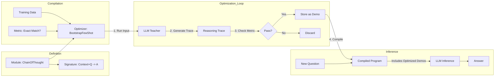

# DSPy: From Prompt Engineering to Prompt Programming

## 1. Latest Context
As of 2025, the AI Engineering landscape is undergoing a massive shift from **"Prompt Engineering"** (manual, fragile trial-and-error) to **"Prompt Programming"** (systematic, automated optimization). Leading this charge is **DSPy (Declarative Self-improving Python)**, a framework from Stanford NLP that treats language model calls as differentiable programs rather than string manipulation tasks.

*   **The Trend**: "Prompt Engineering is Dead."
*   **Adoption**: Enterprise adoption has surged as teams realize that maintaining thousands of brittle text prompts is unscalable.
*   **Engineering Guides**: Best practices now suggest defining *what* you want (Signatures) and letting an optimizer figure out *how* to ask for it (Prompts/Weights).

## 2. What, Why, How

### What is DSPy?
DSPy is a framework for solving advanced tasks with language models (LMs) and retrieval models (RMs). It separates the **logic** of your program (flow of information) from the **parameters** (prompts and few-shot examples).

Think of it like PyTorch for LLMs:
*   **PyTorch**: You define layers (logic) and an optimizer tunes the weights (floats).
*   **DSPy**: You define modules (logic) and an optimizer tunes the prompts (text).

### Why is this needed?
*   **Brittleness**: A prompt that works for GPT-4 might fail for Claude 3.5. DSPy "recompiles" the prompt for the new model automatically.
*   **Complexity**: Building complex RAG pipelines with multi-stage reasoning is hard to prompt-tune manually.
*   **Optimization**: Humans are bad at selecting the perfect "few-shot examples." DSPy searches for the best examples mathematically.

### How does it work?
1.  **Signatures**: You define inputs and outputs (e.g., `Context, Question -> Answer`).
2.  **Modules**: You build a pipeline (e.g., `ChainOfThought`).
3.  **Teleprompters (Optimizers)**: You run an algorithm (like `BootstrapFewShot`) that takes a metric (e.g., accuracy) and a training set. It calls the LLM, finds examples that lead to correct answers, and saves them as the "optimized prompt."

## 3. Use Cases
*   **RAG Pipelines**: Optimizing the query generation and answer synthesis steps in Retrieval Augmented Generation.
*   **Data Extraction**: Systematically improving the accuracy of extracting JSON from unstructured text.
*   **Complex Reasoning**: Multi-hop question answering where intermediate steps need to be verified and refined.
*   **Model Migration**: moving a complex agent from OpenAI to Llama 3 without rewriting 500 prompts—just "recompile" the DSPy program.

## 4. Real-World Examples

### Example 1: Stanford's Multi-Hop Search
In the original paper, a DSPy program replaced a complex hand-tuned system. By using the `BootstrapFewShot` optimizer, it improved accuracy on the HotPotQA benchmark significantly over manual prompt engineering, simply by finding better "demonstrations" for the model to follow.

### Example 2: Enterprise RAG "Correction"
A company building a legal chatbot used DSPy to fix "hallucinations." Instead of editing the prompt to say "Don't hallucinate" (which rarely works), they created a metric checking for citation accuracy. The DSPy optimizer then "learned" to select few-shot examples where the model correctly said "I don't know" when context was missing.

## 5. Future Readiness & Critique
*   **Readiness**: High. It is becoming the standard abstraction layer for building robust AI systems.
*   **Critique**: The learning curve is steep. It requires thinking like a programmer, not a "whisperer." Debugging an "optimized prompt" can be harder because you didn't write it—the optimizer did.

## 6. Evolution & Problem Solved
*   **Problem Solved**: **"The Fragility of Strings."**
*   **Evolution**:
    1.  **Zero-Shot**: "Translate this."
    2.  **Few-Shot**: "Here are 3 examples. Translate this."
    3.  **Chain-of-Thought**: "Think step by step."
    4.  **DSPy**: "Optimize the prompt and examples to maximize this metric."

## 7. Deep Dive: The DSPy "Compiler"

### 7.1 Core Components
*   **Signature**: The interface.
    ```python
    class GenerateAnswer(dspy.Signature):
        """Answer questions with short factoid answers."""
        context = dspy.InputField(desc="may contain relevant facts")
        question = dspy.InputField()
        answer = dspy.OutputField(desc="often between 1 and 5 words")
    ```
*   **Module**: The layer.
    ```python
    self.generate_answer = dspy.ChainOfThought(GenerateAnswer)
    ```
*   **Optimizer**: The trainer.
    The optimizer works by:
    1.  Taking a training set of `(question, answer)` pairs.
    2.  Running the current student model.
    3.  If the model gets it right, save that `(question, trace, answer)` as a "Golden Example."
    4.  If it gets it wrong, discard.
    5.  Update the prompt to include the "Golden Examples" as few-shot demonstrations.

### 7.2 The "BootstrapFewShot" Algorithm
This is the most common optimizer. It "bootstraps" (self-teaches) by using the model (teacher) to generate demonstrations for itself (student).

$$ \text{Maximize } \mathbb{E}[ \text{Metric}(\text{Program}(x)) ] $$

It searches the space of "Prompts" (specifically the few-shot examples included in the prompt) to maximize the Metric.

## 8. Architecture



## 9. Pros, Cons & Industry Usage

### Pros
*   **Systematic**: Replaces "vibe checks" with metrics.
*   **Transferable**: Compile for GPT-4, then recompile for Llama-3-8B.
*   **Modular**: Components are reusable python classes.

### Cons
*   **Cost**: "Compiling" (optimizing) requires many LLM calls (training cost).
*   **Abstraction**: Hides the actual prompt, which can be scary for control freaks.

### Industry Usage
*   **Databricks**: Integrated into their DSP (Data Intelligence Platform).
*   **LangChain**: Now supports DSPy integration.
*   **Research**: heavily used in academic benchmarks to beat state-of-the-art results without retraining models.

## 10. Simulation
See `dspy_simulation.py` for a from-scratch implementation of the `BootstrapFewShot` logic, demonstrating how an optimizer selects the best demonstrations to improve a prompt's performance.

## 11. References
*   **Paper**: [DSPy: Compiling Declarative Language Model Calls (Khattab et al., 2023)](https://arxiv.org/abs/2310.03714)
*   **GitHub**: [stanfordnlp/dspy](https://github.com/stanfordnlp/dspy)
*   **Documentation**: [DSPy Documentation](https://dspy-docs.vercel.app/)
*   **Blog**: [DSPy: Programming—not prompting—Foundation Models](https://bair.berkeley.edu/blog/2023/10/18/dspy/)
