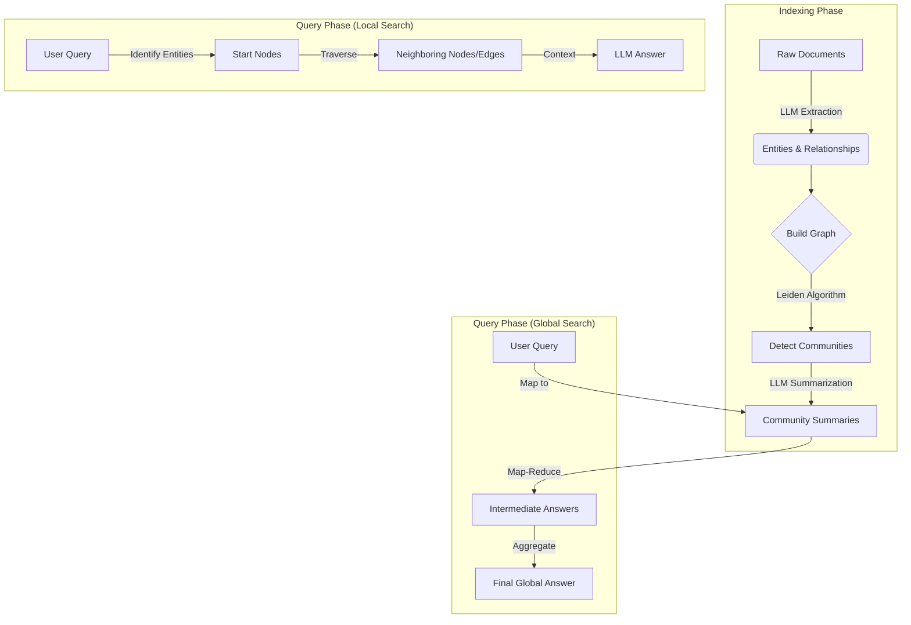

# GraphRAG (Retrieval Augmented Generation with Knowledge Graphs)

## 1. Latest Context
**Validation**: As of late 2024 and early 2025, **GraphRAG** has emerged as a dominant trend in AI Engineering, spearheaded by Microsoft Research's open-source release. It addresses the critical "Global Search" limitation of standard RAG systems.
- **Trend Source**: Trending on GitHub (Microsoft/GraphRAG), heavily discussed in "The Batch" (DeepLearning.AI), and a top topic on Hacker News and arXiv.
- **Significance**: It marks the shift from "Semantic Search" (Vector Databases) to "Structured Reasoning" (Knowledge Graphs + Vectors), enabling LLMs to answer broad questions like "What are the main themes in this entire dataset?" which standard RAG fails to answer effectively.

## 2. What / Why / How

### **What is it?**
GraphRAG is a pipeline that enhances Retrieval Augmented Generation (RAG) by projecting raw text into a **Knowledge Graph**. It extracts entities (people, places, concepts) and their relationships, clusters them into communities, and summarizes those communities.

### **Why do we need it?**
**Naive RAG** (Standard RAG) relies on vector similarity. If you ask, "What are the main conflicts in this story?", a Vector DB retrieves specific chunks mentioning "conflict".
- **The Failure Mode**: Naive RAG struggles with **"Global Questions"** (Q&A over the whole corpus) because the answer isn't in one chunk—it's synthesized from connecting many dots across the dataset.
- **The GraphRAG Solution**: By pre-summarizing "communities" of related entities, GraphRAG can answer high-level questions by "reading" the structure of the data, not just matching keywords.

### **How does it work?**
1.  **Index Phase**: LLM extracts entities/relationships -> Builds a Graph -> Detects Communities (Leiden Algorithm) -> Summarizes each Community.
2.  **Query Phase**:
    - **Global Search**: Aggregates community summaries to answer broad questions.
    - **Local Search**: Traverses neighbors of specific entities for detailed questions.

## 3. Use Cases
1.  **Intelligence Analysis**: "Identify all threat actors and their connected financial networks in these 10,000 reports."
2.  **Scientific Discovery**: "What are the overarching themes in these 500 medical papers regarding protein folding?"
3.  **Legal Discovery**: "Map out the relationship between Person A and Corporation B across these email dumps."
4.  **Narrative Understanding**: "Summarize the evolution of the main character's political views throughout the book series."

## 4. Real-World Examples
- **Microsoft Research**: Demonstrated GraphRAG on the "Violent Incident Information from News Articles" (VIINA) dataset. Naive RAG failed to summarize "Russia-Ukraine" themes comprehensively, while GraphRAG identified complex, multi-hop geopolitical relationships.
- **Financial Fraud Detection**: Banks use similar Graph+LLM techniques to link "mule accounts" (nodes) via shared phone numbers or IP addresses (edges), which vector search would miss because the accounts aren't "semantically" similar, just "structurally" connected.

## 5. Future Readiness Critique
- **Scalability**: Graph construction is expensive (token heavy). The future lies in **"Lazy GraphRAG"** (building graphs on demand) or hybrid approaches.
- **Adoption**: As Context Windows grow (1M+ tokens), Naive RAG might improve, but GraphRAG remains superior for *reasoning* about structure.
- **Integration**: We will likely see Vector DBs (Pinecone, Weaviate) integrating native Graph capabilities (Graph-Vector Hybrid).

## 6. Evolution & Problem Solved

| Feature | Naive RAG (Baseline) | GraphRAG |
| :--- | :--- | :--- |
| **Data Structure** | Flat list of text chunks (Vectors) | Knowledge Graph (Nodes, Edges) + Communities |
| **retrieval** | Cosine Similarity (Semantic Match) | Graph Traversal + Community Summaries |
| **"Global" Q&A** | ❌ Fails (Retrieves random scattered chunks) | ✅ Excellent (Synthesizes community summaries) |
| **"Local" Q&A** | ✅ Good (Finds specific facts) | ✅ Good (Finds facts + 1-hop connections) |
| **Cost (Indexing)**| ⚡ Low (Embedding only) | 🐢 High (LLM Extraction + Summarization) |

## 7. Deep Dive & Refs

**Key References**:
- **Official Project**: [Microsoft Research GraphRAG](https://www.microsoft.com/en-us/research/project/graphrag/)
- **Code Repository**: [GitHub - microsoft/graphrag](https://github.com/microsoft/graphrag)
- **Paper**: "From Local to Global: A Graph RAG Approach to Query-Focused Summarization" (arXiv:2404.16130)

**Deep Dive Note**: The "Magic" is in the **Hierarchical Community Summaries**. The graph is partitioned into communities (clusters). Level 0 might be the whole dataset, Level 1 divides it into broad topics, Level 2 into sub-topics. GraphRAG generates a summary for *each* community. When you ask a global question, it feeds these summaries (not raw text) to the LLM to generate the answer.

## 8. Architecture / Details

### Core Components
1.  **Source Documents**: The raw text.
2.  **Text Chunks**: Documents split into manageable pieces.
3.  **Element Instances**: Entities (Nodes) and Relationships (Edges) extracted from chunks.
4.  **Element Summaries**: Descriptions of what these nodes/edges represent.
5.  **Graph Communities**: Clusters of highly connected nodes.
6.  **Community Summaries**: High-level descriptions of what each cluster is about.

## 9. Pros / Cons & Industry Usage

### Pros
- **Holistic Understanding**: Can "read" the whole dataset structure.
- **Explainability**: You can trace *why* an answer was given by looking at the specific graph path or community.
- **Completeness**: Reduces "lost in the middle" phenomenon of long contexts.

### Cons
- **Expensive Indexing**: extracting entities from every chunk using an LLM is token-intensive and slow.
- **Complexity**: Harder to maintain than a simple Vector DB.
- **Static**: Graphs are hard to update incrementally (though "Drift Search" and newer updates address this).

### Industry Usage
- **Microsoft**: Core of their "Discovery" agentic platform.
- **Palantir/Government**: Heavy usage of Graph+LLM for intelligence.
- **BioTech**: Drug discovery (Knowledge Graphs of proteins/genes) + LLMs.
