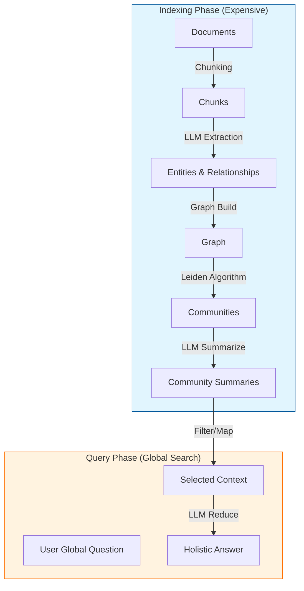

# GraphRAG: From Local Vectors to Global Knowledge

## 1. Latest Context
As of 2024-2025, **GraphRAG** (Graph-based Retrieval Augmented Generation) has exploded as the successor to "Naïve RAG." While standard Vector RAG transformed information retrieval, it hit a hard ceiling: it is excellent at finding *specific needles* in a haystack (Local Search) but terrible at *understanding the haystack itself* (Global Search).

*   **Trending on GitHub**: Microsoft's `graphrag` repository became a top trending project almost immediately upon release.
*   **Engineering Shift**: Teams are realizing that simply increasing context windows (1M+ tokens) doesn't solve the "reasoning over structure" problem.
*   **The "Sense-Making" Gap**: The industry is moving from "Search" (finding facts) to "Sense-Making" (connecting dots), driving the adoption of Knowledge Graphs combined with LLMs.

## 2. What, Why, How

### What is GraphRAG?
GraphRAG is a retrieval method that uses an LLM to extract a **Knowledge Graph** (Entities and Relationships) from source documents *before* any query is asked. It then organizes this graph into hierarchical **Communities** and pre-summarizes them.

When a user asks a question, the system can either:
1.  **Local Search**: Traverse specific nodes for precise answers.
2.  **Global Search**: Use the pre-computed community summaries to answer broad questions like "What are the evolving themes in this dataset?"—a task impossible for Vector RAG.

### Why is it needed?
*   **The "Connecting the Dots" Problem**: Vector databases treat text chunks as independent islands. They cannot see that "Project A" in Document 1 is related to "Incident B" in Document 50 unless they share similar keywords.
*   **Global Summarization**: If you ask a Vector RAG "What is the overall sentiment of these 1000 reviews?", it retrieves the top-k (e.g., 5) reviews and summarizes them, ignoring the other 995. GraphRAG summarizes the *entire structure*.

### How does it work?
1.  **Indexing Phase**:
    *   **Extraction**: An LLM reads text chunks and identifies entities (People, Orgs) and relationships (WorksFor, LocatedIn).
    *   **Clustering**: Algorithms (like Leiden) partition the graph into communities.
    *   **Summarization**: An LLM generates a summary for each community (e.g., "Community 1 deals with payment API issues").
2.  **Query Phase**:
    *   For broad questions, the system aggregates these community summaries rather than raw text chunks, ensuring a holistic answer.

## 3. Use Cases
*   **Intelligence Analysis**: Identifying hidden relationships between bad actors across thousands of reports.
*   **Scientific Discovery**: connecting a protein mentioned in Paper A with a disease mentioned in Paper B.
*   **Legal Discovery**: Understanding the timeline of events across millions of emails.
*   **Enterprise Knowledge**: "What are the top 3 risks facing our supply chain?" (Requires aggregating data from all suppliers, not just the top 5 matches).

## 4. Real-World Examples

### Example 1: The "News Narrative"
In the Microsoft paper, they analyzed news articles about the Russia-Ukraine conflict.
*   **Vector RAG**: When asked "What is the news about?", it returned details about specific battles (top-k chunks).
*   **GraphRAG**: It returned a high-level narrative about the political, military, and economic dimensions by synthesizing community summaries.

### Example 2: Medical Research
A researcher asks: "How does this new drug interact with cardiac conditions?"
*   GraphRAG identifies a "Community" of nodes related to cardiac side effects and another related to the drug's mechanism, synthesizing a path: *Drug -> Inhibits Protein X -> Causes Arrythmia*.

## 5. Future Readiness & Critique
*   **Readiness**: Medium-High. The concepts are solid, but the *indexing cost* is high (lots of LLM calls to build the graph).
*   **Critique**:
    *   **Cost**: Building the graph is expensive (time & money). It moves compute from "Query Time" to "Index Time."
    *   **Maintenance**: Updating the graph when new documents arrive is non-trivial compared to just appending a vector to a DB.

## 6. Evolution & Problem Solved
*   **Problem Solved**: **"Holistic Understanding."** Bridging the gap between specific retrieval and general comprehension.
*   **Evolution**:
    1.  **Keyword Search** (TF-IDF): Exact matches.
    2.  **Vector Search** (Embeddings): Semantic matches (Local).
    3.  **Hybrid Search**: Keywords + Vectors.
    4.  **GraphRAG**: Structured, Global Understanding.

## 7. Deep Dive: The Paper ("From Local to Global")

**Paper**: *"From Local to Global: A Graph RAG Approach to Query-Focused Summarization"* (Microsoft Research)

### 7.1 Key Innovation: The Hierarchy
The paper introduces a pipeline that transforms unstructured text into a hierarchical graph.
*   **Level 0**: Raw Text Chunks.
*   **Level 1**: Entities & Relationships (The Graph).
*   **Level 2**: Root Communities (Clusters of related entities).
*   **Level 3**: Sub-Communities.

### 7.2 The Algorithm (Leiden)
They use the **Leiden Algorithm** to detect communities. Unlike simple K-Means, Leiden optimizes for modularity in networks, ensuring that entities in a "Community" are densely connected.

### 7.3 Map-Reduce for Global Answers
To answer "What are the main themes?", the system:
1.  **Map**: Selects all Community Summaries from a specific level of the hierarchy.
2.  **Reduce**: Feeds these summaries into an LLM context window to generate the final global answer.

## 8. Architecture

## 9. Pros, Cons & Industry Usage

### Pros
*   **Completeness**: Provides answers that cover the *whole* dataset, not just fragments.
*   **Explainability**: You can trace an answer back to specific entities and relationships.
*   **De-hallucination**: Grounding in a graph structure reduces the chance of making up connections.

### Cons
*   **Latency**: Indexing takes a long time. Not suitable for real-time streaming data (yet).
*   **Complexity**: Requires maintaining a Graph DB (Neo4j, NetworkX) alongside a Vector DB.

### Industry Usage
*   **Microsoft**: Integrated into Azure AI Search.
*   **Neo4j**: Pushing "GraphRAG" heavily with their vector + graph capabilities.
*   **LangChain**: Has added GraphRAG implementations (e.g., `LangGraph`).

## 10. References
*   **Paper**: [From Local to Global: A Graph RAG Approach to Query-Focused Summarization (ArXiv)](https://arxiv.org/abs/2404.16130)
*   **Code Repository**: [Microsoft GraphRAG (GitHub)](https://github.com/microsoft/graphrag)
*   **Blog Post**: [GraphRAG: Unlocking LLM discovery on narrative private data](https://www.microsoft.com/en-us/research/blog/graphrag-unlocking-llm-discovery-on-narrative-private-data/)
