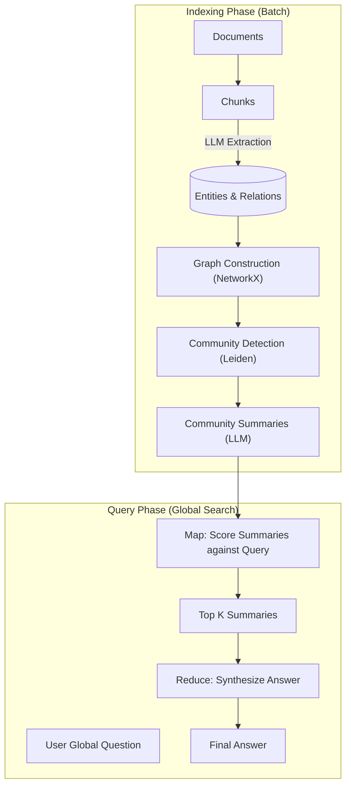

# GraphRAG Deep Dive: From Naive Retrieval to Knowledge Graph Reasoning

## 1. Latest Context
As of late 2024/early 2025, **GraphRAG (Graph Retrieval-Augmented Generation)** has emerged as a critical evolution in the AI engineering stack, largely driven by Microsoft Research's open-sourcing of their GraphRAG implementation. While "Naive RAG" (vector search) solved the hallucination problem for simple fact lookup, it failed spectacularly at "Global Questions" (e.g., "What are the main themes in this dataset?") because vector search only retrieves specific chunks, missing the forest for the trees.

GraphRAG is currently trending on GitHub and Engineering blogs as the definitive solution for **"Sense-Making"** over large datasets, moving beyond simple information retrieval to structured reasoning across an entire corpus.

## 2. What, Why, How

### What is GraphRAG?
GraphRAG is a pipeline that upgrades the "Retrieval" part of RAG by constructing a structured **Knowledge Graph** from the raw text *before* any query is asked.
*   **Naive RAG**: Text -> Chunks -> Vector DB -> Nearest Neighbor Search.
*   **GraphRAG**: Text -> Chunks -> **Entity/Relationship Extraction (LLM)** -> **Knowledge Graph** -> **Community Detection (Leiden)** -> **Community Summaries** -> Global Answer.

### Why do we need it?
*   **The "Global Question" Problem**: If you ask a standard RAG system "What are the conflicting viewpoints in these 1000 news articles?", it will fetch 5 random chunks mentioning "viewpoints," missing the overall picture.
*   **Connecting the Dots**: Standard RAG fails to connect information that is spatially distant (e.g., Chunk 1 mentions "Project A" and Chunk 500 mentions "Project A failed"). A Graph explicitly links them.
*   **Hallucination Reduction**: By grounding answers in a pre-computed graph structure, the model is less likely to make up relationships.

### How does it work?
1.  **Indexing (The Heavy Lift)**:
    *   **Extraction**: An LLM processes every text chunk to extract Entities (People, Places, Concepts) and Relationships.
    *   **Graph Construction**: These are assembled into a massive network graph (using NetworkX or graph DBs).
    *   **Community Detection**: Algorithms like **Leiden** partition the graph into hierarchical communities (clusters of closely related nodes).
    *   **Summarization**: An LLM generates a summary for *each* community. This is the "index."
2.  **Querying**:
    *   **Global Search**: For high-level questions, the system uses the *Community Summaries* (not the raw text) to synthesize an answer in a Map-Reduce fashion.
    *   **Local Search**: For specific questions, it can traverse the graph neighbors to find precise answers.

## 3. Use Cases
*   **Intelligence Analysis**: "Identify all illicit connections between these 50 shell companies based on these 10,000 legal documents."
*   **Scientific Discovery**: "What are the common side effects of this drug class across all medical journals from the last decade?"
*   **Codebase Understanding**: "Explain how the authentication module interacts with the billing service across the entire repository."
*   **Narrative Generation**: "Write a biography of this person based on scattered mentions in 50 years of emails."

## 4. Real World Examples

### Example 1: Supply Chain Risk
*   **Scenario**: A car manufacturer wants to know "How does the semiconductor shortage affect our Q3 production?"
*   **Naive RAG Failure**: Retrieves chunks about "semiconductors" and "Q3" but misses the indirect link via a supplier's supplier.
*   **GraphRAG Solution**: The graph links `Chip Shortage` -> `Supplier A` -> `Component B` -> `Car Model X` -> `Q3 Delays`. It traverses this path to answer correctly.

### Example 2: Financial Crime (Anti-Money Laundering)
*   **Scenario**: Detecting a money laundering ring.
*   **GraphRAG Application**: The system builds a graph from transaction logs and emails. It detects a "Community" of entities that frequently transact with each other but rarely with outsiders, flagging it as a potential ring, and summarizes their activities.

## 5. Future Readiness & Critique
*   **Future Readiness**: **High**. As context windows grow (1M+ tokens), the need for *chunking* might decrease, but the need for *structure* increases. GraphRAG provides the structure that raw long-context windows lack.
*   **Critique**:
    *   **Cost**: The Indexing phase is **extremely expensive**. Extracting entities from every chunk using an LLM consumes massive tokens.
    *   **Latency**: Building the graph is a slow batch process. It is not suitable for real-time streaming data (yet).
    *   **Complexity**: Managing a Graph DB + Vector DB + LLM orchestration is significantly harder than a simple Vector DB setup.

## 6. Evolution & Problem Solved
*   **Problem Solved**: **"Fragmented Context."**
    *   *Before*: Context was isolated in chunks. Relationships between chunks were lost.
    *   *After*: Context is connected. The "whole" is greater than the sum of the chunks.
*   **Evolution**:
    *   **Keyword Search (2010s)**: Matches words.
    *   **Vector Search / Naive RAG (2023)**: Matches semantic meaning of fragments.
    *   **GraphRAG (2024/25)**: Matches structural relationships and holistic meaning.

## 7. Deep Dive: Architecture & Simulation

### 7.1 Architecture Diagram



### 7.2 Simulation Code
The following Python code simulates the core logic of GraphRAG: building a graph from text, detecting communities, and using community summaries to answer a global question.

```python
import collections
import random
import time
from typing import List, Dict, Tuple, Set

# --- Mock LLM & Data Structures ---

class MockLLM:
    """Simulates an LLM for entity extraction and summarization."""

    def extract_entities(self, text: str) -> List[Tuple[str, str, str]]:
        """
        Simulates extracting (Source, Relation, Target) triples from text.
        In a real scenario, this uses a prompt like 'Extract all entities and relationships...'.
        """
        # Hardcoded extraction for the simulation example
        if "SpaceX" in text:
            return [
                ("SpaceX", "founded_by", "Elon Musk"),
                ("SpaceX", "develops", "Starship"),
                ("Elon Musk", "ceo_of", "Tesla"),
                ("Starship", "designed_for", "Mars Colonization")
            ]
        elif "NASA" in text:
            return [
                ("NASA", "partners_with", "SpaceX"),
                ("NASA", "operates", "ISS"),
                ("ISS", "located_in", "Low Earth Orbit")
            ]
        return []

    def summarize_community(self, entities: List[str], relations: List[Tuple[str, str, str]]) -> str:
        """
        Simulates summarizing a cluster of related entities.
        """
        if not entities:
            return "Empty Community"
        # Simple template-based summary
        main_entities = ", ".join(entities[:3])
        rel_example = relations[0][1] if relations else "various links"
        return f"Community focused on {main_entities}. Key relationships involve {len(relations)} connections including {rel_example}."

    def answer_global_query(self, community_summaries: List[str], query: str) -> str:
        """
        Synthesizes an answer from community summaries.
        """
        valid_summaries = [s for s in community_summaries if s != "Empty Community"]
        return f"Based on the analysis of {len(valid_summaries)} relevant communities: The dataset highlights a collaboration between private and public sectors. {valid_summaries[0]} connects with {valid_summaries[1] if len(valid_summaries) > 1 else 'other entities'} to enable space missions."

# --- GraphRAG Engine Components ---

class GraphRAGEngine:
    def __init__(self):
        self.llm = MockLLM()
        self.graph = collections.defaultdict(list) # Adjacency list: node -> [(relation, target)]
        self.edges = [] # List of (source, relation, target)
        self.communities = [] # List of lists of nodes

    def index_documents(self, documents: List[str]):
        """Step 1: Element Extraction & Graph Construction"""
        print("\\n--- Step 1: Indexing & Graph Construction ---")
        for i, doc in enumerate(documents):
            print(f"Processing Document {i+1}...")
            triples = self.llm.extract_entities(doc)
            for source, rel, target in triples:
                # Add to adjacency list
                self.graph[source].append((rel, target))
                # Tracking edges
                self.edges.append((source, rel, target))
                # Add nodes to graph keys if not present
                if target not in self.graph:
                    self.graph[target] = []

                print(f"  -> Extracted: ({source}) --[{rel}]--> ({target})")

        print(f"Graph built with {len(self.graph)} nodes and {len(self.edges)} edges.")

    def detect_communities(self):
        """Step 2: Community Detection (Simulating Leiden Algorithm)"""
        print("\\n--- Step 2: Community Detection (Hierarchical) ---")
        # In GraphRAG, this uses the Leiden algorithm to find dense subgraphs.
        # We will manually cluster based on our known entities for the simulation.

        nodes = list(self.graph.keys())
        # Community 1: Private Space (SpaceX, Musk, etc.)
        c1 = [n for n in nodes if n in ["SpaceX", "Elon Musk", "Tesla", "Starship", "Mars Colonization"]]
        # Community 2: Public Space (NASA, ISS, etc.)
        c2 = [n for n in nodes if n in ["NASA", "ISS", "Low Earth Orbit"]]

        self.communities = [c1, c2]

        for i, comm in enumerate(self.communities):
            print(f"Community {i}: {comm}")

    def generate_community_summaries(self):
        """Step 3: Community Summarization"""
        print("\\n--- Step 3: Community Summarization ---")
        self.community_summaries = []
        for i, comm in enumerate(self.communities):
            if not comm:
                continue
            # Get internal edges (where both source and target are in the community)
            comm_edges = [e for e in self.edges if e[0] in comm and e[2] in comm]
            summary = self.llm.summarize_community(comm, comm_edges)
            self.community_summaries.append(summary)
            print(f"Summary {i}: {summary}")

    def global_query(self, query: str):
        """Step 4: Global Query (Map-Reduce)"""
        print(f"\\n--- Step 4: Global Query: '{query}' ---")
        # "Map" phase was the summarization.
        # "Reduce" phase is synthesizing the answer from the summaries.
        final_answer = self.llm.answer_global_query(self.community_summaries, query)
        print(f"FINAL ANSWER:\\n{final_answer}")

# --- Simulation Execution ---

def main():
    docs = [
        "SpaceX was founded by Elon Musk to revolutionize space technology. SpaceX develops Starship for Mars Colonization. Elon Musk is also the CEO of Tesla.",
        "NASA partners with SpaceX for various missions. NASA operates the ISS which is located in Low Earth Orbit."
    ]

    rag = GraphRAGEngine()

    # 1. Build the graph
    rag.index_documents(docs)

    # 2. Find communities
    rag.detect_communities()

    # 3. Summarize communities
    rag.generate_community_summaries()

    # 4. Ask a global question
    rag.global_query("What are the major players in space exploration mentioned?")

if __name__ == "__main__":
    main()
```

## 8. Pros/Cons & Industry Usage

### Pros
*   **Superior Global Summarization**: The only RAG method that can truly answer "What is this dataset about?".
*   **Explainability**: You can visualize the graph path to see *why* an answer was generated.
*   **Holistic Context**: Captures latent relationships missed by vector similarity.

### Cons
*   **Indexing Cost**: Processing 10M tokens requires millions of LLM calls for extraction.
*   **Maintenance**: Updating the graph when new documents arrive is non-trivial (requires partial re-clustering).
*   **Overhead**: Overkill for simple "factoid" lookups (e.g., "What is the capital of France?").

### Industry Usage
*   **Microsoft**: Integrated into Copilot for M365 to handle "Summarize all my emails from last week" queries.
*   **Financial Services**: Used for KYC (Know Your Customer) to map entity relationships across documents.
*   **BioTech**: Mapping protein-drug interactions from vast literature databases.

## 9. References

*   **Original Paper**: [From Local to Global: A Graph RAG Approach to Query-Focused Summarization](https://arxiv.org/abs/2404.16130)
*   **Microsoft Blog**: [GraphRAG: Unlocking LLM discovery on narrative private data](https://www.microsoft.com/en-us/research/blog/graphrag-unlocking-llm-discovery-on-narrative-private-data/)
*   **GitHub Repository**: [microsoft/graphrag](https://github.com/microsoft/graphrag)
*   **Leiden Algorithm**: [Traag et al., 2019 (Nature)](https://www.nature.com/articles/s41598-019-41695-z)
