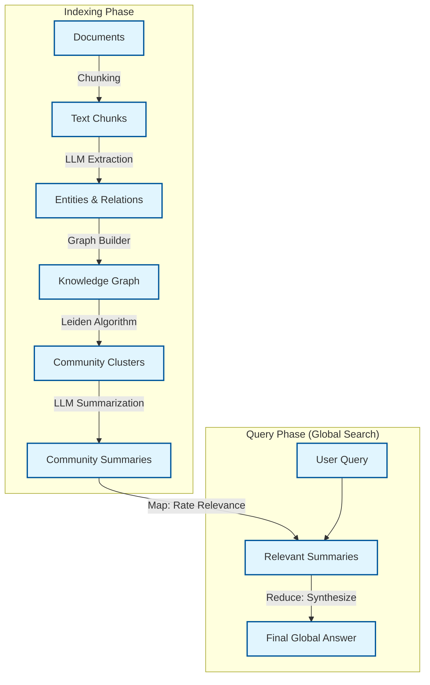

# GraphRAG: From Local to Global Context

## 1. Latest Context & Trends
**Trend:** **Structured Retrieval (GraphRAG)**
In 2024/2025, the AI engineering focus shifted from "Naive RAG" (vector similarity) to "Structured RAG". While Vector Databases revolutionized search, they suffer from a critical flaw: they treat data points in isolation. They struggle with "Global Questions" like "What are the evolving themes in this dataset?" or "How does X indirectly influence Y?".

**Buzz:** Microsoft Research released **GraphRAG**, a framework that combines Knowledge Graphs with LLMs to solve this. It is currently a top trending repository on GitHub and a subject of intense discussion in the AI engineering community (e.g., Hacker News, LinkedIn). It bridges the gap between *Retrieval* and *Reasoning*.

## 2. What, Why, How?

### What is it?
GraphRAG is a retrieval architecture that constructs a Knowledge Graph from unstructured text *before* any query is asked. It uses LLMs to extract entities (Nodes) and relationships (Edges), clusters them into communities, and pre-generates summaries for those communities.

### Why do we need it?
Standard Vector RAG fails at **"Connecting the Dots"**.
*   **The Vector Problem:** If you ask, "How does the policy change affect the supply chain?", a vector search finds chunks about "policy" and "supply chain" separately. It might miss the intermediate chunk about "tariffs" that connects them.
*   **The Graph Solution:** GraphRAG traverses the path `Policy -> Tariffs -> Materials -> Supply Chain`, retrieving the full context even if the endpoints are semantically distant in vector space.

### How does it work?
1.  **Extraction:** An LLM reads text chunks and outputs structured tuples (Source, Relation, Target).
2.  **Graph Construction:** These tuples form a NetworkX/Neo4j graph.
3.  **Community Detection:** Algorithms (like Leiden) partition the graph into hierarchical clusters (e.g., specific topics -> broad themes).
4.  **Summarization:** An LLM summarizes each cluster (Community Summaries).
5.  **Query (Map-Reduce):**
    *   **Local Search:** For specific questions, traverse neighbors.
    *   **Global Search:** For broad questions, the LLM reads the *Community Summaries* (Map) and synthesizes a final answer (Reduce).

## 3. Use Cases
*   **Intelligence Analysis:** "Identify all indirect relationships between Suspect A and the offshore accounts." (Requires multi-hop reasoning).
*   **Medical Research:** "How does Protein X potentially affect Disease Y based on all cited papers?" (Connecting disjoint studies).
*   **Legal Discovery:** "What is the timeline of events leading to the breach?" (Chronological and causal linking).
*   **Enterprise Search:** "What are the top 3 complaints across all support tickets this year?" (Global summarization).

## 4. Real-World Example: Financial Fraud Ring
*   **Scenario:** A bank wants to find a fraud ring.
*   **Vector RAG:** Finds similar transaction amounts or names. It misses the ring because the fraudsters don't "look" similar; they are *linked* by shared metadata (e.g., same phone number used 3 hops away).
*   **GraphRAG:**
    1.  Extracts entities: Person A, Phone B, Address C, Company D.
    2.  Builds Graph: `Person A -[has]-> Phone B -[used_by]-> Person E -[owns]-> Company D`.
    3.  Query: "Find suspicious networks."
    4.  Result: Detects the connected component despite no direct similarity between Person A and Person E.

## 5. Future Readiness Critique
*   **Context Windows:** As context windows grow (1M+ tokens), some argue "Just put it all in context." However, **reasoning over graph structures** is often superior to "haystack" search because the structure *is* the reasoning path.
*   **Hybrid RAG:** The future is likely **Hybrid**: Vector for precision + Graph for context/reasoning + SQL for structured data.

## 6. Evolution & Problem Solved
*   **Gen 1: Keyword Search (Elasticsearch):** Matches exact words. No semantic understanding.
*   **Gen 2: Vector RAG (Pinecone/Weaviate):** Matches meaning/semantics. Fails at multi-hop/global context.
*   **Gen 3: GraphRAG (Neo4j/Microsoft):** Matches *relationships* and *structure*. Solves the "Global Context" and "Reasoning" problem.

## 7. Deep Dive & References

### The Paper
**Title:** "From Local to Global: A Graph RAG Approach to Query-Focused Summarization" (Microsoft Research)
**Key Insight:** The paper introduces a "Global Search" method. Instead of retrieving K chunks, it uses the graph's community summaries to answer queries that span the entire dataset. This beats naive RAG on "sense-making" tasks.

### References
*   **Paper:** [Microsoft Research: From Local to Global](https://arxiv.org/abs/2404.16130)
*   **GitHub:** [microsoft/graphrag](https://github.com/microsoft/graphrag)
*   **Blog:** [Microsoft Blog: GraphRAG Announcement](https://www.microsoft.com/en-us/research/blog/graphrag-unlocking-llm-discovery-on-narrative-private-data/)

## 8. Architecture Details

## 9. Pros, Cons & Industry Usage

| Feature | Pros | Cons |
| :--- | :--- | :--- |
| **Global Context** | Can answer "summary" questions impossible for Vector RAG. | Expensive Indexing (LLM calls for every chunk). |
| **Traceability** | You can see the graph path (A -> B -> C). | High Latency (Graph traversal/Map-Reduce is slower). |
| **Accuracy** | Reduces hallucinations by grounding in structured facts. | Complexity (Requires maintaining a Graph DB or structure). |

**Industry Usage:**
*   **Microsoft:** Copilot interactions with enterprise data.
*   **Palantir:** Long-standing use of graph-based intelligence.
*   **Financial Tech:** Anti-money laundering (AML) systems.
