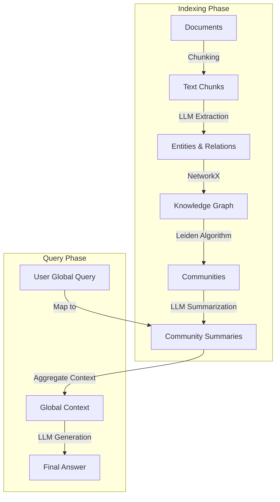

# GraphRAG Deep Dive: From Local to Global

## 1. Latest Context
**Validation**:
- **Microsoft Research**: Released "From Local to Global" paper and the `graphrag` library on GitHub.
- **Trend**: As Enterprise RAG moves to production, the "context window" limit and "retrieval blindness" of standard Vector Search are becoming major bottlenecks for complex "sense-making" tasks.
- **Industry Signal**: Major adoption in Financial Analysis, Intelligence, and Scientific Research where "connecting the dots" across thousands of documents is more important than finding a specific keyword.

## 2. What / Why / How

### What is GraphRAG?
**GraphRAG** (Retrieval-Augmented Generation with Graphs) is a methodology that advances RAG beyond simple vector similarity. Instead of just chunking text and embedding it, GraphRAG uses an LLM to build a **Knowledge Graph** (Nodes = Entities, Edges = Relationships) from the source documents. It then uses community detection algorithms to cluster the graph into semantic "communities" and generates summaries for each community.

### Why do we need it? (The Problem with Baseline RAG)
Standard RAG (Vector Search) excels at **Local Questions**:
- *Query*: "What are the specs of the iPhone 15?"
- *Mechanism*: Find chunk -> Return Answer. Works great.

Standard RAG fails at **Global Questions**:
- *Query*: "What are the major themes in these 5,000 tech support logs?"
- *Mechanism*: Vector search looks for the word "themes" or "logs", fails to aggregate data across the entire dataset. It cannot "read" the whole dataset to summarize it because of context limits.

### How it Works (The "Map-Reduce" of RAG)
1.  **Extract**: LLM identifies entities (people, places, concepts) and relationships from text chunks.
2.  **Build Graph**: Construct a global knowledge graph.
3.  **Cluster**: Use algorithms like **Leiden** to find "communities" (dense clusters of related nodes).
4.  **Summarize (Map)**: An LLM generates a summary for every community (e.g., "Community 4 talks about Database Latency issues").
5.  **Query (Reduce)**: When a user asks a global question, the system aggregates the *community summaries* (not raw chunks) to generate a holistic answer.

## 3. Use Cases
- **Intelligence Analysis**: "How do these 10,000 intercepted messages relate to 'Project X'?" (Connecting hidden dots).
- **Codebase Understanding**: "How does the payment module interact with the legacy user database?" (Understanding dependencies).
- **Medical Research**: "What is the consensus across these 500 papers regarding side effects of Drug Y?"
- **Legal Discovery**: "What is the timeline of events across all these emails?"

## 4. Real-World Example: "The Detective's Board"
Imagine a detective trying to solve a crime using a room full of witness statements.
- **Vector Search**: The detective searches for the keyword "Gun". They find 3 statements mentioning a gun. They miss the motive.
- **GraphRAG**: The detective builds a "string board" on the wall. They connect "Suspect A" to "Location B" to "victim C". They notice a cluster of nodes around "Money Laundering" that never explicitly mentions the murder but explains the *why*.

## 5. Future Readiness Critique
- **Current State**: GraphRAG is expensive. Indexing requires running an LLM over *every* chunk to extract entities.
- **Future**: We will see "Hybrid RAG" becoming standard—using cheap Vector Search for specific facts and expensive Graph Indices for complex reasoning.
- **Evolution**: Graphs will become dynamic, updating in real-time as new data flows in, rather than requiring full re-indexing.

## 6. Evolution & Problem Solved
| Generation | Technology | Solved Problem | Remaining Limitation |
| :--- | :--- | :--- | :--- |
| **Gen 1** | **Keyword Search** (BM25) | Exact matches | Misses synonyms/context. |
| **Gen 2** | **Vector Search** (RAG) | Semantic similarity | Misses global structure/reasoning. |
| **Gen 3** | **GraphRAG** | **Global Structure & Reasoning** | High indexing cost & latency. |

## 7. Deep Dive & Refs

### The Paper: "From Local to Global"
- **Title**: *From Local to Global: A Graph RAG Approach to Query-Focused Summarization*
- **Authors**: Microsoft Research
- **Key Finding**: On "sense-making" tasks, GraphRAG consistently outperforms baseline RAG in **comprehensiveness** and **diversity** of answers. It is comparable to using an infinite context window but cheaper than passing *all* text to an LLM every time.

### References
- [Microsoft GraphRAG Project Page](https://microsoft.github.io/graphrag/)
- [ArXiv Paper](https://arxiv.org/abs/2404.16130)
- [LangChain Graph implementations](https://python.langchain.com/docs/integrations/graphs/)

## 8. Architecture / Details

## 9. Pros / Cons & Industry Usage

### Pros
- **Holistic Understanding**: Can answer "Who," "Why," and "How" better than "What."
- **Explainability**: You can trace the answer back to specific nodes and relationships in the graph.
- **Hallucination Reduction**: Grounded in structured relationships, preventing the LLM from inventing connections.

### Cons
- **Indexing Cost**: Extremely token-intensive. You pay to "read" the whole dataset during indexing.
- **Complexity**: Managing graph databases (Neo4j, NetworkX) is harder than managing Vector DBs (Pinecone, Milvus).

### Industry Usage
- **Microsoft**: Core component of Copilot for Security and Azure AI Search.
- **Palantir**: Long-standing user of Knowledge Graphs for intelligence, now augmenting with LLMs.
- **Neo4j**: Adding vector search to graphs (GraphRAG support) to capture this market.

## 10. Simulation
A Python simulation of the GraphRAG pipeline is available in this directory:
`graphrag_simulation.py`

Run it to see how GraphRAG connects "isolated" errors to find a root cause that Vector Search misses.
