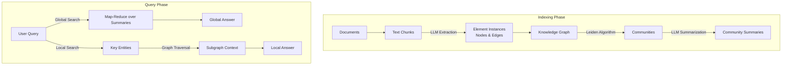

# GraphRAG (Graph-based Retrieval Augmented Generation)

## 1. Latest Context
**Date:** March 2025
**Trend:** The Shift from "Naive RAG" to "Reasoning RAG".

As of March 2025, the AI Engineering industry is actively moving beyond standard Vector-based Retrieval Augmented Generation (RAG). While Vector RAG excels at finding specific facts ("needle in a haystack"), it fails significantly at **"global reasoning"**—answering questions that require traversing multiple documents to understand a high-level theme or relationship ("connecting the dots").

Tools like **Microsoft's GraphRAG**, **RAGFlow**, and **LlamaIndex's Property Graph** are trending because they solve this "reasoning gap" by combining the semantic search of vectors with the structural rigor of **Knowledge Graphs (KGs)**. This represents a maturation of GenAI architectures from stochastic retrieval to structured knowledge traversal.

## 2. What, Why, How

### What is it?
GraphRAG is an architectural pattern that enhances LLM context by structuring retrieved data as a **Knowledge Graph** (nodes and edges) rather than just a flat list of text chunks. It uses LLMs to extract entities (e.g., People, Places, Concepts) and their relationships during indexing, creating a structured map of the corpus.

### Why is it needed?
Standard RAG relies on vector similarity. If you ask, *"What are the main themes in this dataset?"*, a Vector RAG system will retrieve the top-k most similar chunks to the word "themes"—which is often useless. It lacks a "global view."
GraphRAG enables **Global Search**: it can iterate over communities of nodes in the graph to generate summaries, effectively "reading" the entire dataset structure to answer high-level questions.

### How does it work?
1.  **Indexing (The Heavy Lift):**
    *   **Text Chunking:** Source documents are split.
    *   **Extraction:** An LLM processes every chunk to identify Entities (Nodes) and Relationships (Edges).
    *   **Graph Construction:** These are assembled into a global graph.
    *   **Community Detection:** Algorithms (like Leiden) cluster related nodes into hierarchical "communities".
    *   **Community Summarization:** An LLM generates a summary for every community.
2.  **Querying:**
    *   **Local Search:** For specific questions, traverse the graph from relevant entities.
    *   **Global Search:** For broad questions, aggregate the pre-computed community summaries to generate a holistic answer.

## 3. Use Cases
*   **Intelligence & Investigation:** connecting disparate clues across thousands of reports to find a hidden criminal network.
*   **Supply Chain Risk:** Understanding how a strike in one country affects a component supplier in another (multi-hop dependency).
*   **Scientific Discovery:** Linking proteins, drugs, and diseases across millions of papers to find novel interactions.
*   **Legal Discovery:** Mapping relationships between entities across vast email corpuses.

## 4. Real-World Examples
*   **Microsoft Research GraphRAG:** The reference implementation demonstrated that on the "Violent Confusion" dataset, GraphRAG could answer "What are the communities doing?" while baseline RAG failed completely.
*   **Financial Market Analysis:** A hedge fund uses GraphRAG to map relationships between subsidiary companies, news events, and stock tickers. A query like *"How does the drought in Brazil impact our Tech portfolio?"* works because the graph links *Drought -> Coffee Prices -> Brazil Economy -> Tech Consumer Spending*.

## 5. Future Readiness Critique
GraphRAG is **High Readiness** for enterprise but comes with **High Cost**.
*   **Scalability:** The indexing phase is computationally expensive (LLM calls for every chunk).
*   **Maintenance:** keeping the graph updated as new documents arrive is harder than updating a vector index.
*   **Integration:** It paves the way for **Neurosymbolic AI**, combining neural intuition (LLMs) with symbolic logic (Graphs).

## 6. Evolution & Problem Solved
*   **Generation 1 (2023):** Naive RAG (Chunk -> Embed -> Retrieve). *Problem: Hallucinations, missed context.*
*   **Generation 2 (2024):** Advanced RAG (Reranking, Hybrid Search). *Problem: Still limited to local context window.*
*   **Generation 3 (2025):** GraphRAG / Agentic RAG. *Problem Solved: Global Context and Multi-hop Reasoning.*

GraphRAG explicitly solves the **"Global Question"** problem—queries that require aggregating information from the entire dataset rather than a specific section.

## 7. Deep Dive & References
*   **Paper:** ["From Local to Global: A Graph RAG Approach to Query-Focused Summarization"](https://arxiv.org/abs/2404.16130) (Microsoft Research).
*   **GitHub:** [microsoft/graphrag](https://github.com/microsoft/graphrag)
*   **Blog:** [Microsoft Research Blog on GraphRAG](https://www.microsoft.com/en-us/research/blog/graphrag-unlocking-llm-discovery-on-narrative-private-data/)
*   **Comparison:** [RAG vs GraphRAG](https://memgraph.com/blog/rag-vs-graphrag)

## 8. Architecture & Details

### Key Technical Components
1.  **Leiden Algorithm:** Used for hierarchical community detection. It groups nodes that are densely connected.
2.  **Element Summaries:** Instead of keeping raw text, GraphRAG often generates summaries of the entities and edges to compress context.
3.  **Map-Reduce Prompting:** For global queries, the system maps the query across all community summaries and reduces the partial answers into a final report.

## 9. Pros, Cons & Industry Usage

| Feature | Naive RAG | GraphRAG |
| :--- | :--- | :--- |
| **Retrieval Mechanism** | Vector Similarity (k-NN) | Graph Traversal + Community Maps |
| **Context Window** | Limited to top-k chunks | Theoretically infinite (via summarization) |
| **Indexing Cost** | Low (Embedding only) | High (LLM Extraction per chunk) |
| **Latency** | Low (ms) | High (seconds/minutes for Global Search) |
| **Best For** | "What is the capital of X?" | "How does theme X relate to theme Y?" |

**Industry Usage:**
Increasingly adopted in **Financial Services** (KYC/AML graph analysis), **Pharma** (Drug Discovery), and **Government Intelligence**. It is currently the standard for "heavy duty" knowledge management where accuracy and breadth trump speed.
