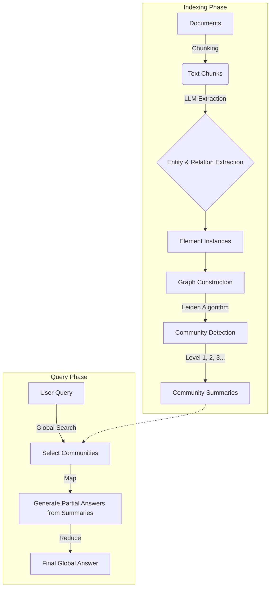

# GraphRAG (Graph Retrieval-Augmented Generation)

## 1. Latest Context
In recent months, the AI engineering community has seen a significant shift from "Naive RAG" (vector-based retrieval) to **Structured RAG**. The catalyst for this trend was Microsoft Research's release of **GraphRAG**, a modular graph-based Retrieval-Augmented Generation (RAG) system. It trended heavily on GitHub (reaching thousands of stars in days) and Hacker News, addressing a critical flaw in standard RAG: the inability to answer "global" questions that require understanding the *entire* dataset rather than just specific chunks.

## 2. What, Why, How

### What
GraphRAG is a pipeline that transforms unstructured text into a knowledge graph. It extracts "Entities" (nodes) and "Relationships" (edges), organizes them into hierarchical "Communities", and pre-generates summaries for each community. When a user queries the system, it uses these summaries to provide a holistic answer.

### Why
**The "Global Understanding" Problem**: Standard RAG (Vector Search) is excellent at fetching specific facts ("What is the revenue in Q3?"). However, it fails at global reasoning ("What are the major themes in these 500 documents?").
*   **Vector RAG**: Retrieves top-k chunks. If the answer requires connecting dots across 50 chunks, it fails (Context Window limits & "Lost in the Middle").
*   **GraphRAG**: Pre-computes the "connective tissue" of the data, allowing the LLM to reason over the *structure* of the information.

### How
The process involves two main phases:
1.  **Indexing (The Heavy Lifting)**:
    *   **Extraction**: An LLM processes raw text to identify entities (People, Places, Concepts) and their relationships.
    *   **Graph Construction**: Builds a graph where nodes are entities and edges are relationships.
    *   **Community Detection**: Uses algorithms (like Leiden) to cluster related nodes into hierarchical communities.
    *   **Summarization**: Generates summaries for each community (e.g., "Community 1 focuses on the Legal dispute between Company A and B").
2.  **Querying**:
    *   **Global Search**: For high-level questions, it aggregates community summaries relevant to the query (Map-Reduce).
    *   **Local Search**: For specific questions, it traverses the graph to find connected entities.

## 3. Use Cases
*   **Intelligence Analysis**: Connecting disparate intelligence reports to find hidden networks or patterns that no single report mentions.
*   **Medical Research**: Identifying relationships between drugs, symptoms, and proteins across thousands of papers.
*   **Legal Discovery**: Mapping out the relationship network of individuals and organizations in a massive corpus of emails.
*   **Complex Q&A**: Answering "How has the narrative around 'Climate Change' evolved in this news archive over 10 years?"

## 4. Real-World Examples
*   **Microsoft Research Podcast Analysis**: Microsoft demonstrated GraphRAG on podcast transcripts. While vector RAG could find specific quotes, GraphRAG could answer "What are the conflicting viewpoints on AI safety discussed across all episodes?" by synthesizing community summaries.
*   **Supply Chain Risk**: A manufacturing firm uses GraphRAG to map supplier news. If "Factory A" has a fire (Doc 1) and "Factory A" supplies "Component B" (Doc 2), and "Product C" needs "Component B" (Doc 3), GraphRAG can infer the risk to "Product C", whereas vector RAG might miss the multi-hop connection.

## 5. Future Readiness Critique
GraphRAG is currently "Read-Heavy, Write-Expensive".
*   **Readiness**: High. It solves a real bottleneck in Enterprise RAG.
*   **Critique**: The indexing phase is extremely expensive (LLM calls to extract entities from *every* chunk). It is not yet suitable for real-time streaming data due to the need for graph re-clustering.
*   **Prediction**: Future iterations will likely use smaller, specialized models (SLMs) for entity extraction to reduce costs, and "Dynamic Graph" algorithms for incremental updates.

## 6. Evolution & Problem Solved
*   **Gen 1 (Naive RAG)**: Chunk -> Embed -> Vector DB -> Retrieve Top-K. (Problem: Missing Context, Hallucination on broad queries).
*   **Gen 2 (Hybrid RAG)**: Vector + Keyword Search + Re-ranking. (Problem: Still focused on local retrieval).
*   **Gen 3 (GraphRAG)**: Structure-aware retrieval. Solves the "Reasoning across the dataset" problem by physically materializing the connections.

## 7. Deep Dive & Refs

### Key Papers & Resources
*   **Paper**: [From Local to Global: A Graph RAG Approach to Query-Focused Summarization](https://arxiv.org/abs/2404.16130)
*   **GitHub Repository**: [microsoft/graphrag](https://github.com/microsoft/graphrag)
*   **Blog Post**: [Microsoft Research Blog: GraphRAG](https://www.microsoft.com/en-us/research/blog/graphrag-unlocking-llm-discovery-on-narrative-private-data/)

### Core Concepts
*   **Leiden Algorithm**: Used for hierarchical community detection (finding dense clusters of nodes).
*   **Hierarchical Summarization**: Creating summaries at different levels of granularity (Root -> Level 1 -> Level 2).
*   **Prompt Tuning**: GraphRAG requires domain-specific prompts to extract the *right* kind of entities (e.g., extracting "Proteins" vs "People").

## 8. Architecture

## 9. Pros, Cons & Industry Usage

### Pros
*   **Holistic Answers**: Can answer "What is this dataset about?" which Vector RAG cannot.
*   **Explainability**: You can trace the answer back to specific entity relationships.
*   **Hallucination Reduction**: Grounded in extracted facts/triples.

### Cons
*   **Cost**: Indexing is expensive (tokens per doc).
*   **Latency**: Graph traversals or Map-Reduce over summaries can be slower than a simple ANN search.
*   **Complexity**: Requires maintaining a Graph DB or graph structure, plus a Vector DB.

### Industry Usage
*   **Microsoft**: Integrated into Azure AI Search.
*   **LangChain**: Has started implementing graph-based retrieval patterns.
*   **Neo4j / ArangoDB**: Leveraging GraphRAG trends to promote Graph Databases as the backend for RAG.
