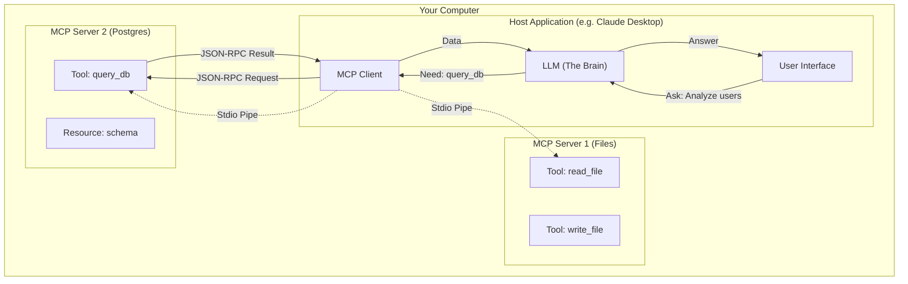

# Model Context Protocol (MCP) Deep Dive: The "USB-C" for AI

## 1. Latest Context
As of early 2025, the AI engineering world is witnessing a massive shift from proprietary, fragmented integration methods (like OpenAI's Function Calling or LangChain's specific tools) to a **universal open standard**: the **Model Context Protocol (MCP)**.

Major players like **Anthropic** (Claude Desktop), **Google Cloud**, **Replit**, and **Zed** have adopted MCP. It is currently trending on GitHub and Hacker News as the definitive solution to the "AI Interoperability" problem. It transforms how AI agents connect to data—moving from "building an integration for every tool" to "building a standard server once, usable by any AI."

## 2. What, Why, How

### What is MCP?
Think of MCP as a **USB-C port for AI applications**.
*   **USB-C**: A standard way to connect a camera, hard drive, or mouse to any computer (Mac, Windows, Linux).
*   **MCP**: A standard way to connect a database, file system, or API service to any AI Model (Claude, GPT-4, Llama).

It is an open protocol (JSON-RPC 2.0 based) that defines how an AI (the Client) discovers and uses resources (Data) and tools (Functions) hosted by a service (the Server).

### Why do we need it?
Before MCP, we had the **MxN Problem**:
*   To connect 3 Models (Claude, GPT, Llama) to 3 Tools (Google Drive, Slack, GitHub), you needed to write **9 different integration scripts**.
*   With MCP, you write **3 MCP Servers** (Drive, Slack, GitHub). Now, *any* MCP-compliant model can connect to them instantly. It reduces complexity from `M * N` to `M + N`.

### How does it work?
MCP uses a **Client-Host-Server** architecture:
1.  **MCP Host**: The application running the AI (e.g., Claude Desktop App, Cursor, or a Python script).
2.  **MCP Client**: The internal component that speaks the protocol (1:1 with the Host usually).
3.  **MCP Server**: A lightweight program that runs locally or remotely, exposing "Tools" and "Resources."
    *   *Example*: A "File System Server" exposes a tool `read_file(path)`.

They communicate via **Stdio** (local pipes) or **SSE** (Server-Sent Events over HTTP).

## 3. Use Cases

*   **Local Data Access**: Letting a cloud LLM (like Claude) safely read and edit files on your local laptop (via a Local File System MCP Server).
*   **Database Querying**: An agent that connects to a generic "Postgres MCP Server" to run SQL queries for data analysis.
*   **DevOps Automation**: Connecting an agent to a "Kubernetes MCP Server" to check pod health and fetch logs.
*   **Context Injection**: Automatically feeding relevant documentation into the prompt (via MCP "Resources") without manual copy-pasting.

## 4. Real World Examples

### Example 1: Claude Desktop & Local Git
*   **Scenario**: You want Claude to fix a bug in your local code.
*   **Old Way**: Copy-paste 10 files into the chat window.
*   **MCP Way**: You run the `git-mcp-server`. Claude Desktop connects to it. You say "Fix the bug in `auth.py`." Claude uses the `git_read_file` tool to pull the content, analyzes it, and proposes a fix.

### Example 2: Replit Agent
*   **Scenario**: Replit's autonomous agent needs to install packages and run code.
*   **Implementation**: Replit exposes the container environment as an MCP Server. The Agent (Client) calls tools like `shell_exec` and `file_write` defined by the protocol, ensuring safe and structured access to the environment.

## 5. Future Readiness & Critique

### Future Readiness: High
*   **Standardization**: MCP is poised to become the *de facto* standard. Learning it now is like learning HTTP in the 90s.
*   **Model Agnostic**: As models churn (OpenAI vs DeepSeek vs Anthropic), your MCP Servers remain valid. You don't need to rewrite your tools when you switch models.

### Critique & Challenges
*   **Security**: Exposing local files and databases to an LLM "brain" (which might be in the cloud) requires robust permissioning. MCP handles this with "Human in the Loop" approval prompts, but the risk remains.
*   **"Another Standard"**: As per [xkcd 927](https://xkcd.com/927/), creating a new standard to unify others often results in just one more standard. However, the backing by Anthropic and open-source momentum suggests this one might stick.
*   **State Management**: MCP is stateless by default. Managing complex, multi-turn state requires careful server design.

## 6. Evolution & Problem Solved

| Era | Method | Problem |
| :--- | :--- | :--- |
| **2023** | **Hardcoded Prompts** | "Paste your CSV here." Limited context window. |
| **2023 Late** | **LangChain/LlamaIndex** | Python-specific glue code. Fragile, not portable across languages. |
| **2024** | **Proprietary Functions** | `openai.functions`. Vendor lock-in. Different schemas for every model. |
| **2025** | **MCP** | Universal JSON-RPC standard. Write once, run anywhere. |

## 7. Deep Dive: Architecture & Protocol

### 7.1 Core Components
*   **Resources**: Passive data sources (like files, logs) that clients can read. Think `GET /logs`.
*   **Prompts**: Pre-defined templates stored on the server. Think "Slash Commands".
*   **Tools**: Executable functions that can take side effects. Think `POST /api`.

### 7.2 Architecture Diagram



## 8. Simulation Code
The following Python code simulates the **core wire protocol** (JSON-RPC 2.0) of MCP. It demonstrates how a Client and Server handshake and execute tools without needing the full SDK.

**File:** `AI Engineering/mcp_simulation.py`

*(See the file in the repository for the executable code)*

### Key Code Snippet (Protocol Logic)

```python
# The essence of MCP is JSON-RPC 2.0
def request(method, params):
    return {
        "jsonrpc": "2.0",
        "method": method,
        "params": params,
        "id": uuid.uuid4()
    }

# Servers expose "Tools" that Clients "Call"
async def handle_message(self, message):
    if message["method"] == "tools/call":
        tool_name = message["params"]["name"]
        # ... execute python function ...
        return {"result": output}
```

## 9. References & Further Reading

*   **Official Spec**: [modelcontextprotocol.io](https://modelcontextprotocol.io)
*   **Anthropic Announcement**: [Building the open standard for AI connectivity](https://www.anthropic.com/news/model-context-protocol)
*   **GitHub Organization**: [github.com/modelcontextprotocol](https://github.com/modelcontextprotocol)
*   **Community Servers**: A growing list of servers for SQLite, Google Drive, Slack, etc., available in the open source ecosystem.
