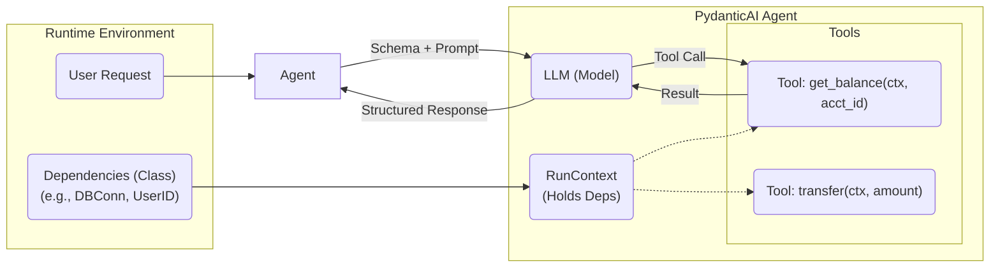

# PydanticAI: The "FastAPI" for GenAI Agents

> **Status:** Trending (Early 2025) 🚀
> **Category:** AI Engineering / Agent Frameworks
> **Core Value:** Type-safe, production-grade agent development with Dependency Injection.

## 1. Latest Context & The "Why"
As of early 2025, the AI engineering landscape is shifting from "prototype-first" (LangChain spaghetti) to "production-first" reliability. **PydanticAI** has emerged as a top trending framework because it leverages the ubiquity of **Pydantic** (used by virtually every Python backend) to bring the "FastAPI experience" to building AI Agents.

*   **The Trend:** Engineers are tired of debugging runtime `KeyError`s in JSON dictionaries returned by LLMs.
*   **The Shift:** A move toward **Structured Generation** and **Type-Safe Tooling**. PydanticAI forces LLM interactions to adhere to strict Python schemas.
*   **Validation:** Featured heavily on Hacker News and endorsed by major production users like **Sophos** and **Boosted.ai** for reducing support burdens and increasing reliability.

## 2. What is PydanticAI?
PydanticAI is a Python agent framework built by the team behind Pydantic. It focuses on three pillars:
1.  **Type Safety:** Uses Python type hints for everything (inputs, outputs, tool arguments).
2.  **Dependency Injection:** A rigorous system for passing runtime context (API keys, DB connections) to agents and tools without global state.
3.  **Model Agnostic:** Works with OpenAI, Anthropic, Ollama, etc., via a unified interface.

### The "FastAPI" Analogy
| Feature | FastAPI (Web) | PydanticAI (Agents) |
| :--- | :--- | :--- |
| **Request Validation** | Validates HTTP JSON body | Validates LLM Output / Tool Args |
| **Dependency Injection** | `Depends()` for DB/Auth | `RunContext` for DB/Auth |
| **Developer Experience** | Autocomplete, Type Checks | Autocomplete, Type Checks |

## 3. Architecture Deep Dive: The Core Loop

The magic of PydanticAI lies in its **Dependency Injection (DI)** system. Unlike other frameworks where you might shove context into a prompt string or a global variable, PydanticAI injects it into tools at runtime.

### Mermaid Architecture

### Key Concept: `RunContext`
When an agent runs, you pass a dependency object (e.g., a dataclass). Every tool the agent has access to can request this object via `RunContext`.
*   **Why?** It makes tools stateless and easy to test. You can mock the context in unit tests.
*   **How?** The framework inspects the tool's signature. If it sees `RunContext`, it injects the current context automatically.

## 4. Real-World Use Cases
1.  **Customer Support Agents (Sophos Case Study):**
    *   **Challenge:** Agents need access to specific user data (order history, subscription status) securely.
    *   **Solution:** PydanticAI injects the `UserContext` into every tool call. The LLM cannot "hallucinate" access to another user's data because the tool logic uses the injected, authenticated context.
2.  **Financial Analysis (Boosted.ai Case Study):**
    *   **Challenge:** Complex multi-step reasoning requiring structured financial data output.
    *   **Solution:** Using Pydantic models to define the exact schema of the financial report. The agent retries automatically if the LLM output fails validation.
3.  **RAG Pipelines:**
    *   Injecting a vector database client as a dependency allows tools to perform semantic searches without hardcoding connection strings.

## 5. Evolution & Problem Solved
*   **Gen 1 (LangChain):** "Chains" of prompts. Flexible but fragile. Hard to debug.
*   **Gen 2 (Assistants API):** Managed state, but vendor lock-in (OpenAI only).
*   **Gen 3 (PydanticAI/Smolagents):** **Code-First Agents**. You write Python functions, the framework handles the LLM wiring.
    *   **Problem Solved:** *Unpredictability.* By enforcing types, PydanticAI turns "prompt engineering" into "software engineering."

## 6. Future Readiness Critique
*   **Pros:**
    *   **Testability:** Best-in-class. Because dependencies are explicit, unit testing agents is trivial.
    *   **Observability:** Integrates natively with `Logfire` (Pydantic's observability tool).
    *   **Safety:** Harder to write insecure code when context is injected rather than concatenated.
*   **Cons:**
    *   **Verbosity:** Requires defining data models for everything. Slower for "quick scripts."
    *   **Learning Curve:** Requires understanding Python type hints and Dependency Injection patterns.
*   **Verdict:** PydanticAI is the future for **Enterprise AI**. For hobbyists, it might be overkill.

## 7. Deep Dive References
*   [PydanticAI Official Docs](https://ai.pydantic.dev/)
*   [GitHub Repository](https://github.com/pydantic/pydantic-ai)
*   *Concepts referenced: Dependency Injection, Structured Generation, Agentic Patterns.*
