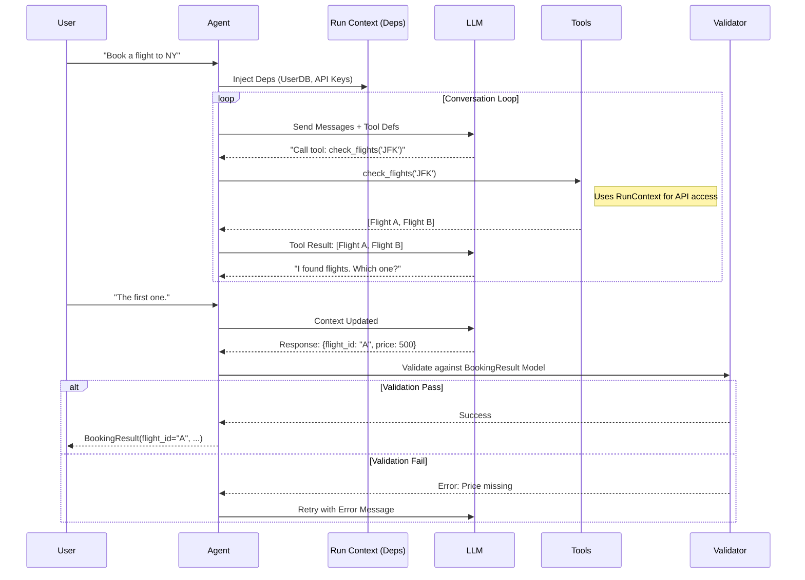

# PydanticAI: The Rise of Type-Safe Agent Engineering

## 1. Latest Context
As of late 2024 and continuing into 2025, the "Agentic AI" landscape has shifted from experimental prototyping to production engineering. While frameworks like LangChain pioneered the space, developers increasingly faced issues with **reliability**, **determinism**, and **debugging**.

**PydanticAI** has emerged as a "Second Generation" framework. Built by the team behind Pydantic (the standard for data validation in Python), it treats Agent Engineering as **Software Engineering**. It moves away from string-based prompt engineering toward **schema-based context engineering**, leveraging the robust type system of Python to ensure that LLM outputs and tool interactions are as reliable as compiled code.

## 2. What, Why, How

### What is PydanticAI?
PydanticAI is a Python Agent Framework designed to build production-grade applications with Generative AI. It is built directly on top of `pydantic`, the most widely used data validation library in Python.
*   **Core Philosophy**: "If it validates, it runs."
*   **The Paradigm**: LLM inputs, outputs, and tool parameters are defined as Pydantic Models. The framework enforces these schemas at runtime.

### Why do we need it?
*   **The "String Soup" Problem**: Traditional agent code often relies on fragile string parsing of LLM outputs. If the LLM misses a comma, the app crashes.
*   **Type Safety**: Developers want their IDEs to autocomplete and type-check agent code just like standard application logic.
*   **Dependency Injection**: Real-world agents need access to database connections, user sessions, and API keys. Global variables are messy; PydanticAI provides a structured way to inject these dependencies safely.

### How does it work?
1.  **Define**: You define an `Agent` and the `ResultType` (a Pydantic model).
2.  **Inject**: You define a `RunContext` (e.g., a dataclass containing a DB connection).
3.  **Execute**: The framework orchestrates the conversation. It creates a system prompt (potentially using the context), sends it to the LLM, and validates the response against the `ResultType`.
4.  **Retry**: If validation fails, PydanticAI feeds the validation error *back* to the LLM, asking it to correct its mistake automatically.

## 3. Use Cases
PydanticAI is best suited for high-reliability internal tools and business-critical workflows.

*   **Structured Data Extraction**: Converting messy emails or PDFs into strict JSON schemas for ERP systems.
*   **Complex User Workflows**: Booking systems where the agent must collect specific fields (Date, Time, Location) and validate them against business logic (Availability) before proceeding.
*   **RAG with Access Control**: Agents that need to query a vector database but must only return results the current user is authorized to see (using injected UserContext).
*   **Form Filling Agents**: An agent that acts as a dynamic frontend, asking clarifying questions until it has enough data to populate a strict Pydantic model.

## 4. Real World Examples

### Example 1: The "Support Triage" Agent
An agent that categorizes support tickets and extracts key metadata.
*   **Input**: "My internet is down and I've tried restarting the router."
*   **Dependency**: `CustomerDatabase` (to check their plan tier).
*   **Output Schema**:
    ```python
    class TicketAction(BaseModel):
        priority: Literal['High', 'Medium', 'Low']
        category: Literal['Connectivity', 'Billing', 'Hardware']
        suggested_reply: str
        escalate_to_human: bool
    ```
*   **Outcome**: The agent *cannot* return a category of "Internet Stuff". It *must* return "Connectivity".

### Example 2: The "SQL Guard"
An agent that writes SQL queries for business users.
*   **Trap**: LLMs often hallucinate table names.
*   **PydanticAI Fix**: The tools provided to the agent use Pydantic models to validate table names against a dynamic enum of *actual* tables in the database *before* the query is even attempted.

## 5. Future Readiness & Critique
*   **Future Readiness**: **High**. As LLMs become commoditized, the differentiator will be the *scaffolding* around them. Structured Output (JSON mode) is becoming native to models (OpenAI, Gemini), and PydanticAI aligns perfectly with this trend.
*   **Critique**: The framework is code-heavy. Unlike "No-Code" builders, it requires strong Python skills. It creates a barrier to entry for non-engineers but raises the ceiling for what engineers can build.

## 6. Evolution & Problem Solving
*   **Problem Solved**: **"The Reliability Gap."**
    *   *Before*: You hoped the LLM gave you JSON. You wrote regex to parse it. You prayed.
    *   *After*: You get a validated Python object, or the framework handles the retry loop for you.
*   **Evolution**:
    *   **Generation 1 (LangChain)**: "Chains" of string prompts. Flexible but fragile.
    *   **Generation 2 (Function Calling)**: Raw API calls. Better, but manual validation required.
    *   **Generation 3 (PydanticAI)**: **Model-Centric Agents**. The Schema is the Prompt.

## 7. Deep Dive: Dependency Injection & Architecture

### 7.1 The Power of `RunContext`
One of PydanticAI's killer features is its type-safe dependency injection.

In many frameworks, tools are defined globally. This makes it hard to pass request-specific data (like `user_id`) to a tool without hacking global state or jamming it into the prompt string.

PydanticAI solves this with `RunContext`.

```python
@agent.tool
async def get_user_balance(ctx: RunContext[DatabaseConn], currency: str) -> float:
    # 'ctx.deps' gives access to the dependencies injected at runtime
    return await ctx.deps.db.fetch_balance(ctx.deps.user_id, currency)
```

This allows you to write tools that are:
1.  **Stateless**: The tool logic doesn't hold state.
2.  **Testable**: You can easily inject a Mock Database connection in your unit tests.
3.  **Secure**: Credentials live in the dependencies, not in the prompt history.

### 7.2 The Validation Loop
PydanticAI implements a robust feedback loop:
1.  **LLM Generation**: Model produces output.
2.  **Pydantic Validation**: Framework validates against the `ResultType` model.
3.  **Success**: Return the object.
4.  **Failure**:
    *   Catch `ValidationError`.
    *   Construct a new user message: "Your response failed validation: Field 'age' must be an integer. Please try again."
    *   Send back to LLM (up to `max_retries`).

## 8. Architecture Diagram



## 9. Pros, Cons & Industry Usage

### Pros
*   **Developer Experience**: If you know Pydantic, you know PydanticAI.
*   **Testing**: First-class support for `TestRunContext` and `capture_run_messages` makes testing agents easy.
*   **Performance**: Lightweight compared to heavy orchestration frameworks.

### Cons
*   **New Ecosystem**: Smaller community than LangChain (for now).
*   **Python Only**: Strictly tied to the Python/Pydantic ecosystem.

### Industry Usage
*   **Data Engineering Teams**: Heavily adopted by teams already using Pydantic for data pipelines (ETL).
*   **FinTech**: Used for building compliance agents where strict output schemas are a legal requirement.
*   **Startups**: Popular with "Vertical AI" companies building specialized agents (e.g., Legal AI, Medical AI) where precision > creativity.

## 10. References & Further Reading
*   **Official Documentation**: [https://ai.pydantic.dev/](https://ai.pydantic.dev/)
*   **GitHub Repository**: [https://github.com/pydantic/pydantic-ai](https://github.com/pydantic/pydantic-ai)
*   **Launch Article**: [Pydantic Logfire & AI Integration](https://pydantic.dev/)
*   **Community Discussions**:
    *   *Reddit (r/Python)*: "Has anyone tried PydanticAI?"
    *   *Hacker News*: Discussions on "Type-safe AI Agents"
