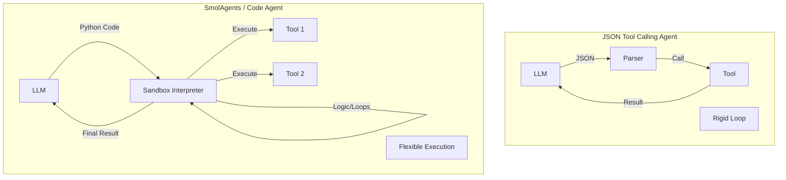

# SmolAgents: The Rise of Code Agents

## 1. Latest Context
As of early 2025, the AI Engineering landscape is witnessing a pivotal shift from **"JSON Tool Calling"** (the dominant paradigm of 2023-2024) to **"Code Agents"**. While frameworks like LangChain and AutoGPT relied on LLMs outputting structured JSON to call functions, this approach struggled with complex reasoning, loops, and multi-step logic.

**SmolAgents**, a library by Hugging Face released in late 2024/early 2025, encapsulates this new paradigm. It is gaining rapid traction on GitHub and in the open-source community because it simplifies agent creation into a "barebones" ~1,000 lines of code library that empowers LLMs to write and execute **Python code** as their primary action space. This trend aligns with the broader industry move towards "Agentic Coding" (e.g., DeepSeek R1, Claude Code) where the model's output is executable logic rather than just structured data.

## 2. What, Why, How

### What are SmolAgents?
**SmolAgents** is a lightweight Python library designed to build agents that "think in code".
*   **The Core**: It provides a `CodeAgent` class that generates Python code blocks to perform actions, rather than selecting from a list of JSON-defined tools.
*   **The Philosophy**: "Code is more expressive than JSON." Instead of convincing an LLM to output valid JSON (which they often fail at), SmolAgents leans into the LLM's strength: writing code.

### Why do we need them?
*   **Expressiveness Gap**: JSON tool calling is rigid. You cannot easily express "search for X, and *for each result*, check Y, then aggregate". You have to chain multiple agent steps. A Code Agent can just write a `for` loop.
*   **Token Efficiency**: Writing a compact Python script often uses fewer tokens than a verbose JSON schema explanation and response.
*   **Debugging**: Debugging a Python script generated by an agent is easier for developers than debugging a failed JSON parse or a hallucinated parameter in a JSON blob.

### How do they work?
1.  **System Prompt**: The agent is given a system prompt that exposes available tools as Python functions (e.g., `search_web(query: str)`).
2.  **Generation**: The LLM generates a reasoning trace followed by a Python code block.
    ```python
    # Agent thought: I need to search for the weather and then convert it.
    results = search_web("weather in Tokyo")
    print(f"The weather is {results}")
    ```
3.  **Execution**: The framework extracts the code block and executes it in a **sandboxed environment** (Local, E2B, or Docker).
4.  **Observation**: The standard output (stdout) or the return value of the code becomes the "observation" passed back to the LLM.

## 3. Use Cases
SmolAgents and the Code Agent paradigm are best for **computational and logic-heavy tasks**:

*   **Data Analysis**: "Load this CSV, filter for rows where column A > 50, and plot the distribution." (A Code Agent can just write pandas code).
*   **Multi-step Research**: "Find the top 3 competitors, visit their pricing pages, and calculate the average subscription cost." (Requires loops and state, perfect for code).
*   **Browser Automation**: Using libraries like `browser-use` or Playwright directly within the generated code to navigate complex DOMs.
*   **Vision-Code Hybrid**: Using VLMs to inspect a UI and writing code to interact with coordinates.

## 4. Real World Examples

### Example 1: The "Data Analyst" Agent
A typical LangChain agent would need a "CSV Tool", a "Plotting Tool", and complex orchestration.
A **SmolAgent** simply gets access to a python environment.
*   **User**: "What is the correlation between sales and temperature in `data.csv`?"
*   **Agent Action**:
    ```python
    import pandas as pd
    df = pd.read_csv('data.csv')
    correlation = df['sales'].corr(df['temperature'])
    print(correlation)
    ```
*   **Result**: The agent acts as a junior data scientist.

### Example 2: The "Hugging Face Hub" Agent
SmolAgents can natively interact with the HF Hub.
*   **Task**: "Find the most downloaded text-to-image model and generate an image of a cat."
*   **Agent Action**: Writes code using `huggingface_hub` client to search, sort by downloads, and then calls the Inference API with the model ID.

## 5. Future Readiness & Critique
*   **Future Readiness**: **Very High**. As models like DeepSeek-Coder-V2 and Claude 3.5 Sonnet become better at coding, the "Code Agent" paradigm will likely supersede JSON tool calling for complex tasks. It aligns with "System 2" thinking (reasoning via computation).
*   **Critique**:
    *   **Security**: Executing LLM-generated code is inherently risky. Sandboxing (e.g., E2B, WASM) is critical. "Local execution" without sandboxing is a major vulnerability.
    *   **Determinism**: Code generation can be flaky. If the agent imports a library that doesn't exist, it crashes. The "Error -> Correction" loop is essential but costs tokens.

## 6. Evolution & Problem Solving
*   **Problem Solved**: **"The Reasoning Bottleneck."**
    *   *Before*: Agents were "Action-Takers" (Pick tool A, then B). They struggled to "Plan" or "Iterate" inside a single step.
    *   *After*: Agents are "Programmers". They can write a plan as a script, handling edge cases and logic control flow *within* the action itself.
*   **Evolution**:
    *   **Gen 1 (2023)**: ReAct (Reason + Act) via text.
    *   **Gen 2 (2024)**: Function Calling (OpenAI JSON mode).
    *   **Gen 3 (2025)**: **Code Agents** (SmolAgents, executable thought).

## 7. Deep Dive: Technical Specification & Architecture

### 7.1 The `CodeAgent` Architecture
The core differentiator is the **Action Space**.

| Feature | JSON Tool Calling (LangChain/OpenAI) | Code Agents (SmolAgents) |
| :--- | :--- | :--- |
| **Output** | JSON Object `{"tool": "search", "args": {...}}` | Python Code `search(query="foo")` |
| **Control Flow** | Hard-coded in the orchestration layer (DAGs) | Dynamic, written by the LLM (loops, ifs) |
| **State** | Passed via context window | Variables in the Python local scope |
| **Complexity** | O(N) chains for N steps | O(1) script for N steps (often) |

### 7.2 References
*   **GitHub Repository**: [https://github.com/huggingface/smolagents](https://github.com/huggingface/smolagents)
*   **Hugging Face Blog**: [https://huggingface.co/blog/smolagents](https://huggingface.co/blog/smolagents)
*   **Concept**: *The Shift from Models to Agents* (Hugging Face ecosystem).

## 8. Details, Trade-offs & Architecture

### Architecture Diagram


### Trade-offs
*   **Safety vs. Power**: Giving an agent a Python interpreter is the ultimate power but the ultimate risk. You cannot easily "allow-list" logic like you can with JSON schemas.
*   **Model Capability**: Requires a model that is good at coding (Claude 3.5 Sonnet, GPT-4o, DeepSeek V3). Smaller/older models struggle to write syntactically correct python on the first try.

## 9. Pros, Cons & Industry Usage

### Pros
*   **Simplicity**: The SmolAgents library is incredibly small and easy to understand.
*   **Universality**: Python is the lingua franca of Data Science and AI.
*   **Modality Agnostic**: Code can handle images, text, and audio objects as variables naturally.

### Cons
*   **Sandboxing Overhead**: You *must* use a sandbox (like E2B or a restricted local scope).
*   **Library Hallucination**: Agents loves to `import` libraries that aren't installed.

### Industry Usage
*   **Hugging Face**: Driving the standard for open-source agents.
*   **Data Science Platforms**: Integrating "Code Interpreter" style agents (like ChatGPT's Advanced Data Analysis) directly into workflows.
*   **E2B**: Providing the sandboxing infrastructure that makes this paradigm safe for production.
