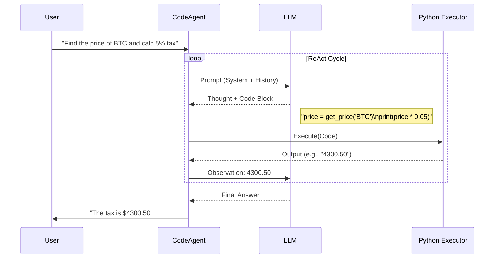

# System Design Deep Dive: Code Agents (Smolagents)

## 1. Latest Context
In late 2024 and early 2025, the AI Engineering landscape saw a significant shift from "JSON-based tool calling" to **"Code Agents"**. This trend was catalyzed by the release of **Smolagents** by Hugging Face (Dec 2024), which quickly garnered over 23,000 GitHub stars. Unlike traditional agents (e.g., LangChain's early implementations) that output structured JSON to call tools, Code Agents write executable Python code. This shift acknowledges a fundamental truth: LLMs are trained on massive amounts of code and reason more effectively in Python than in JSON.

## 2. What, Why, How

### What
**Code Agents** are AI agents that perform actions by generating and executing code (typically Python) rather than outputting structured data (JSON/XML) to be parsed by a controller.

### Why
*   **Expressiveness:** Code allows for loops, conditionals (`if/else`), and variable storage within a single turn. A JSON agent often needs multiple round-trips to perform a loop.
*   **Robustness:** LLMs often make syntax errors in JSON (e.g., trailing commas, missing quotes). They are significantly better at writing syntactically correct Python.
*   **Debugging:** When code fails, the error message (Traceback) provides precise feedback to the LLM for self-correction. JSON parsing errors are often generic.
*   **Composability:** Agents can combine multiple tool outputs using standard programming logic (e.g., `result = tool_a() + tool_b()`).

### How
The agent operates in a **ReAct** (Reason + Act) loop:
1.  **Thought:** The LLM plans the next step.
2.  **Action (Code):** The LLM writes a Python code block (e.g., `print(search_tool("query"))`).
3.  **Execution:** The system extracts the code and runs it in a sandboxed Python interpreter (using `exec()` or a secure container like E2B).
4.  **Observation:** The standard output (`stdout`) or return value is captured and fed back to the LLM.

## 3. Use Cases
*   **Data Analysis:** Uploading a CSV and asking the agent to "plot the sales trend." The agent can write Pandas code to load, process, and visualize the data in one go.
*   **Browser Automation:** Complex web navigation where the agent writes code to interact with DOM elements (e.g., using Playwright or Selenium wrappers).
*   **Complex Math/Logic:** Problems requiring intermediate calculations (e.g., "Calculate the 100th Fibonacci number") are trivial for code agents but hard for pure LLMs.

## 4. Real-World Examples
*   **Hugging Face Smolagents:** A lightweight library (~1k lines of code) enabling agents to write Python code to call tools.
*   **Open Interpreter:** A terminal-based tool that lets LLMs run code on your computer to complete tasks.
*   **CodeAct (Academic):** The research framework that pioneered this approach.

## 5. Future Readiness Critique
The move to Code Agents is likely a **permanent shift** for "Agentic" workflows. As models become better at reasoning, the bottleneck becomes the "actuator" (the interface to the world). Python is a universal actuator. However, it introduces significant **security risks** (Remote Code Execution). Future readiness depends on the adoption of secure, ephemeral sandboxing standards (e.g., WebAssembly, Firecracker microVMs).

## 6. Evolution & Problem Solved
*   **Gen 1 (ReAct Text):** Agents output free text: `Action: Search[Query]`. Hard to parse reliably.
*   **Gen 2 (ToolFormer / Function Calling):** Agents output JSON: `{"tool": "search", "args": {"query": "..."}}`. Better, but verbose and brittle. No logic in the action.
*   **Gen 3 (Code Agents):** Agents output Python: `results = search("..."); if results: ...`. Compact, logical, and robust.

## 7. Deep Dive & Refs

### The Paper: "Executable Code Actions Elicit Better LLM Agents"
*   **Authors:** Wang et al. (University of Illinois Urbana-Champaign, Apple)
*   **Published:** ICML 2024
*   **Key Concept:** **CodeAct**. The authors propose using executable Python code as the unified action space.
*   **Findings:** CodeAct outperforms JSON-based agents by up to **20%** on benchmarks like API-Bank.
*   **Mechanism:** The paper demonstrates that LLMs can "self-debug" effectively when given the Python traceback of a failed execution.

### References
*   📄 **Paper:** [Executable Code Actions Elicit Better LLM Agents (Arxiv)](https://arxiv.org/abs/2402.01030)
*   💻 **Repo:** [Smolagents (GitHub)](https://github.com/huggingface/smolagents)
*   📚 **Docs:** [Hugging Face Agents Course](https://huggingface.co/learn/agents-course/unit2/smolagents/code_agents)

## 8. Architecture / Details

## 9. Pros, Cons & Industry Usage

### Pros
*   **Efficiency:** One code block can replace 5-10 turns of JSON conversational ping-pong.
*   **Accuracy:** Math and logic are offloaded to the Python interpreter, where they belong.
*   **Ecosystem:** Access to 300k+ PyPI packages.

### Cons
*   **Security:** Executing arbitrary code is dangerous. Requires robust sandboxing (e.g., Docker, E2B).
*   **Latency:** Sandboxing adds startup time overhead.
*   **Model Requirement:** Requires models trained on code (e.g., Claude 3.5 Sonnet, GPT-4o, Qwen-Coder). Smaller, non-code models struggle.

### Industry Usage
*   **High:** Data Science platforms (ChatGPT Code Interpreter, Julius.ai).
*   **Growing:** General purpose automation (n8n, Zapier via code steps).

## 10. Simulation
A pure Python simulation of the `CodeAgent` architecture (without external dependencies) is available in this directory: `smolagents_simulation.py`. It demonstrates how to parse code blocks from an LLM response and execute them in a controlled local scope.
