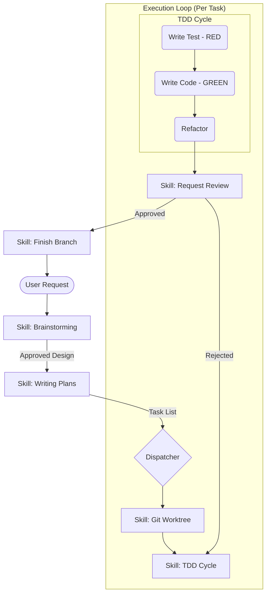

# Superpowers Framework: The "Strict-Mode" for AI Agents

## 1. Latest Context
As of late 2025, the **Superpowers** framework (github.com/obra/superpowers) has skyrocketed to #3 on GitHub trending, amassing over 28,000 stars. Created by Jesse Vincent, it represents a pivotal shift in AI Engineering: moving from "chatty" assistants to **disciplined, process-driven autonomous agents**.

While tools like Claude Code or GitHub Copilot Agent allow for open-ended interaction, Superpowers imposes a **strict software development methodology** on the agent. It is gaining traction because it addresses the "Junior Engineer Problem"—where agents write code that looks correct but fails in edge cases or lacks tests—by enforcing mandatory Test-Driven Development (TDD) and rigorous planning.

## 2. What, Why, How

### What is Superpowers?
Superpowers is an open-source library of **Agent Skills** and a **Development Workflow** designed for coding agents.
*   **The Core**: It is a set of `SKILL.md` files (and associated scripts) that define *mandatory* behaviors.
*   **The Philosophy**: "Mandatory, not optional." When a skill is triggered (e.g., "Implement Feature"), the agent *must* follow the process (Brainstorm -> Plan -> TDD -> Review).
*   **Platform**: It functions as a plugin for **Claude Code** and can be bootstrapped into **Codex** or **OpenCode**.

### Why do we need it?
*   **Discipline over Intelligence**: Large Language Models (LLMs) are often lazy or overconfident. They skip tests, ignore edge cases, and write "happy path" code. Superpowers forces them to slow down.
*   **Context Isolation**: By using `git worktrees` for every task, it prevents the agent from messing up the main codebase.
*   **Verification**: It actively prevents the "LGTM" (Looks Good To Me) syndrome by requiring code reviews against a pre-approved plan before merging.

### How does it work?
1.  **Interception**: The user asks for a feature.
2.  **Brainstorming**: The `brainstorming` skill activates. The agent *cannot* write code yet. It must discuss the design and generate a spec.
3.  **Planning**: The `writing-plans` skill breaks the spec into 2-5 minute tasks.
4.  **Execution (TDD)**: The `test-driven-development` skill enforces the **Red-Green-Refactor** cycle. If the agent writes implementation code before a test exists, the skill (conceptually) deletes it or forces a rollback.
5.  **Review**: A separate "Reviewer" persona checks the work against the plan.

## 3. Use Cases
*   **Autonomous Feature Implementation**: Giving an agent a high-level goal ("Add OAuth support") and letting it work for hours without human intervention.
*   **Legacy Code Refactoring**: Safely modifying old codebases by enforcing that tests must be written *before* changes are made.
*   **Onboarding New Agents**: Using the framework as a "training wheels" set for new, less capable models to ensure they perform at a senior level.

## 4. Real World Examples

### Example 1: The "Delete My Code" TDD Enforcement
A user asks Superpowers to "add a rate limiter."
1.  **Agent attempts**: Writes `def rate_limit(): ...`
2.  **Superpowers (TDD Skill)**: "STOP. No test found for `rate_limit`. Reverting changes. Write the test first."
3.  **Agent**: Writes `test_rate_limit.py` (Red).
4.  **Superpowers**: "Test failed as expected. Now write the code."
5.  **Agent**: Writes `def rate_limit(): ...` (Green).

### Example 2: The "Junior with No Judgment" Simulation
Jesse Vincent describes the implementation plan as being clear enough for "an enthusiastic junior engineer with poor taste, no judgment, and an aversion to testing." By explicitly spelling out every file path and verification step in the **Plan** phase, Superpowers allows the agent to execute complex tasks reliably, acting as its own "Senior Engineer" manager.

## 5. Future Readiness & Critique

### Future Readiness: High
*   **Standardization**: As agents become commoditized, the *process* (the skills) becomes the differentiator. Superpowers is an early standard for "Process-as-Code."
*   **Agent-to-Agent Collaboration**: The framework supports "Subagent Driven Development," where a manager agent dispatches tasks to worker agents. This is the blueprint for future AI software factories.

### Critique
*   **Overhead**: The rigorous process (Brainstorm -> Plan -> TDD) is slow for trivial changes. It feels like "Enterprise Java" for AI.
*   **Token Cost**: The extensive context required for the skills and plans consumes significant tokens.
*   **Rigidity**: "Mandatory" skills can be frustrating if the user *wants* a quick-and-dirty prototype.

## 6. Evolution & Problem Solved
*   **Problem Solved**: **"The Stochastic Coder."** Agents are probabilistic; engineering requires determinism. Superpowers bridges this gap by wrapping probabilistic models in deterministic workflows.
*   **Evolution**:
    *   *Gen 1 (Copilot)*: Autocomplete.
    *   *Gen 2 (Agents)*: "Fix this bug" (often introduces new bugs).
    *   *Gen 3 (Superpowers)*: "Follow this engineering process to fix this bug."

## 7. Deep Dive: Architecture & The "Skill Loop"

### The Workflow Architecture

### Key Components
1.  **Skills Library**: A directory of markdown files defining the behavior.
2.  **`commands/`**: Shell scripts that the skills execute to interact with the system (e.g., creating worktrees, running tests).
3.  **The "Plan"**: A JSON or Markdown document that acts as the shared state between the Architect (Brainstormer) and the Builder (Subagent).

## 8. Details, Trade-offs & Industry Usage

### Trade-offs
*   **Speed vs. Quality**: Superpowers is optimized for **Correctness**, not Latency. It is slower than a human for small tasks but scales better for large ones.
*   **Complexity**: Requires setting up the plugin and potentially modifying the agent's system prompt to respect the "Mandatory" nature of skills.

### Industry Usage
*   **Open Source**: The `obra/superpowers` repo is the reference implementation.
*   **Claude Code**: The primary target platform today, using its native plugin system.
*   **DevOps**: Teams are adapting similar patterns to "Ops Agents" that must follow strict deployment checklists (e.g., "Check backup before migration").

## 9. References
*   **GitHub Repository**: [github.com/obra/superpowers](https://github.com/obra/superpowers)
*   **Blog Post**: [Superpowers for Claude Code](https://blog.fsck.com/2025/10/09/superpowers/)
*   **Concept**: Agent Skills
