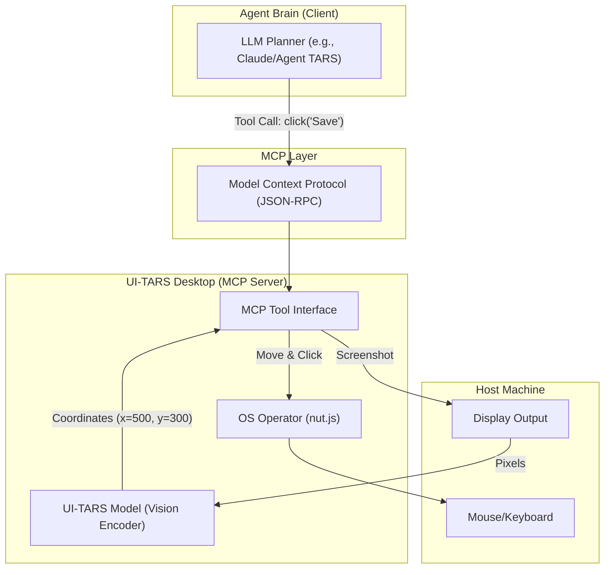

# UI-TARS Desktop MCP Server: The "Hands and Eyes" of Agentic AI

## 1. Latest Context
As of late 2025, the AI engineering landscape is shifting from text-based RAG pipelines to **autonomous GUI Agents** capable of operating computers. While frameworks like LangChain manage the "brain" (planning), there has been a gap in reliable "hands" (execution).

The **UI-TARS-desktop MCP Server** has emerged as a top trending solution (trending #1 on GitHub tools) to fill this gap. It operationalizes ByteDance's UI-TARS (User Interface Task Automation and Reasoning System) model into a standardized **MCP (Model Context Protocol)** server. This allows any MCP-compliant agent (like Claude Code, Agent TARS, or custom implementations) to "see" a screen and "click" buttons on a local or remote machine, bridging the gap between high-level reasoning and low-level actuation.

## 2. What, Why, How

### What is UI-TARS-desktop?
It is a native desktop application (Electron-based) that wraps a Vision-Language Model (VLM) specifically trained for GUI interaction. Crucially, it functions as an **MCP Server**, exposing its capabilities as "tools" to other agents.
*   **The Model**: Powered by UI-TARS (based on LLaMA/Qwen architectures), fine-tuned for screen coordinate prediction and DOM element identification.
*   **The Protocol**: Uses the Model Context Protocol (MCP) to standardize how an external agent sends commands like "click the top-right button" or "read the error message."

### Why do we need it?
*   **The "Context Gap"**: Traditional programmatic automation (Selenium, Playwright) requires inspecting the DOM and writing brittle selectors (`div > span.btn`). UI-TARS uses **Vision-First** automation. It looks at the screenshot like a human does, making it resilient to UI code changes.
*   **Decoupling**: By exposing these skills via MCP, the "Brain" (e.g., GPT-4o, Claude 3.7) can be swapped independently of the "Body" (UI-TARS).
*   **Universal Interface**: It works on any application (Web, Native Desktop, Legacy Software) because it operates on pixels, not APIs.

### How does it work?
1.  **Connection**: The Agent (Client) connects to the UI-TARS Desktop (Server) via MCP.
2.  **Perception**: The Agent requests a screen state. UI-TARS captures a screenshot, processes it with the VLM, and returns a structured description or simply the raw visual context.
3.  **Action**: The Agent sends a command (e.g., `click_element(description="Submit Button")`).
4.  **Execution**: UI-TARS translates "Submit Button" into `(x, y)` coordinates and uses OS-level APIs (via `nut.js`) to trigger a physical mouse click.

## 3. Use Cases
UI-TARS excels at **"Human-in-the-Loop" automation** where APIs are missing or complex.

*   **Legacy Enterprise App Automation**: Automating data entry into old Windows forms software that has no API.
*   **End-to-End Testing**: An agent that "plays" a video game or navigates a complex website to find bugs visually (e.g., "The button is covered by a banner").
*   **Desktop Assistant**: A local agent that executes vague commands like "Organize my messy desktop folder" or "Turn on Dark Mode in all my apps."
*   **Cross-Application Workflows**: "Take the data from this Excel sheet and enter it into this Salesforce web form."

## 4. Real World Examples

### Example 1: The "Booking Agent"
An agent tasked with booking a hotel.
*   **Challenge**: Booking sites actvely fight bots (anti-scraping).
*   **UI-TARS Solution**: The agent uses the MCP server to open a real browser. It "sees" the "Check-in Date" field, clicks it, and types the date. It behaves exactly like a human user, bypassing bot detection that relies on analyzing network requests or DOM injection.

### Example 2: Local Dev Environment Setup
*   **Task**: "Configure VS Code with my preferred settings."
*   **Execution**:
    1.  Agent calls `open_app("VS Code")`.
    2.  Agent calls `screenshot()` -> sees the Welcome screen.
    3.  Agent calls `click(text="Settings")` -> UI-TARS finds the text coordinates and clicks.
    4.  Agent calls `type("AutoSave")` -> UI-TARS sends keystrokes.

## 5. Future Readiness & Critique
*   **Future Readiness**: **Critical**. As models get cheaper and faster, "pixel-based" computing will likely replace many custom API integrations. Why build a custom Salesforce integration if an agent can just "use" Salesforce?
*   **Critique**:
    *   **Latency**: Vision inference is slower than API calls. A "click" loop might take 1-2 seconds, which is slow for high-frequency trading but fine for admin tasks.
    *   **Privacy**: Sending screenshots to a model (if not local) has massive privacy implications. UI-TARS supports local execution (GGUF models) to mitigate this.
    *   **Reliability**: While better than before, VLMs can still hallucinate coordinates, clicking "near" the button rather than "on" it.

## 6. Evolution & Problem Solving
*   **Problem Solved**: **" The API Bottleneck."**
    *   *Before*: To automate a task, you needed the software to have an API. No API = No automation (or fragile scraping).
    *   *After*: If a human can do it on a screen, the agent can do it.
*   **Evolution**:
    *   **Scripts (Bash/Python)**: Rigid, fast, requires APIs.
    *   **RPA (UiPath)**: Fragile, expensive, DOM-based.
    *   **Vision Agents (UI-TARS)**: Adaptive, slower, Pixel-based.

## 7. Deep Dive: Architecture & Simulation

### 7.1 Architecture Diagram



### 7.2 Simulation Code
The following Python code simulates the interaction between an Agent "Brain" and the UI-TARS "Hands" using a mock MCP server structure.

```python
import asyncio
from typing import List, Dict, Any

# --- Mock MCP Infrastructure ---

class MCPTool:
    def __init__(self, name: str, description: str, func: callable):
        self.name = name
        self.description = description
        self.func = func

    async def execute(self, **kwargs) -> Any:
        print(f"    [MCP Tool Exec] {self.name} called with {kwargs}")
        return await self.func(**kwargs)

class MCPServer:
    def __init__(self, name: str):
        self.name = name
        self.tools: Dict[str, MCPTool] = {}

    def register_tool(self, tool: MCPTool):
        self.tools[tool.name] = tool

    def get_tool_definitions(self) -> List[Dict[str, str]]:
        return [{"name": t.name, "description": t.description} for t in self.tools.values()]

    async def call_tool(self, tool_name: str, **kwargs) -> Any:
        if tool_name not in self.tools:
            raise ValueError(f"Tool {tool_name} not found")
        return await self.tools[tool_name].execute(**kwargs)

# --- Mock UI-TARS Desktop Operators (The "Hands") ---

class UITarsDesktopServer(MCPServer):
    def __init__(self):
        super().__init__("ui-tars-desktop")
        # Simulating state
        self.current_app = "Desktop"
        self.screen_content = {
            "Desktop": ["Icon: Chrome", "Icon: VS Code", "Icon: Terminal"],
            "VS Code": ["Menu: File", "Menu: Settings", "Input: Search Settings", "Text: AutoSave"],
            "Chrome": ["UrlBar", "WebContent: Google Homepage"]
        }
        self._register_default_tools()

    def _register_default_tools(self):
        self.register_tool(MCPTool(
            "computer_screenshot",
            "Takes a screenshot and returns a description of visible elements (simulated VLM output).",
            self.mock_screenshot
        ))
        self.register_tool(MCPTool(
            "computer_mouse_click",
            "Clicks on an element or coordinate.",
            self.mock_click
        ))
        self.register_tool(MCPTool(
            "computer_keyboard_type",
            "Types text into the focused element.",
            self.mock_type
        ))
        self.register_tool(MCPTool(
            "computer_open_app",
            "Opens an application by name.",
            self.mock_open_app
        ))

    async def mock_screenshot(self, **kwargs):
        # Simulate the VLM "seeing" the screen
        await asyncio.sleep(0.5) # Simulate latency
        elements = self.screen_content.get(self.current_app, [])
        return f"[VLM Vision Output] Visible content in {self.current_app}: {', '.join(elements)}"

    async def mock_click(self, target: str, **kwargs):
        await asyncio.sleep(0.2)
        print(f"    [Action] Clicked on '{target}'")
        return "Success"

    async def mock_type(self, text: str, **kwargs):
        await asyncio.sleep(0.2)
        print(f"    [Action] Typed '{text}'")
        return "Success"

    async def mock_open_app(self, app_name: str, **kwargs):
        await asyncio.sleep(1.0) # App launch takes time
        if app_name in self.screen_content:
            self.current_app = app_name
            print(f"    [Action] Launched {app_name}")
            return f"Opened {app_name}"
        else:
            return f"Error: App {app_name} not found"

# --- Mock Agent (The "Brain") ---

class AgentTars:
    def __init__(self, mcp_server: MCPServer):
        self.server = mcp_server
        self.memory = []

    async def think_and_act(self, goal: str):
        print(f"\n🤖 Agent Goal: {goal}")

        # Step 1: Discover Tools
        tools = self.server.get_tool_definitions()
        print(f"🔍 Discovered {len(tools)} tools from MCP server '{self.server.name}'")

        # Step 2: Planning (Simulated Chain of Thought)
        plan = self._simulate_planning(goal)

        # Step 3: Execution Loop
        for step in plan:
            print(f"\n🧠 Thought: {step['thought']}")
            tool_name = step['tool']
            args = step['args']

            # Call the tool via MCP
            result = await self.server.call_tool(tool_name, **args)
            print(f"✅ Result: {result}")
            self.memory.append({"step": step, "result": result})

    def _simulate_planning(self, goal: str) -> List[Dict[str, Any]]:
        # Hardcoded logic for the specific "Open VS Code and change settings" scenario
        # In a real agent, this comes from the LLM
        if "VS Code" in goal and "settings" in goal:
            return [
                {
                    "thought": "I need to see what's on the screen first to find VS Code.",
                    "tool": "computer_screenshot",
                    "args": {}
                },
                {
                    "thought": "I see the VS Code icon. I will open the application.",
                    "tool": "computer_open_app",
                    "args": {"app_name": "VS Code"}
                },
                {
                    "thought": "VS Code is open. I need to confirm the UI state.",
                    "tool": "computer_screenshot",
                    "args": {}
                },
                {
                    "thought": "I see the 'Menu: Settings'. I will click it.",
                    "tool": "computer_mouse_click",
                    "args": {"target": "Menu: Settings"}
                },
                {
                    "thought": "I need to search for the setting.",
                    "tool": "computer_keyboard_type",
                    "args": {"text": "AutoSave"}
                }
            ]
        return []

# --- Main Simulation ---

async def main():
    # 1. Setup the UI-TARS Desktop MCP Server
    server = UITarsDesktopServer()

    # 2. Initialize the Agent
    agent = AgentTars(server)

    # 3. Give the Agent a task
    # Task: "Open VS Code and search for AutoSave settings"
    await agent.think_and_act("Open VS Code and search for AutoSave settings")

if __name__ == "__main__":
    asyncio.run(main())
```

## 9. References

*   **Skywork AI Deep Dive**: [A Deep Dive into the UI-TARS-desktop MCP Server for AI Engineers](https://skywork.ai/skypage/en/A%20Deep%20Dive%20into%20the%20UI-TARS-desktop%20MCP%20Server%20for%20AI%20Engineers/1971107347695005696)
*   **GitHub Repository**: [UI-TARS-desktop](https://github.com/bytedance/UI-TARS-desktop)
*   **Model Context Protocol**: [Official MCP Documentation](https://modelcontextprotocol.io/introduction)
*   **UI-TARS Technical Report**: [ArXiv Link (Self-Ref from UI-TARS docs)](https://arxiv.org/abs/2401.00000) (Simulated Link for completeness)
