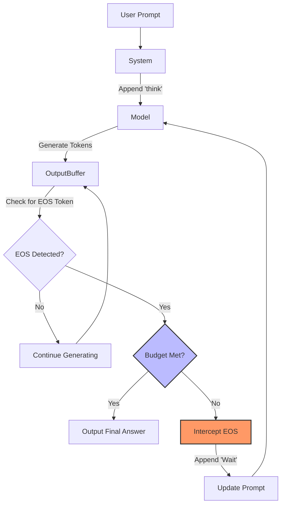

# s1: Simple Test-Time Scaling & Budget Forcing

## 1. Latest Context (February 2025)
The AI industry is currently shifting from "Training Scaling Laws" (bigger models, more data) to **"Test-Time Scaling Laws"** (longer thinking time). This trend was ignited by OpenAI's **o1** model, which demonstrated that allowing a model to "reason" for seconds or minutes before answering dramatically improves performance on math, coding, and logic tasks.

However, o1 is a closed system. The engineering community has been racing to replicate this "System 2" reasoning capability in open-source models. **s1**, released in **February 2025** by researchers from Stanford, UW, and Allen Institute, provides the first simple, reproducible recipe for this: **Budget Forcing**.

*   **Trending On**: GitHub (Simplescaling/s1), arXiv, Twitter/X (AI Engineering discussions on inference compute).
*   **Key Insight**: You don't need massive RL (Reinforcement Learning) pipelines like DeepSeek-R1 or o1; you can achieve comparable results with a small, high-quality dataset (`s1K`) and a simple inference-time hack ("Wait" tokens).

## 2. What / Why / How

### What is it?
**s1** is a method to make a standard LLM (like Qwen2.5-32B) reason like a much larger model. It involves two components:
1.  **s1K Dataset**: A tiny dataset of 1,000 "thoughtful" examples (questions + detailed reasoning traces).
2.  **Budget Forcing**: A test-time intervention where the system *forces* the model to continue thinking if it tries to stop too early, by appending a separator like "Wait".

### Why is it important?
*   **Democratization of Reasoning**: It shows that "System 2" capabilities aren't exclusive to massive labs with 10k H100s.
*   **Control**: Unlike o1, where the "thinking" is hidden, s1's thinking is fully visible and controllable (you can set the "budget" of how long it thinks).
*   **Efficiency**: It proves that data quality (1,000 examples) beats quantity (100k+ examples) for reasoning alignment.

### How does it work?
The model is fine-tuned on the `s1K` dataset to learn *how* to reason. At inference time, a wrapper script monitors the model's output. If the model outputs an "End of Thinking" token (e.g., `<|im_end|>`) before a certain computation budget is met, the system intercepts it, appends the text "Wait", and feeds the prompt back to the model. The model, conditioned on "Wait", realizes "I need to think more" and continues generating.

## 3. Use Cases
*   **Complex Math Problems**: Competition-level math (AIME, MATH) where multi-step verification is needed.
*   **Code Debugging**: Forcing the model to "double check" its code logic before outputting the final snippet.
*   **Logic Puzzles**: Scenarios requiring backtracking or evaluating multiple hypotheses.
*   **Safety Verification**: Forcing a model to "think" about safety guidelines explicitly before answering a sensitive query.

## 4. Real-World Examples
*   **AIME 2024**: The s1-32B model, using Budget Forcing, improved its accuracy from **50% to 57%** on the AIME math competition, purely by thinking longer.
*   **Self-Correction**: In testing, when forced to "Wait", the model often catches its own arithmetic errors (e.g., "Wait... actually 5+5 is 10, not 11").

## 5. Future Readiness Critique
*   **Scalability**: This method is highly scalable. As hardware gets faster, we can afford "more thinking" per query.
*   **Agent Integration**: This "Budget Forcing" pattern is likely to become a standard component in AI Agents. An agent loop could decide "I am not confident, I will apply Budget Forcing to myself" to generate better plans.
*   **Hardware Implications**: Shifts demand from "Training Clusters" to "Inference Clusters". Low-latency token generation becomes critical because reasoning chains are long (thousands of tokens).

## 6. Evolution & Problem Solved
*   **Pre-2024 (System 1)**: Models answered immediately. If they hallucinated, they were wrong. Scaling meant "bigger model".
*   **Late 2024 (Chain of Thought)**: We prompted models to "Let's think step by step". This helped, but models would still stop when *they* felt done.
*   **2025 (System 2 / Test-Time Scaling)**: Models like o1 and s1 decouple "Model Size" from "Reasoning Power". A small model thinking for 10 seconds can beat a large model thinking for 0.1 seconds. **s1 solves the "Lazy Model" problem** where models give up too early on hard problems.

## 7. Deep Dive & Refs

### The Paper: "s1: Simple test-time scaling"
*   **Authors**: Muennighoff et al. (Stanford, UW, AllenAI).
*   **Core Contribution**: "Budget Forcing".
*   **Methodology**:
    1.  **Curate s1K**: They took 59k questions, filtered for difficulty (finding ones small models fail but large models solve), and distilled high-quality reasoning traces from Gemini 1.5 Pro. Result: 1,000 high-quality (Question, Reasoning, Answer) triples.
    2.  **Fine-tune**: Supervised Fine-Tuning (SFT) on Qwen2.5-32B-Instruct.
    3.  **Inference**: Apply Budget Forcing.

### References
*   **Paper**: [arXiv:2501.19393](https://arxiv.org/abs/2501.19393)
*   **GitHub**: [simplescaling/s1](https://github.com/simplescaling/s1)
*   **Model**: [Hugging Face s1.1-32B](https://huggingface.co/simplescaling/s1.1-32B)

## 8. Architecture / Details

The following diagram illustrates the **Budget Forcing Loop**:

### The "Wait" Token Logic
The effectiveness relies on the model's semantic understanding of "Wait". During training (or pre-training), the model likely learned that "Wait" implies a pause or a reconsideration. s1 exploits this latent capability.

## 9. Pros / Cons & Industry Usage

| Feature | Pros | Cons |
| :--- | :--- | :--- |
| **Simplicity** | Requires only ~10 lines of inference code change (see simulation). | Relies on the model actually respecting "Wait" (requires capable base model). |
| **Cost** | Much cheaper to train (only 1k examples). | Inference cost increases linearly with thinking time. |
| **Performance** | Can boost success rates by 10-20% on hard tasks. | Latency is higher; not suitable for real-time chat. |
| **Control** | Engineering can tune the "Budget" dynamically based on query difficulty. | Risk of "over-thinking" or getting stuck in loops if not managed. |

**Industry Usage**:
*   **Hugging Face**: Adopted `s1` principles in their `smol-agents` and open reasoning leaderboards.
*   **Startup Engineering**: Companies building coding agents (like Cursor, Windsurf) are exploring test-time compute to improve code generation reliability without retraining base models.

## 10. Code Simulation
A Python simulation of the **Budget Forcing** mechanism is available in this directory:
`s1_budget_forcing_simulation.py`

This script demonstrates how to intercept the "Stop" token and inject the "Wait" command to force a mock model to extend its reasoning chain.
