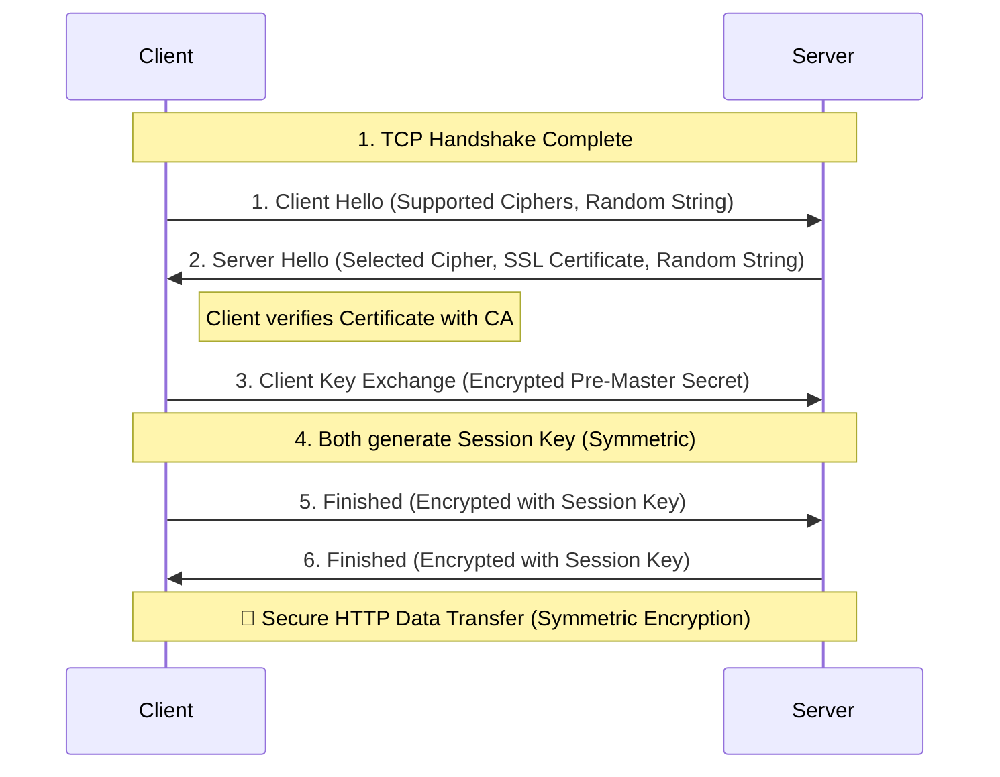

# HTTP Deep Dive

## 🎯 Goal
Master the fundamentals of **HTTP** (HyperText Transfer Protocol), understand how **HTTPS** secures the web, and explore the modern evolutions like **HTTP/2** and **HTTP/3 (QUIC)**.
**Focus**: Request/Response Cycle, TLS Handshake, Performance optimizations, and Real-world adoption.

---

## 🌐 HTTP Basics
HTTP is the foundation of data communication on the World Wide Web. It follows a **Client-Server** model where a client (browser) sends a **Request** and the server returns a **Response**.

### 1. Key Concepts
*   **Stateless**: The server does not keep track of previous requests. Each request is independent. (Cookies/Sessions are used to "add" state).
*   **Text-Based**: HTTP/1.x is human-readable.

### 2. The Flow
1.  **DNS Resolution**: Client resolves `google.com` to an IP.
2.  **TCP Handshake**: Client establishes a connection (SYN, SYN-ACK, ACK).
3.  **HTTP Request**: Client sends a message.
4.  **HTTP Response**: Server processes and sends back data.

### 3. HTTP Methods (Verbs)
*   **GET**: Retrieve a resource. (`GET /index.html`)
*   **POST**: Submit data to be processed. (`POST /login`)
*   **PUT**: Update/Replace a resource.
*   **DELETE**: Remove a resource.

### 4. Status Codes
*   **200 OK**: Success.
*   **301 Moved Permanently**: Redirect.
*   **400 Bad Request**: Client sent invalid data.
*   **401 Unauthorized**: Authentication failed.
*   **404 Not Found**: Resource doesn't exist.
*   **500 Internal Server Error**: Server crashed.
*   **502 Bad Gateway**: Upstream server error.

---

## 🔒 HTTP vs HTTPS
**HTTP** sends data in **plaintext**. Anyone on the network (public Wi-Fi, ISP) can snoop and read your passwords or credit card numbers.
**HTTPS** (HTTP Secure) adds a security layer (**SSL/TLS**) to encrypt the data.

| Feature | HTTP | HTTPS |
| :--- | :--- | :--- |
| **Security** | None (Plaintext) | Encrypted (TLS) |
| **Port** | 80 | 443 |
| **Trust** | No verification | Verified by Certificates (CA) |
| **Performance** | Faster (No handshake) | Slower (Initial handshake overhead) |

---

## 🛡️ HTTPS Mechanics (How it Works)
HTTPS uses **TLS (Transport Layer Security)**. It guarantees three things:
1.  **Encryption**: No one can read the data.
2.  **Integrity**: No one can modify the data.
3.  **Authentication**: You are talking to the real server (proof via Certificate).

### The TLS Handshake (Simplified)
Before sending HTTP data, the client and server must agree on a secret key.

### Key Concepts
*   **Asymmetric Encryption (Public/Private Key)**: Used *only* during the handshake to exchange the secret. (Slow, Secure).
*   **Symmetric Encryption (Session Key)**: Used for the actual data transfer. (Fast).
*   **Certificate Authority (CA)**: Trusted organizations (like Let's Encrypt, DigiCert) that issue certificates proving "google.com" is actually Google.

---

## 🚀 Evolutions: HTTP/1.1 vs HTTP/2 vs HTTP/3

The web needed to get faster. Here is how the protocol evolved.

### 1. HTTP/1.1 (1997) - The Standard
*   **Persistence (Keep-Alive)**: Reuses the same TCP connection for multiple requests (avoids repeated 3-way handshakes).
*   **Problem**: **Head-of-Line (HOL) Blocking**. If request #1 is slow, requests #2 and #3 are stuck waiting behind it on the same connection.

### 2. HTTP/2 (2015) - The Multiplexer
*   **Multiplexing**: Sends multiple requests *in parallel* over a single TCP connection. No more blocking!
*   **Binary Framing**: improved parsing efficiency (machine readable, not text).
*   **Header Compression (HPACK)**: Reduces overhead of repetitive headers.
*   **Server Push**: Server sends CSS/JS before the client even asks for it.
*   **Problem**: **TCP HOL Blocking**. Since it still runs on TCP, if *one* packet is lost, the Operating System pauses *all* streams until that packet is retransmitted.

### 3. HTTP/3 (2020+) - The Game Changer (QUIC)
*   **Built on UDP**: Ditches TCP entirely. Uses **QUIC** (Quick UDP Internet Connections).
*   **Solves TCP HOL Blocking**: If a packet is lost, only *that specific stream* is affected. Other streams continue.
*   **0-RTT Handshake**: Can reconnect and send data instantly without a handshake if the client has visited before.
*   **Connection Migration**: Smooth transition between Wi-Fi and 5G (uses Connection ID instead of IP).

---

## 🔄 Similar Protocols

### 1. WebSockets
*   **Use Case**: Real-time chat, Live stock feeds, Gaming.
*   **How it works**: Starts as an HTTP Handshake, then "Upgrades" to a persistent, **bi-directional** connection. Server can push data to Client anytime.
*   **vs HTTP**: HTTP is Request-Response (Client must ask). WebSockets are full-duplex.

### 2. gRPC (Google Remote Procedure Call)
*   **Use Case**: Microservices communication (Backend-to-Backend).
*   **How it works**: Uses **HTTP/2** as the transport. Uses **Protobuf** (binary format) instead of JSON.
*   **Pros**: Extremely fast, smaller payload, strongly typed.

---

## 🏭 Industry State (2024/2025)

### Adoption
*   **HTTPS is Mandatory**: Browsers now mark non-HTTPS sites as "Not Secure". **HSTS** (Strict Transport Security) forces browsers to use HTTPS automatically.
*   **HTTP/3 is Rising**: ~37% of websites (Google, Facebook, Cloudflare) use HTTP/3.
*   **HTTP/2 is Standard**: The default for most modern web servers (Nginx, Apache).
*   **TLS 1.3**: The new standard. Faster handshake (1-RTT) and removed insecure ciphers.

### When to use what?
*   **Standard Web App**: HTTP/2 + HTTPS (JSON/REST).
*   **Internal Microservices**: gRPC (for performance).
*   **Real-time Dashboard**: WebSockets or Server-Sent Events (SSE).
*   **High Latency/Mobile**: HTTP/3 (better packet loss handling).

---

## 🧠 Flashcards

| Question | Answer |
| :--- | :--- |
| **Why is HTTP called "Stateless"?** | The server retains no memory of past requests. Each request must contain all necessary info (e.g., Auth Token). |
| **How does HTTPS solve "Man-in-the-Middle" attacks?** | It encrypts data so attackers see garbage, and uses Certificates to verify the server's identity. |
| **What is the main problem with HTTP/1.1?** | Head-of-Line (HOL) Blocking: one slow request blocks all others on the connection. |
| **How does HTTP/2 solve HOL blocking?** | **Multiplexing**: It splits requests into small frames and interleaves them on one connection. |
| **Why does HTTP/3 use UDP instead of TCP?** | To solve *TCP* level blocking. If a TCP packet is lost, the OS pauses everything. UDP/QUIC handles retransmission per-stream. |
| **Symmetric vs Asymmetric Encryption in TLS?** | Asymmetric (Public Key) is used *once* to exchange the key. Symmetric (Session Key) is used for the *rest* of the conversation (it's faster). |
