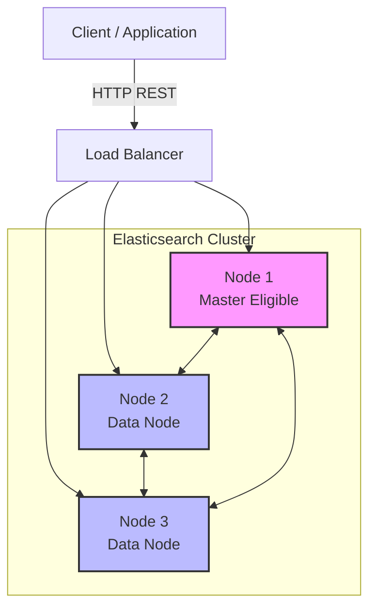
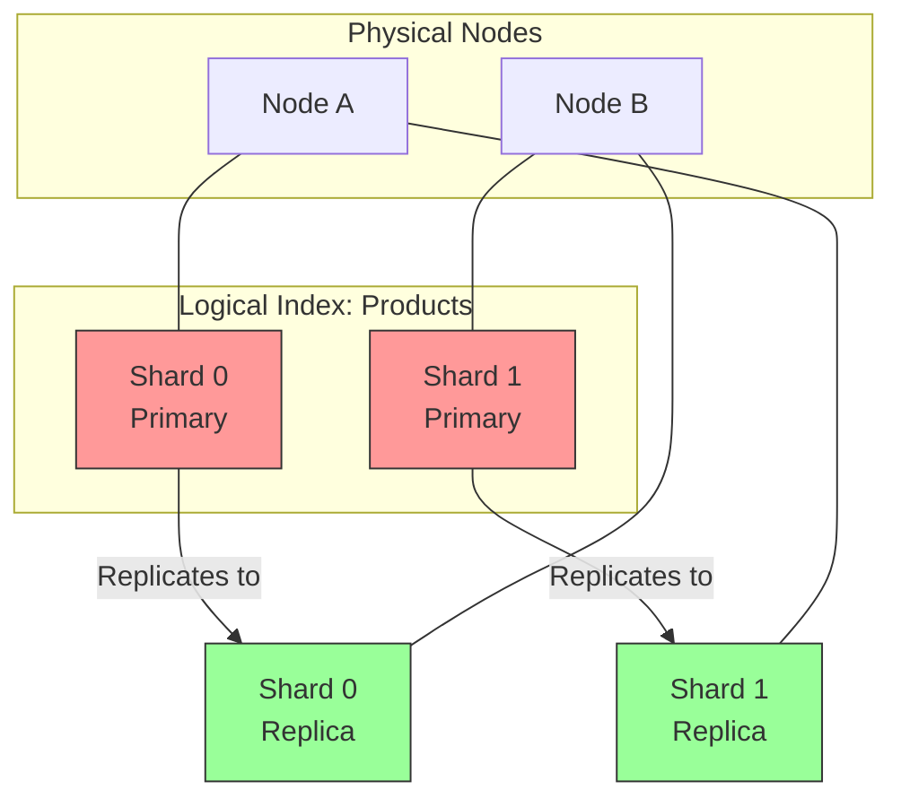
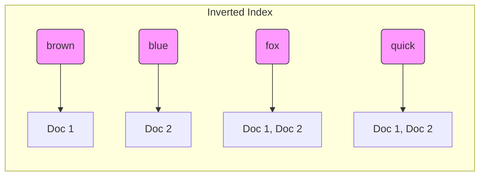

# Elasticsearch: The Distributed Search & Analytics Engine

## 🧠 What is it?
**Elasticsearch** is a distributed, RESTful search and analytics engine capable of addressing a growing number of use cases. It acts as the heart of the **Elastic Stack (ELK)**.

*   **Core Philosophy**: "You know, for search."
*   **Under the hood**: Built on top of **Apache Lucene**.
*   **Language**: Java.
*   **Data Format**: Stores data as **JSON** documents.

---

## 🏗️ Architecture

Elasticsearch is designed to be distributed and scalable from the ground up.

### 1. High-Level Topology

### 2. Data Organization (Shards & Replicas)
An **Index** (logical namespace) is split into **Shards** (physical Lucene indices).
*   **Primary Shard**: Where the write happens first.
*   **Replica Shard**: Copy of primary for High Availability (HA) and Read scaling.

---

## ⚙️ How It Works: The Inverted Index

Unlike a relational database (which scans rows), ES uses an **Inverted Index** (like the index at the back of a book).

**Document 1**: "The quick brown fox"
**Document 2**: "The quick blue fox"

### Visual Representation

*   **Search**: Query for "brown fox" -> Intersection of [1] and [1, 2] -> Result: Doc 1.
*   **Speed**: O(1) or O(log N) lookup, regardless of dataset size.

---

## ⚔️ Challengers & Alternatives

| Feature | **Elasticsearch** | **Solr** | **OpenSearch** | **Algolia** | **Meilisearch** |
| :--- | :--- | :--- | :--- | :--- | :--- |
| **Origin** | Lucene-based | Lucene-based | Fork of ES (AWS) | Proprietary (SaaS) | Rust-based |
| **Best For** | Logging (ELK), Complex Analytics | Enterprise Search, Legacy | AWS Native, Logging | Front-end Search (Typo tolerance) | Fast, simple site search |
| **Complexity** | High | High | High | Low (Hosted) | Low |
| **Hosting** | Self or Elastic Cloud | Self-hosted | AWS Managed / Self | SaaS Only | Self or SaaS |
| **License** | Elastic License (Not Open Source) | Apache 2.0 (Open Source) | Apache 2.0 (Open Source) | Proprietary | MIT |

---

## ⚖️ Trade-offs

### ✅ Pros
1.  **Speed**: Near real-time (NRT) search (refresh interval ~1s).
2.  **Scalability**: Horizontal scaling is seamless. Just add nodes.
3.  **Flexibility**: Schema-less (can infer schema), powerful Query DSL.
4.  **Ecosystem**: Kibana for visualization is best-in-class.

### ❌ Cons
1.  **Memory Hungry**: JVM Heap pressure is real. Garbage Collection (GC) pauses can kill nodes.
2.  **Storage Cost**: Indexes are larger than raw data due to inverted index + doc values + stored fields.
3.  **Split Brain**: In older versions, network partitions could create two master nodes (fixed mostly with new consensus algorithms).
4.  **Not a Primary DB**: Eventual consistency means it shouldn't be your "source of truth" for transactional data.

---

## 🌍 Real-World Use Cases

1.  **Log Analytics (Observability)**:
    *   **Scenario**: Uber uses ES to aggregate logs from thousands of microservices.
    *   **Stack**: Filebeat (Collector) -> Logstash/Kafka (Buffer) -> Elasticsearch (Store) -> Kibana (View).
2.  **E-Commerce Search**:
    *   **Scenario**: eBay/Walmart using ES for product search.
    *   **Features**: Faceted search (filter by color, price), Fuzzy matching (typo tolerance), Geo-search (items near me).
3.  **Security (SIEM)**:
    *   **Scenario**: Detecting anomalies in network traffic.

---

## 🔗 References
*   [Elasticsearch Architecture (Elastic.co)](https://www.elastic.co/guide/en/elasticsearch/reference/current/elasticsearch-intro.html)
*   [The Internals of Elasticsearch (GitBook)](https://www.gitbook.com/book/jelastic/deep-dive-into-elasticsearch/details)
*   [OpenSearch vs Elasticsearch](https://opensearch.org/faq/)
