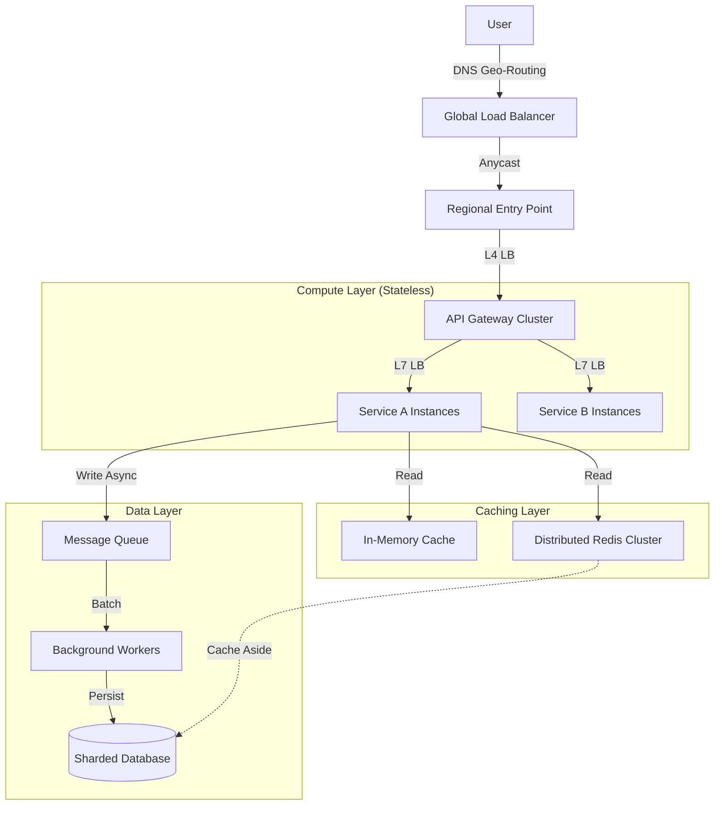

# 🚀 System Architecture: Deep Dive into 1M RPS API Design

> **Goal**: Design an API capable of handling **1 Million Requests Per Second (RPS)** with low latency (< 50ms), high availability (99.999%), and horizontal scalability.

---

## 1. The Challenge: What is 1M RPS?

1 Million Requests Per Second is a massive scale, typical of giants like Google Search, Facebook Likes, or WhatsApp Messages.
*   **1,000,000 req/sec** $\times$ 60 sec = **60 Million req/min**.
*   **3.6 Billion req/hour**.
*   **86.4 Billion req/day**.

### The Constraints
1.  **Throughput**: Must ingest data without dropping packets.
2.  **Latency**: Processing must be fast. If p99 latency spikes, queues fill up, and the system crashes (Backpressure).
3.  **Cost**: Brute-forcing with 10,000 servers is expensive. We need efficient architecture.

---

## 2. High-Level Architecture

To handle this load, we cannot use a monolithic architecture. We need a layered, distributed approach.

---

## 3. Deep Dive: Key Components

### A. Traffic Entry (The Front Door)
At 1M RPS, a single Load Balancer is a bottleneck.
1.  **DNS Geo-Routing**: Route users to the nearest Data Center (Latency reduction).
2.  **Anycast IP**: Multiple physical servers advertise the same IP address. The internet routing protocol (BGP) routes packets to the closest one.
3.  **L4 Load Balancer (Network Layer)**:
    *   Acts as a packet forwarder (NAT). Very fast.
    *   Distributes traffic to a fleet of L7 Load Balancers.
4.  **L7 Load Balancer (Application Layer)**:
    *   Terminates SSL.
    *   Inspects Headers/Auth.
    *   Routes to specific Microservices.

### B. The Application Layer (Statelessness)
*   **Stateless**: Servers must **not** store session data locally.
*   **Why?**: If Server A has my session and crashes, I am logged out. If I am routed to Server B, it knows nothing about me.
*   **Solution**: Store sessions in **Redis** or use **JWT (JSON Web Tokens)** which carry the session data in the payload.
*   **Scaling**: Use Auto-Scaling Groups. If CPU > 50%, launch more containers (Kubernetes HPA).

### C. Caching Strategy (The Speed Layer)
You cannot hit the database 1M times per second. It will melt.
**The Onion Strategy**:
1.  **CDN (Content Delivery Network)**: Caches static assets (images, JS) and even API responses at the "Edge" (near the user).
    *   *Hit Rate Goal*: 90%.
2.  **API Gateway Cache**: Caches common responses (e.g., "Get Configurations") for short TTL (1-5s).
3.  **Distributed Cache (Redis/Memcached)**: Shared cache for all services. Stores user profiles, counters.
4.  **Local In-Memory Cache (Guava/Caffeine)**: The fastest cache (RAM). Avoids network calls to Redis.
    *   *Risk*: Data consistency (Server A has old data, Server B has new data). Use for immutable or slowly changing data.

### D. Database Strategy (The Storage Layer)
1.  **Sharding**: Split data across multiple nodes.
    *   *Strategy*: `hash(user_id) % N`.
    *   *Benefit*: Distributes writes. 1M writes/sec becomes 10k writes/sec per node if you have 100 shards.
2.  **Read Replicas**: Master node handles Writes. 10 Slave nodes handle Reads.
3.  **CQRS (Command Query Responsibility Segregation)**:
    *   Separate the "Write" model from the "Read" model.
    *   Writes go to a high-throughput store (Cassandra/DynamoDB).
    *   Reads come from a search index (Elasticsearch) or Cache.

### E. Asynchronous Processing (The Buffer)
For write-heavy systems (e.g., Logging, Analytics, Likes), **never write directly to DB**.
1.  **Message Queue (Kafka)**: The API accepts the request, pushes it to Kafka, and responds "202 Accepted" immediately. Latency = 5ms.
2.  **Workers**: Backend consumers read from Kafka in batches (e.g., 1000 messages) and bulk-insert into the DB.
3.  **Backpressure**: If the DB slows down, Kafka buffers the messages. The API stays fast.

---

## 4. Real-World Example: "The Like Button"

Imagine building the "Like" system for a viral Super Bowl post (1M Likes/sec).

### The Flow
1.  **User Clicks Like**:
    *   App sends `POST /likes {post_id, user_id}`.
2.  **API Gateway**:
    *   Validates JWT.
    *   Checks Rate Limiter (Token Bucket).
    *   Forwards to **Like Service**.
3.  **Like Service (Fast Path)**:
    *   Writes event to **Kafka Topic** `likes-ingest`.
    *   Increment **Redis Counter** `likes:{post_id}` (Atomic `INCR`).
    *   Returns `200 OK` to user. **Total time: 10ms**.
4.  **Background Worker (Slow Path)**:
    *   Reads batch of 5,000 likes from Kafka.
    *   Deduplicates (checks if user already liked).
    *   Bulk inserts into **Cassandra** `likes_table`.
    *   Updates **Total Count** in SQL (if needed for consistency).

### Why this works?
*   **Redis** handles the immediate "Feedback" (User sees the count go up).
*   **Kafka** absorbs the spike (Shock Absorber).
*   **Cassandra** handles the massive write volume via Sharding.

---

## 5. Back-of-the-Envelope Math

*   **Traffic**: 1,000,000 Req/sec.
*   **Payload**: 1KB per request.
*   **Bandwidth**: $1M \times 1KB = 1GB/sec$ (8 Gbps).
    *   *Verdict*: Easily handled by a 10Gbps network card or split across 2-3 load balancers.
*   **Compute**:
    *   Assume a Go/Java server handles 10k RPS.
    *   Servers needed: $1,000,000 / 10,000 = 100$ Servers.
    *   *Verdict*: Very manageable size for a Kubernetes cluster.
*   **Storage (Writes)**:
    *   1M writes/sec.
    *   Single SQL Node limits ~10k TPS.
    *   We need $1M / 10k = 100$ Shards (or use Cassandra which scales linearly).

---

## 6. Summary Checklist

| Component | Strategy for 1M RPS |
| :--- | :--- |
| **DNS** | Geo-Routing + Anycast |
| **Load Balancer** | L4 (Network) $\rightarrow$ L7 (Application) |
| **Compute** | Stateless Microservices + Auto-scaling |
| **Database** | Sharding + Async Writes (Queue) |
| **Caching** | Multi-level (Edge + Distributed + Local) |
| **Resilience** | Rate Limiting + Circuit Breakers |
