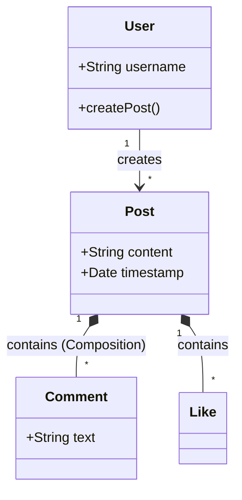

# Day 2: UML & Class Diagrams

## 🎯 Goal
Understand how to visualize code structure and relationships. Mastering Class Diagrams is essential for the "Low-Level Design" (LLD) interview rounds.

---

## 🏗️ The 3 Key Relationships (The "Diamond Problem")

The most confusing part of UML for beginners is distinguishing between **Association**, **Aggregation**, and **Composition**.

### 1. Association (`--->`)
*   **Concept**: A generic "uses-a" relationship. Two classes talk to each other but neither owns the other. They have their own lifecycles.
*   **Symbol**: A simple line (or arrow).
*   **Analogy**: **Teacher and Student**. A student can learn from multiple teachers. A teacher teaches multiple students. If the Teacher quits, the Student doesn't die.
*   **Code**:
    ```java
    class Teacher { ... }
    class Student {
        List<Teacher> teachers; // Just a reference
    }
    ```

### 2. Aggregation (`<>---`)
*   **Concept**: A "has-a" relationship (Weak Association). One class belongs to a collection, but can exist independently.
*   **Symbol**: Empty Diamond (`<>`).
*   **Analogy**: **Pond and Ducks**. The Pond "has" Ducks. But if the Pond dries up, the Ducks can fly to another pond. They are not destroyed.
*   **Code**:
    ```java
    class Duck { ... }
    class Pond {
        List<Duck> ducks;

        // Ducks are passed IN. They exist OUTSIDE too.
        Pond(List<Duck> ducks) {
            this.ducks = ducks;
        }
    }
    ```

### 3. Composition (`<*>---`)
*   **Concept**: A "part-of" relationship (Strong Association). The child *cannot* exist without the parent. If the parent is destroyed, the child is destroyed.
*   **Symbol**: Filled Diamond (`<*>`).
*   **Analogy**: **House and Rooms**. A Room is part of a House. If you bulldoze the House, the Room ceases to exist. You can't have a "floating room" without a house.
*   **Code**:
    ```java
    class Room { ... }
    class House {
        List<Room> rooms;

        House() {
            // Rooms are created INSIDE. They die when House dies.
            this.rooms = new ArrayList<>();
            this.rooms.add(new Room());
        }
    }
    ```

---

## 📊 Essential Diagram Notations

| Feature | Notation | Example |
| :--- | :--- | :--- |
| **Public** | `+` | `+ name: String` |
| **Private** | `-` | `- password: String` |
| **Protected** | `#` | `# internalId: int` |
| **Static** | `Underline` | `<u>count</u>` |
| **Inheritance** | `Empty Arrow` | `Dog --|> Animal` |
| **Interface** | `Dashed Arrow` | `Dog ..|> Barkable` |

---

## 🧠 Flashcards (Anki Style)

| Question | Answer |
| :--- | :--- |
| What does a **Filled Diamond** represent in UML? | **Composition** (Strong "part-of" relationship). Parent controls Child's lifecycle. |
| What does an **Empty Diamond** represent? | **Aggregation** (Weak "has-a" relationship). Child can exist without Parent. |
| How do you represent **Inheritance**? | A solid line with an empty triangle arrow pointing to the Parent. |
| **Car and Engine**: Composition or Aggregation? | Usually **Composition**. An engine is specific to a car. If the car is scrapped, the engine goes with it (unless salvaged, but generally it's a "part-of"). |
| **Library and Books**: Composition or Aggregation? | **Aggregation**. If the Library burns down, the Books (conceptually) or checked-out books still exist. They are not intrinsically bound to *that* specific building instance forever. |

---

## 🙋 Interview Questions

1.  **"Draw the Class Diagram for a Library Management System."**
    *   *Objects*: `Library`, `Book`, `Member`, `Librarian`, `Loan`.
    *   *Relationships*:
        *   Library `<*>---` Book (Wait, is it? See debate above. Usually simpler to model as Aggregation if books move between libraries, but Composition if 'Library' implies the *Inventory*).
        *   Member `---` Loan `---` Book (Association).
        *   Librarian `--|>` User (Inheritance).
2.  **"What is the difference between Abstract Class and Interface in a diagram?"**
    *   *Answer*: Abstract class name is often *italicized*. Interface often has `<<interface>>` stereotype. Relationship lines differ (Solid vs Dashed).
3.  **"Model a deck of cards."**
    *   `Deck` `<*>---` `Card` (Composition: A card is part of a deck. If deck is destroyed, cards are gone... mostly).
    *   `Card` has `Suit` and `Rank` (Enums).

---

## 🛠️ Practical Exercise (Day 2 Task)

**Task**: Use [Mermaid.js Live Editor](https://mermaid.live/) to draw a class diagram for a **Social Media Post** system.

**Requirements**:
1.  `User` creates `Post`.
2.  `Post` has multiple `Comment`s.
3.  `Post` has multiple `Like`s.
4.  If `Post` is deleted, `Comment`s must be deleted (Composition).

**Solution Hint (Mermaid Code)**:


---

## 📚 Resources
*   [Visual Paradigm: Association vs Aggregation vs Composition](https://www.visual-paradigm.com/guide/uml-unified-modeling-language/uml-aggregation-vs-composition/)
*   [PlantUML Guide](https://plantuml.com/class-diagram) - Text-to-UML tool.
*   [Mermaid.js Cheat Sheet](https://mermaid.js.org/syntax/classDiagram.html)
