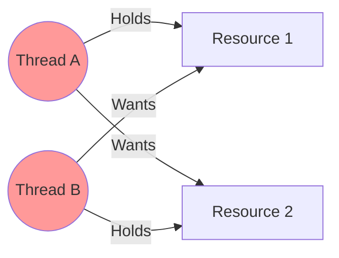

# Day 13: Concurrency Primitives & Deadlocks

## 🎯 Goal
Go beyond basic threads. Understand the low-level primitives that orchestrate thread synchronization and the classic pitfalls like Deadlock and Livelock. This is "Operating Systems 101" for Backend Engineers.

---

## 🧱 Concurrency Primitives

### 1. Mutex (Mutual Exclusion)
A **Mutex** is a locking mechanism used to synchronize access to a resource. Only one thread can acquire the mutex at a time.
*   **Analogy**: A key to a restroom. Only one person fits.
*   **Ownership**: The thread that locks it **must** unlock it.

### 2. Semaphore
A **Semaphore** is a signaling mechanism. It maintains a counter.
*   **Counting Semaphore**: Allows `N` threads to access a resource simultaneously (e.g., 10 DB connections).
*   **Binary Semaphore**: Counter is 0 or 1. Similar to Mutex but **no ownership**. Thread A can wait (decrement), and Thread B can signal (increment).
*   **Analogy**: A bouncer at a club with a clicker. He lets `N` people in. When one leaves, another enters.

### 3. Monitor
A high-level synchronization construct (built into Java/C#). It bundles:
1.  **Mutual Exclusion** (Lock).
2.  **Condition Variables** (Wait/Signal).
*   **Java**: The `synchronized` keyword uses Monitors internally.

### 4. Condition Variables
Allow threads to sleep until a specific condition is met, rather than busy-waiting.
*   `wait()`: Release lock and sleep.
*   `notify()`: Wake up one sleeping thread.
*   **Pattern**: Always use in a loop! `while(!condition) wait();`

---

## ☠️ Deadlock, Livelock, Starvation

### Deadlock
Two threads are blocked forever, waiting for each other.
**The 4 Conditions (Coffman Conditions)** - All must be true for Deadlock:
1.  **Mutual Exclusion**: Resources cannot be shared.
2.  **Hold and Wait**: Thread holds one resource while waiting for another.
3.  **No Preemption**: Resources cannot be forcibly taken.
4.  **Circular Wait**: A waits for B, B waits for A.



### Livelock
Threads are not blocked, but they keep changing state in response to each other without doing useful work.
*   **Analogy**: Two people meeting in a hallway, both stepping left, then right, indefinitely.

### Starvation
A thread is perpetually denied resources because other "greedy" threads (high priority) keep taking them.

---

## 🆚 Mutex vs Semaphore

| Feature | Mutex | Semaphore |
| :--- | :--- | :--- |
| **Concept** | Locking (Object) | Signaling (Integer) |
| **Ownership** | Locked by specific thread | No ownership |
| **Speed** | Faster (OS optimized) | Slower |
| **Use Case** | Critical Section protection | Resource Pools, Event Signaling |

---

## 💻 Code Example: Producer-Consumer (Condition Variables)

### Java (Using ReentrantLock & Condition)
```java
import java.util.LinkedList;
import java.util.Queue;
import java.util.concurrent.locks.Condition;
import java.util.concurrent.locks.Lock;
import java.util.concurrent.locks.ReentrantLock;

class SharedBuffer {
    private final Queue<Integer> queue = new LinkedList<>();
    private final int capacity = 5;
    private final Lock lock = new ReentrantLock();
    // Condition variables for specific events
    private final Condition notFull = lock.newCondition();
    private final Condition notEmpty = lock.newCondition();

    public void produce(int item) throws InterruptedException {
        lock.lock();
        try {
            while (queue.size() == capacity) {
                // Wait until there is space
                notFull.await();
            }
            queue.add(item);
            System.out.println("Produced: " + item);
            // Signal consumers that data is available
            notEmpty.signal();
        } finally {
            lock.unlock();
        }
    }

    public void consume() throws InterruptedException {
        lock.lock();
        try {
            while (queue.isEmpty()) {
                // Wait until there is data
                notEmpty.await();
            }
            int item = queue.poll();
            System.out.println("Consumed: " + item);
            // Signal producers that space is available
            notFull.signal();
        } finally {
            lock.unlock();
        }
    }
}
```

---

## 🧠 Flashcards

| Question | Answer |
| :--- | :--- |
| What is the **Coffman Condition** "Circular Wait"? | A closed chain of processes exists, such that each process holds at least one resource needed by the next process in the chain. |
| Why use `while` instead of `if` with `wait()`? | **Spurious Wakeups**: The OS might wake a thread up without a signal. Also, the condition might have changed again before the thread got the CPU. |
| **Mutex** vs **Binary Semaphore**? | Mutex has ownership (only owner can unlock). Semaphore has no ownership (anyone can signal). |
| What is **Priority Inversion**? | When a low-priority thread holds a lock needed by a high-priority thread, effectively lowering the high-priority thread's performance. |

---

## 🛠️ Practical Task
**Task**: Simulate a **Banking Transaction Deadlock**.
1.  Create `Account` class with `balance`.
2.  Method `transfer(from, to, amount)`.
3.  Lock `from` then Lock `to`.
4.  Run two threads:
    *   Thread 1: Transfer A -> B.
    *   Thread 2: Transfer B -> A.
5.  Observe the hang.
6.  **Fix it**: Implement a Global Ordering (e.g., always lock the Account with the smaller ID first).
