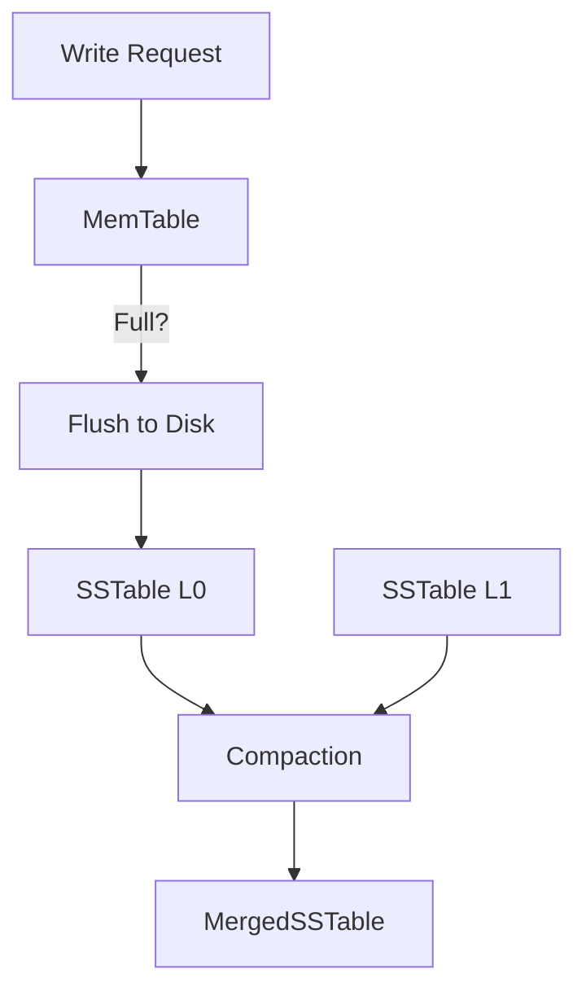

# Day 15: Storage Engines

## 🎯 Goal
Understand what happens when you write data to a database. How is it persisted? Why are some DBs fast at writes and others fast at reads?

---

## 💾 The Two Main Families

### 1. Log-Structured Merge-Trees (LSM-Trees)
*   **Philosophy**: Append-only. Write everything sequentially to a log.
*   **Structure**:
    1.  **MemTable**: In-memory balanced tree (Red-Black tree). Writes go here first. Fast.
    2.  **SSTable (Sorted String Table)**: Immutable file on disk. When MemTable is full, it's flushed to disk as an SSTable.
    3.  **Compaction**: Background process merges old SSTables, discarding deleted keys.
*   **Pros**: **High Write Throughput** (Sequential writes are fast on HDD/SSD).
*   **Cons**: Slower Reads (Need to check MemTable -> SSTable 1 -> SSTable 2...).
*   **Examples**: Cassandra, RocksDB, LevelDB, HBase, Kafka (Log concept).

### 2. B-Trees (B+ Trees)
*   **Philosophy**: Update in-place. Break database down into fixed-size **Pages** (e.g., 4KB).
*   **Structure**:
    *   Tree structure where leaves contain the actual data (or pointers).
    *   Branching factor is high (hundreds of children), keeping the tree shallow.
*   **Pros**: **Fast Reads** (Low depth, predictable performance). Good for Range Scans.
*   **Cons**: Slower Writes (Random I/O to update pages, tree rebalancing overhead).
*   **Examples**: MySQL (InnoDB), PostgreSQL, Oracle.

---

## 🔍 Indexing Basics
An index is a derived data structure.
*   **Clustered Index**: The data is stored *inside* the index (usually the Primary Key B-Tree). Sorting by PK is free.
*   **Secondary Index**: Contains the Key and a pointer to the Primary Key (or Heap).

---

## 🆚 LSM vs B-Tree

| Feature | LSM-Tree | B-Tree |
| :--- | :--- | :--- |
| **Write Pattern** | Sequential (Append-only) | Random (Update in-place) |
| **Write Speed** | 🚀 Extremely Fast | 🐢 Moderate |
| **Read Speed** | 🐢 Slower (Check multiple files) | 🚀 Fast (Follow pointer) |
| **Space Amp** | High (stale data until compaction) | Moderate (fragmentation) |
| **Ideal For** | High Ingestion (Logs, Chat, IoT) | General Purpose (OLTP, eCommerce) |

---

## 🧠 Flashcards

| Question | Answer |
| :--- | :--- |
| Why is **Sequential Write** faster than Random Write? | Disk heads don't need to seek (HDD). Even on SSDs, sequential writes reduce write amplification and GC overhead. |
| What is a **Bloom Filter**? | A probabilistic data structure used in LSM trees to quickly tell if a key does *NOT* exist in an SSTable, saving disk reads. |
| What is **Write Amplification**? | One logical write resulting in multiple physical writes to the disk (e.g., during Compaction or Page splitting). |
| What is a **WAL**? | Write-Ahead Log. Used in B-Trees to ensure durability. Data is written to WAL (sequential) before the Page (random) to survive crashes. |

---

## 🛠️ Practical Task
**Task**: Design a simple **Append-Only Log** in code.
1.  Function `append(key, value)`: Writes "key:value" to the end of a file `data.log`.
2.  Function `get(key)`: Reads the file from the **end to start** (why?) to find the latest value.
3.  **Optimize**: Create an in-memory `HashMap` (Index) that stores `{key: file_offset}`.
4.  Update `get(key)` to use the offset to seek directly.
