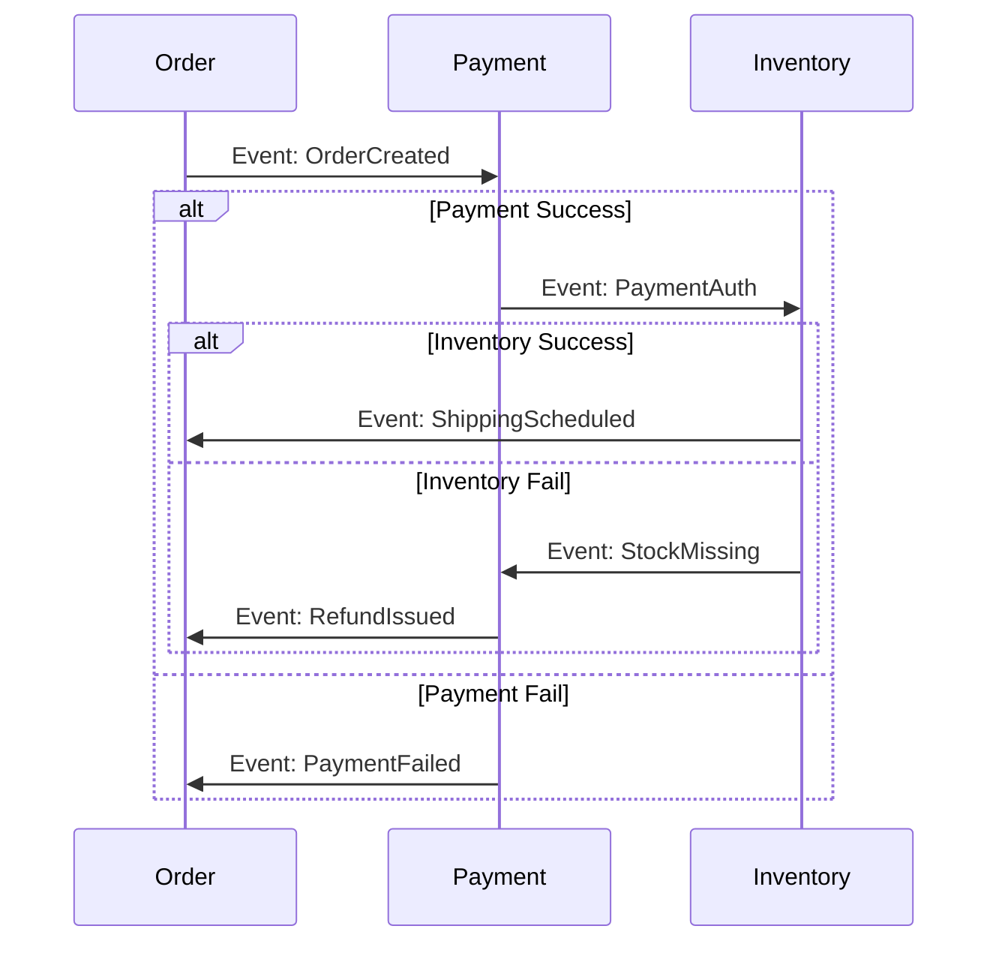

# Day 40: Distributed Transactions (Saga Pattern)

## 🎯 Goal
Understand how to maintain data consistency across multiple microservices without a global lock.
**Focus**: ACID vs BASE, Two-Phase Commit (2PC), and the Saga Pattern.

---

## 🧩 Key Concepts

### 1. The Problem
*   **Monolith**: `BEGIN TRANSACTION` -> Update Order Table -> Update Payment Table -> `COMMIT`. Easy (ACID).
*   **Microservices**: "Order Service" has its own DB. "Payment Service" has its own DB. You cannot run a single ACID transaction across them.

### 2. Two-Phase Commit (2PC) - The "Old" Way
*   **Phase 1 (Prepare)**: Coordinator asks all services: "Can you commit?" Services lock rows.
*   **Phase 2 (Commit)**: If all say "Yes", Coordinator says "Commit". If one says "No", Coordinator says "Rollback".
*   **Problem**: **Blocking**. If Coordinator dies, services are stuck holding locks. Not scalable.

### 3. Saga Pattern - The "New" Way
*   Break the transaction into a sequence of **local transactions**.
*   T1 (Order) -> T2 (Payment) -> T3 (Inventory).
*   If T2 fails, execute **Compensating Transactions** (Undo operations) in reverse.
*   C2 (Refund Payment) -> C1 (Cancel Order).

---

## 🏗️ Saga Choreography vs Orchestration

### A. Choreography (Event-Based)
*   Services talk to each other via events.
*   *Order Service*: "Order Created" -> *Payment Service* listens, processes, emits "Payment Processed" -> *Inventory Service* listens...
*   **Pros**: Simple, loose coupling.
*   **Cons**: "Cyclic dependencies" risk. Hard to visualize the whole flow.

### B. Orchestration (Command-Based)
*   A central **Orchestrator** (State Machine) tells services what to do.
*   *Orchestrator*: Call Order Service -> Wait -> Call Payment Service -> Wait...
*   **Pros**: Central control, easy to handle timeouts/retries.
*   **Cons**: SPOF (Single Point of Failure) if orchestrator isn't highly available.

---

## 💻 Code Simulation: Saga Logic (Orchestration)

Pseudo-code representing a Saga Orchestrator.

```python
class OrderSaga:
    def execute(self, order_data):
        try:
            # Step 1: Create Order
            order_id = OrderService.create_order(order_data)

            try:
                # Step 2: Charge Payment
                payment_id = PaymentService.charge(order_id, order_data['amount'])

                try:
                    # Step 3: Reserve Inventory
                    InventoryService.reserve(order_id, order_data['items'])
                    print("✅ Transaction Successful")

                except InventoryException:
                    # Compensate Step 2
                    PaymentService.refund(payment_id)
                    raise

            except PaymentException:
                # Compensate Step 1
                OrderService.cancel(order_id)
                raise

        except Exception as e:
            print(f"❌ Transaction Failed: {e}")
```

---

## 🧠 Diagram: Choreography



---

## ⚡ Flashcards
1.  **What is a Compensating Transaction?**
    *   An operation that undoes the effect of a previous step in a Saga. (e.g., "Refund" is the compensation for "Charge"). It must be **Idempotent**.
2.  **ACID vs BASE?**
    *   **ACID**: Atomicity, Consistency, Isolation, Durability (Strong consistency, Monoliths).
    *   **BASE**: Basically Available, Soft state, Eventual consistency (Distributed Systems).
3.  **What if the Compensating Transaction fails?**
    *   Retries! The system must ensure compensation eventually succeeds. Human intervention might be required if it fails permanently.
